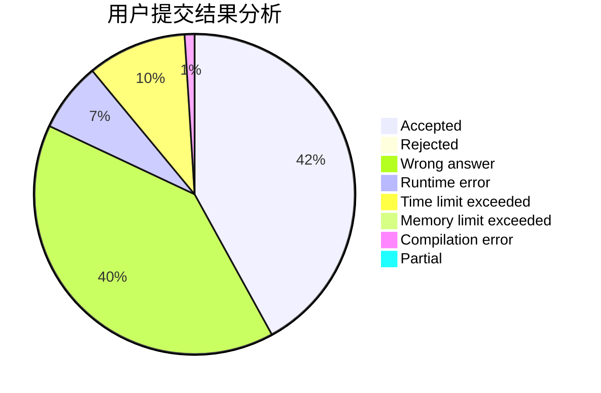
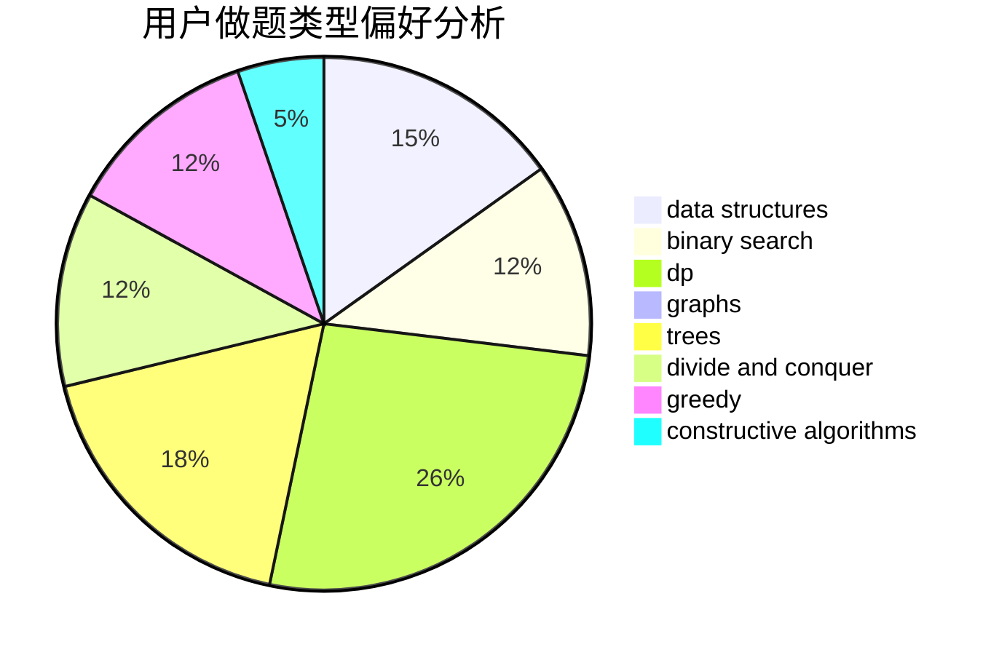

# Imakf

<!-- tabs:start -->

#### **用户提交结果分析**

#### **用户做题类型偏好分析**

#### **用户错题知识点分析**

<!-- tabs:end -->
# 推荐题目
[1132C](https://codeforces.com/contest/1132/problem/C)		brute force		  
[935B](https://codeforces.com/contest/935/problem/B)		implementation		  
[677C](https://codeforces.com/contest/677/problem/C)		bitmasks,
                        combinatorics,
                        implementation,
                        strings		  
[1073D](https://codeforces.com/contest/1073/problem/D)		binary search,
                        brute force,
                        data structures,
                        greedy		  
[1240A](https://codeforces.com/contest/1240/problem/A)		dsu,graphs,sortings,trees		  
[1164P](https://codeforces.com/contest/1164/problem/P)		dsu,graphs,sortings,trees		  
[1314D](https://codeforces.com/contest/1314/problem/D)		dsu,graphs,sortings,trees		  
[1092E](https://codeforces.com/contest/1092/problem/E)		constructive algorithms,
                        dfs and similar,
                        greedy,
                        trees		  
[896D](https://codeforces.com/contest/896/problem/D)		chinese remainder theorem,
                        combinatorics,
                        math,
                        number theory		  
[856D](https://codeforces.com/contest/856/problem/D)		dp,
                        trees		  
