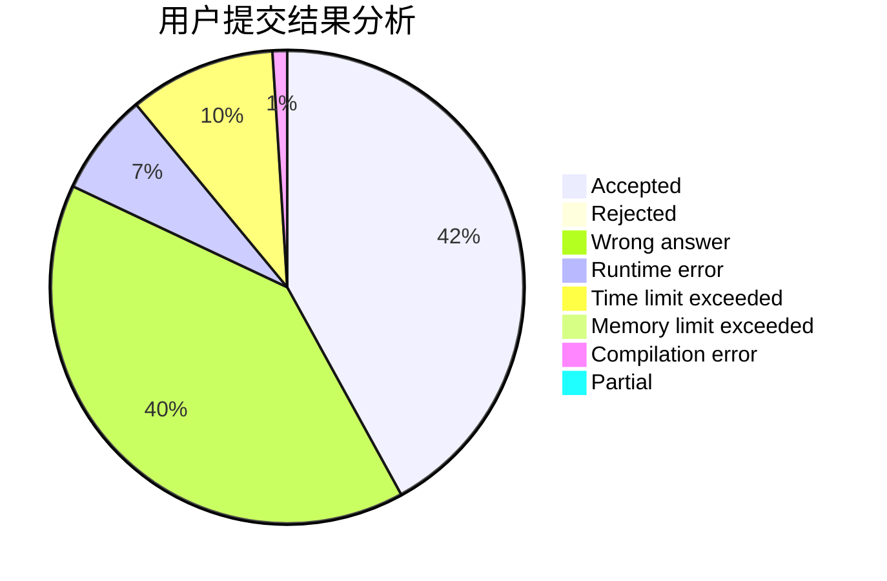
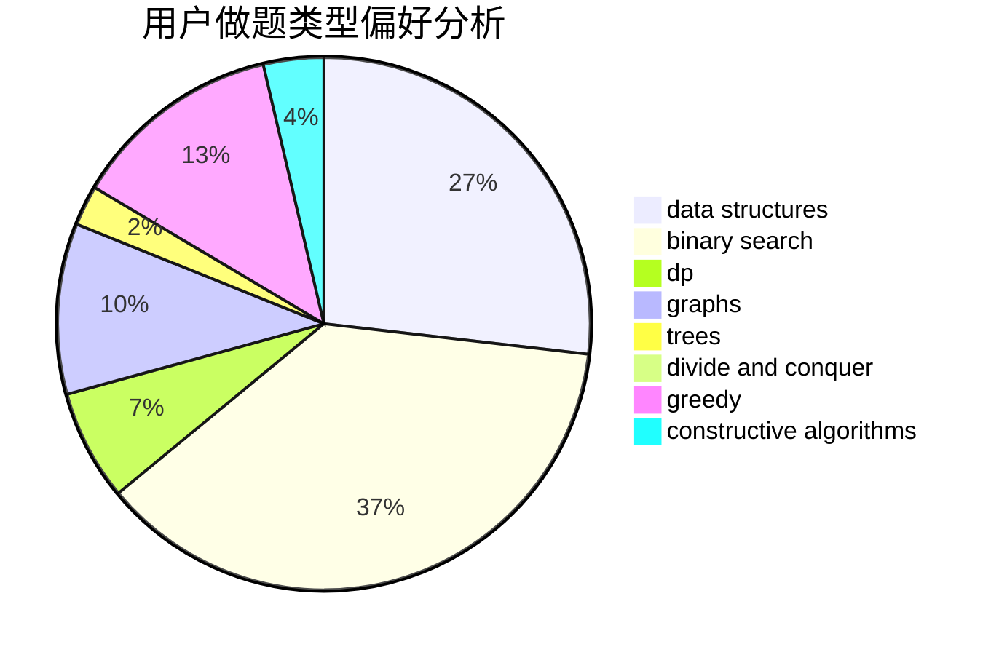

# Imakf

<!-- tabs:start -->

#### **用户提交结果分析**

#### **用户做题类型偏好分析**

#### **用户错题知识点分析**

<!-- tabs:end -->
# 推荐题目
[1130C](https://codeforces.com/contest/1130/problem/C)		brute force,
                        dfs and similar,
                        dsu		  
[915C](https://codeforces.com/contest/915/problem/C)		dp,
                        greedy		  
[653C](https://codeforces.com/contest/653/problem/C)		brute force,
                        implementation		  
[1073A](https://codeforces.com/contest/1073/problem/A)		implementation,
                        strings		  
[1234D](https://codeforces.com/contest/1234/problem/D)		data structures		  
[1163B1](https://codeforces.com/contest/1163B/problem/1)		data structures,
                        implementation		  
[1305E](https://codeforces.com/contest/1305/problem/E)		constructive algorithms,
                        greedy,
                        implementation,
                        math		  
[1092B](https://codeforces.com/contest/1092/problem/B)		sortings		  
[876C](https://codeforces.com/contest/876/problem/C)		dsu,graphs,sortings,trees		  
[838D](https://codeforces.com/contest/838/problem/D)		math,
                        number theory		  
