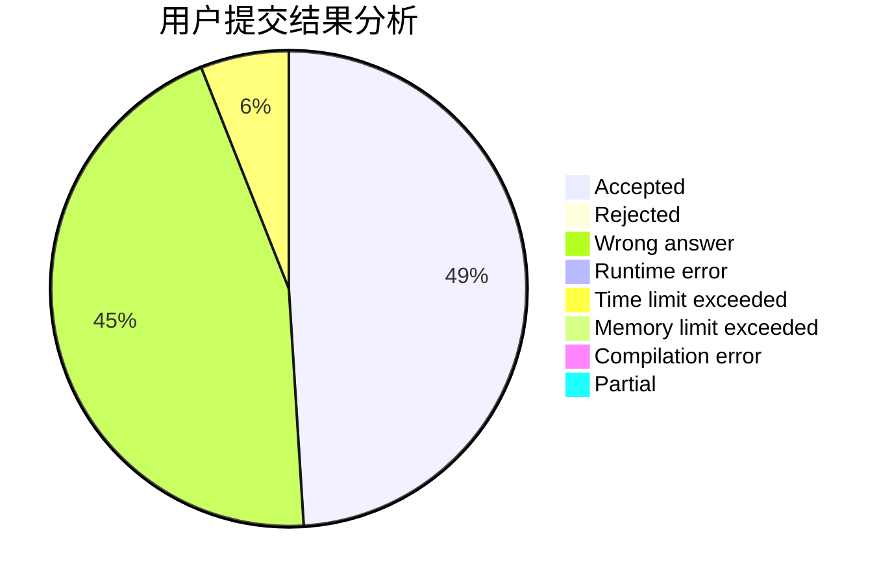
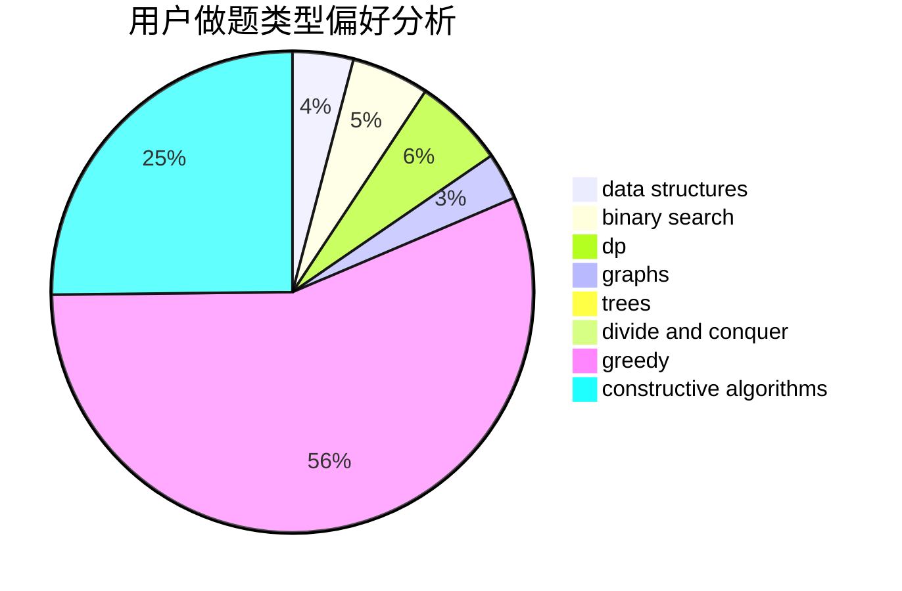
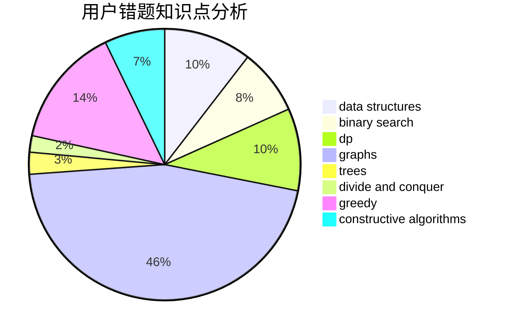

# Imdie

<!-- tabs:start -->

#### **用户提交结果分析**

#### **用户做题类型偏好分析**

#### **用户错题知识点分析**

<!-- tabs:end -->
# 推荐题目
[1460A](https://codeforces.com/contest/1460/problem/A)		dsu,graphs,sortings,trees		  
[780G](https://codeforces.com/contest/780/problem/G)		data structures,
                        dp		  
[1163B1](https://codeforces.com/contest/1163B/problem/1)		data structures,
                        implementation		  
[1384E](https://codeforces.com/contest/1384/problem/E)		dsu,graphs,sortings,trees		  
[729A](https://codeforces.com/contest/729/problem/A)		implementation,
                        strings		  
[719A](https://codeforces.com/contest/719/problem/A)		implementation		  
[1512F](https://codeforces.com/contest/1512/problem/F)		brute force,
                        dp,
                        greedy,
                        implementation		  
[164C](https://codeforces.com/contest/164/problem/C)		flows,
                        graphs		  
[1131E](https://codeforces.com/contest/1131/problem/E)		dp,
                        greedy,
                        strings		  
[567A](https://codeforces.com/contest/567/problem/A)		greedy,
                        implementation		  
