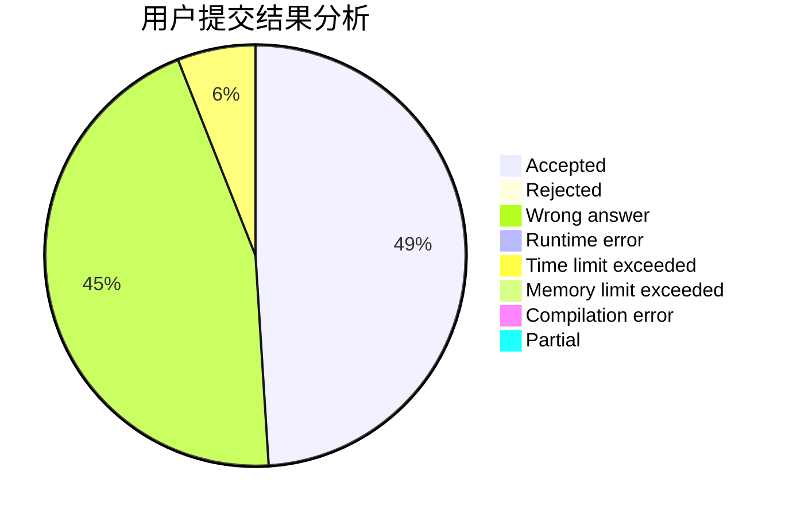
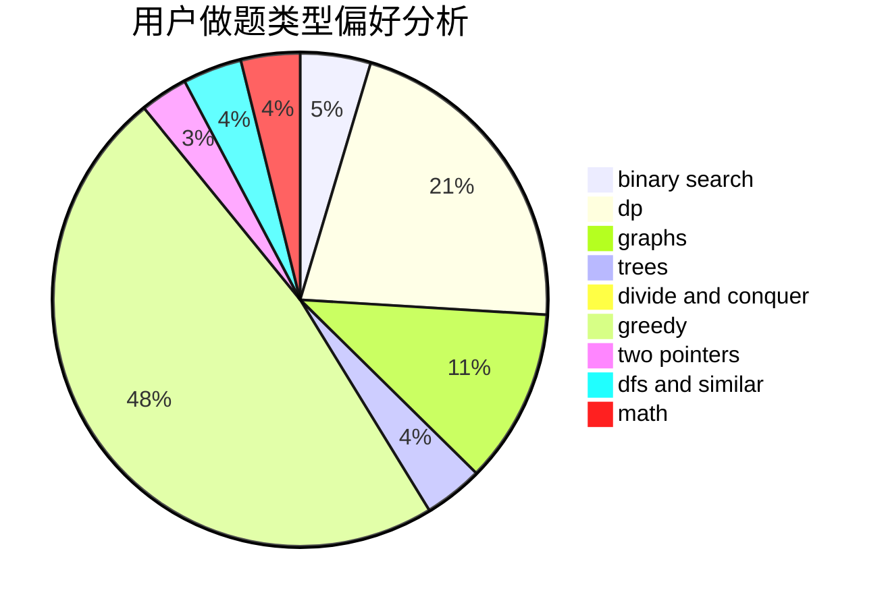

# Imdie

<!-- tabs:start -->

#### **用户提交结果分析**

#### **用户做题类型偏好分析**

<!-- tabs:end -->
# 推荐题目
[1468J](https://codeforces.com/contest/1468/problem/J)
[799F](https://codeforces.com/contest/799/problem/F)
[1164P](https://codeforces.com/contest/1164/problem/P)
[1394E](https://codeforces.com/contest/1394/problem/E)
[746A](https://codeforces.com/contest/746/problem/A)
[736B](https://codeforces.com/contest/736/problem/B)
[171F](https://codeforces.com/contest/171/problem/F)
[18A](https://codeforces.com/contest/18/problem/A)
[1133B](https://codeforces.com/contest/1133/problem/B)
[585F](https://codeforces.com/contest/585/problem/F)
