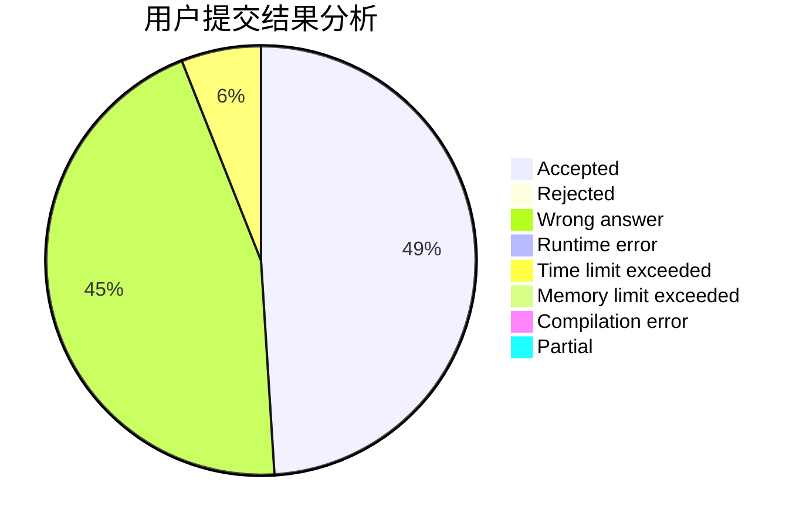
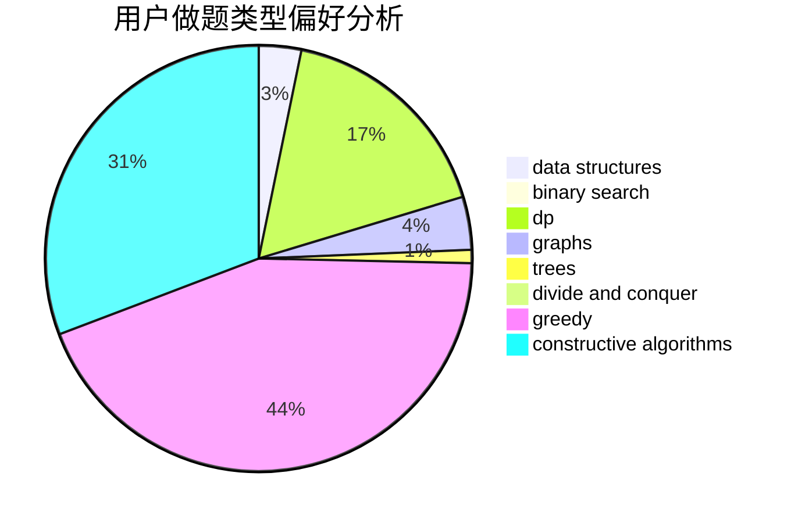
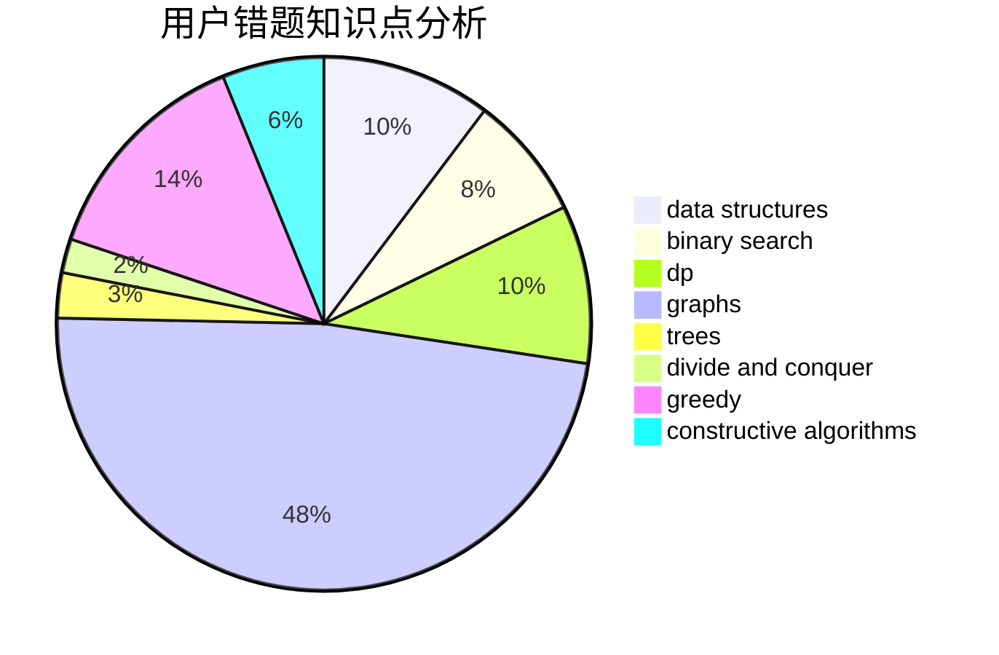

# Imdie

<!-- tabs:start -->

#### **用户提交结果分析**

#### **用户做题类型偏好分析**

#### **用户错题知识点分析**

<!-- tabs:end -->
# 推荐题目
[1468J](https://codeforces.com/contest/1468/problem/J)		dsu,
                        graphs,
                        greedy		  
[799F](https://codeforces.com/contest/799/problem/F)		data structures		  
[1164P](https://codeforces.com/contest/1164/problem/P)		dsu,graphs,sortings,trees		  
[1394E](https://codeforces.com/contest/1394/problem/E)		strings		  
[746A](https://codeforces.com/contest/746/problem/A)		implementation,
                        math		  
[736B](https://codeforces.com/contest/736/problem/B)		dsu,graphs,sortings,trees		  
[171F](https://codeforces.com/contest/171/problem/F)		*special problem,
                        brute force,
                        implementation,
                        number theory		  
[18A](https://codeforces.com/contest/18/problem/A)		brute force,
                        geometry		  
[1133B](https://codeforces.com/contest/1133/problem/B)		math,
                        number theory		  
[585F](https://codeforces.com/contest/585/problem/F)		dp,
                        implementation,
                        strings		  
