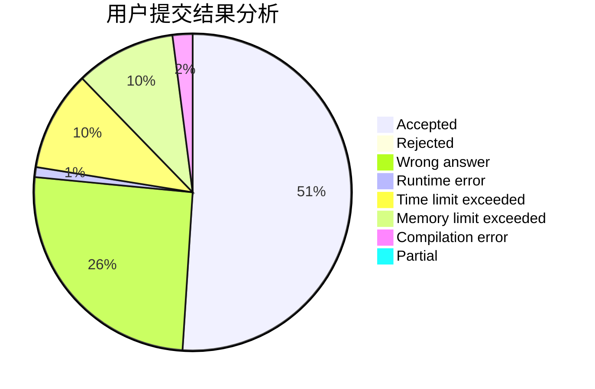
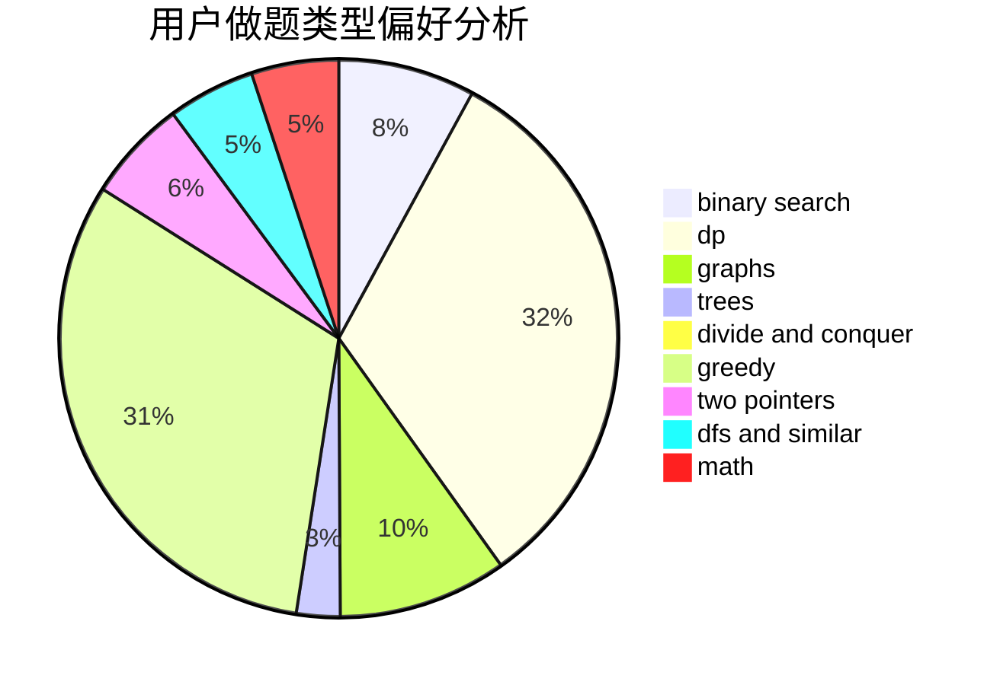

# ImmortaLimit

<!-- tabs:start -->

#### **用户提交结果分析**

#### **用户做题类型偏好分析**

<!-- tabs:end -->
# 推荐题目
[225E](https://codeforces.com/contest/225/problem/E)
[862A](https://codeforces.com/contest/862/problem/A)
[510E](https://codeforces.com/contest/510/problem/E)
[3912](https://codeforces.com/contest/391/problem/2)
[1296D](https://codeforces.com/contest/1296/problem/D)
[701C](https://codeforces.com/contest/701/problem/C)
[798E](https://codeforces.com/contest/798/problem/E)
[117C](https://codeforces.com/contest/117/problem/C)
[273D](https://codeforces.com/contest/273/problem/D)
[935F](https://codeforces.com/contest/935/problem/F)
