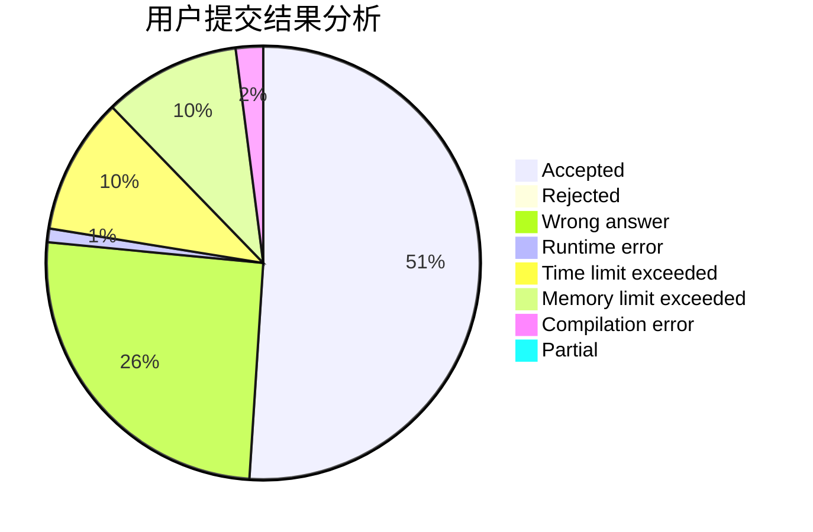
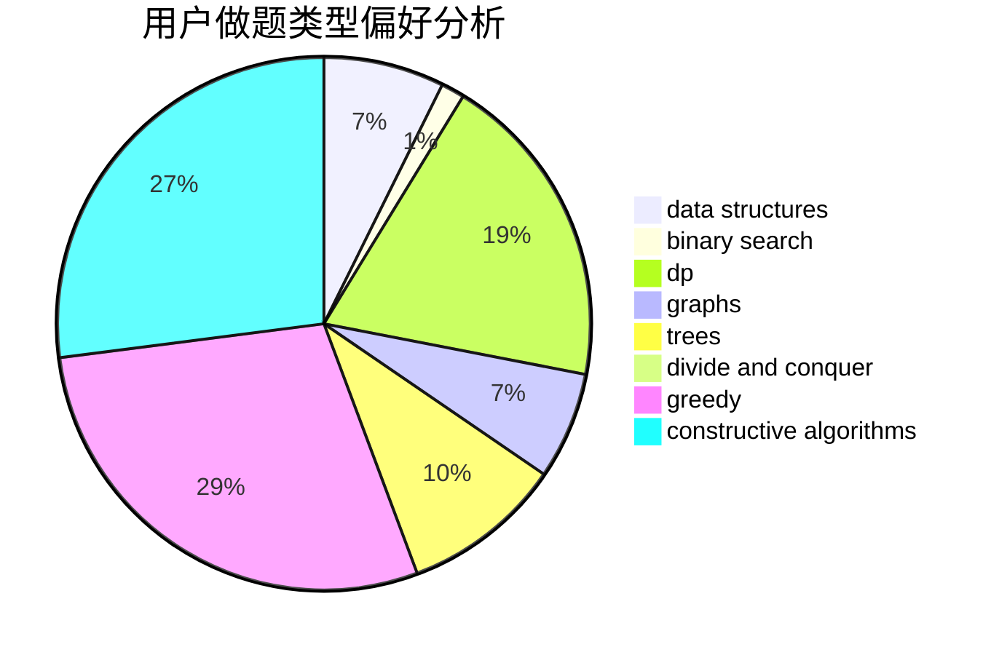
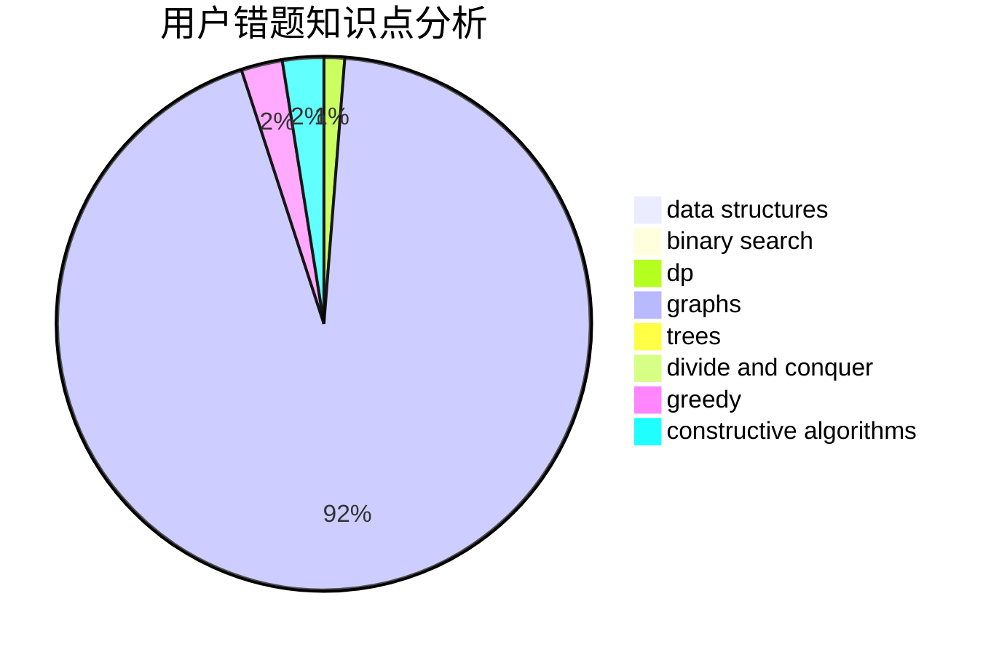

# ImmortaLimit

<!-- tabs:start -->

#### **用户提交结果分析**

#### **用户做题类型偏好分析**

#### **用户错题知识点分析**

<!-- tabs:end -->
# 推荐题目
[200C](https://codeforces.com/contest/200/problem/C)		brute force,
                        implementation		  
[842E](https://codeforces.com/contest/842/problem/E)		binary search,
                        dfs and similar,
                        divide and conquer,
                        graphs,
                        trees		  
[490F](https://codeforces.com/contest/490/problem/F)		data structures,
                        dfs and similar,
                        dp,
                        trees		  
[364C](https://codeforces.com/contest/364/problem/C)		brute force,
                        number theory		  
[1290B](https://codeforces.com/contest/1290/problem/B)		binary search,
                        constructive algorithms,
                        data structures,
                        strings,
                        two pointers		  
[677C](https://codeforces.com/contest/677/problem/C)		bitmasks,
                        combinatorics,
                        implementation,
                        strings		  
[780B](https://codeforces.com/contest/780/problem/B)		binary search		  
[1176E](https://codeforces.com/contest/1176/problem/E)		dfs and similar,
                        dsu,
                        graphs,
                        shortest paths,
                        trees		  
[254D](https://codeforces.com/contest/254/problem/D)		brute force,
                        dfs and similar,
                        graphs,
                        implementation,
                        shortest paths		  
[915G](https://codeforces.com/contest/915/problem/G)		math,
                        number theory		  
