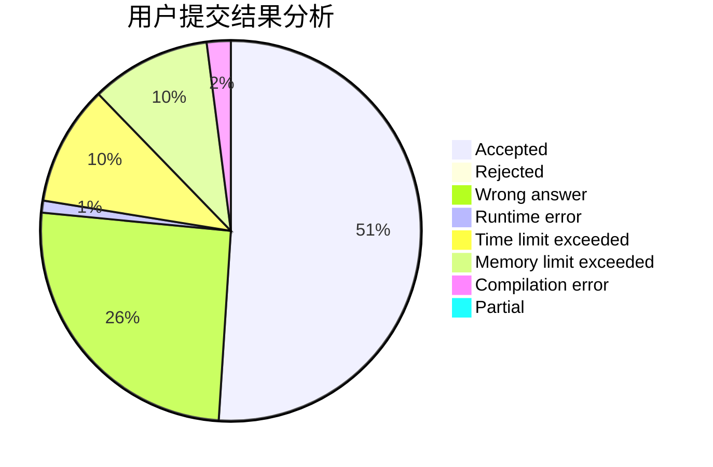
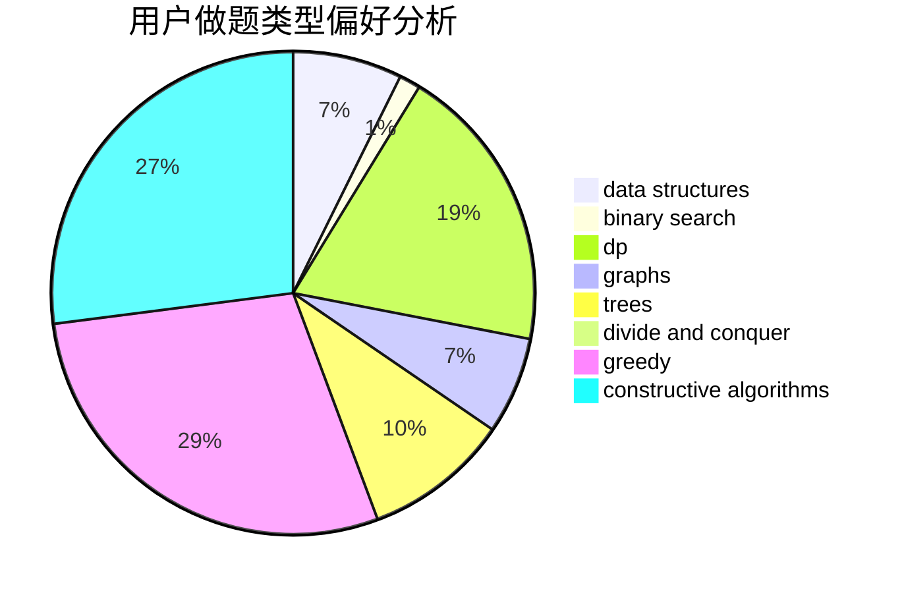
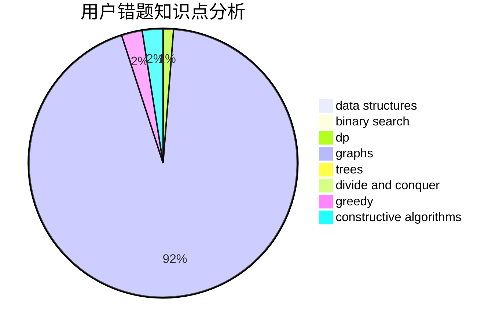

# ImmortaLimit
<!-- tabs:start -->
#### **用户提交结果分析**

#### **用户做题类型偏好分析**

#### **用户错题知识点分析**

<!-- tabs:end -->
# 推荐题目
[Identify the Operations](http://codeforces.com/problemset/problem/1442/B)		combinatorics,
                        data structures,
                        dsu,
                        greedy,
                        implementation		  
[Football Championship](http://codeforces.com/problemset/problem/200/C)		brute force,
                        implementation		  
[Treeland Tour](http://codeforces.com/problemset/problem/490/F)		data structures,
                        dfs and similar,
                        dp,
                        trees		  
[Nikita and game](http://codeforces.com/problemset/problem/842/E)		binary search,
                        dfs and similar,
                        divide and conquer,
                        graphs,
                        trees		  
[Zero Tree](http://codeforces.com/problemset/problem/274/B)		dfs and similar,
                        dp,
                        greedy,
                        trees		  
[Coprime Arrays](http://codeforces.com/problemset/problem/915/G)		math,
                        number theory		  
[Delete from the Left](http://codeforces.com/problemset/problem/1005/B)		brute force,
                        implementation,
                        strings		  
[The Meeting Place Cannot Be Changed](http://codeforces.com/problemset/problem/780/B)		binary search		  
[Rats](http://codeforces.com/problemset/problem/254/D)		brute force,
                        dfs and similar,
                        graphs,
                        implementation,
                        shortest paths		  
[Five Dimensional Points](https://codeforces.com/contest/851/problem/C)		brute force,
                        geometry,
                        math		  
<!-- tabs:start -->
#### **data structures**
[Identify the Operations](http://codeforces.com/problemset/problem/1442/B)		combinatorics,
                        data structures,
                        dsu,
                        greedy,
                        implementation		  
[Football Championship](http://codeforces.com/problemset/problem/490/F)		data structures,
                        dfs and similar,
                        dp,
                        trees		  
[Treeland Tour](http://codeforces.com/problemset/problem/442/D)		data structures,
                        trees		  
[Nikita and game](http://codeforces.com/problemset/problem/1290/B)		binary search,
                        constructive algorithms,
                        data structures,
                        strings,
                        two pointers		  
[Zero Tree](http://codeforces.com/problemset/problem/429/D)		data structures,
                        divide and conquer,
                        geometry		  
[Coprime Arrays](http://codeforces.com/problemset/problem/1156/E)		data structures,
                        divide and conquer,
                        dsu,
                        two pointers		  
[Delete from the Left](http://codeforces.com/problemset/problem/1111/E)		data structures,
                        dfs and similar,
                        dp,
                        graphs,
                        trees		  
[The Meeting Place Cannot Be Changed](https://codeforces.com/contest/1277/problem/F)		brute force,
                        combinatorics,
                        constructive algorithms,
                        data structures,
                        greedy,
                        math		  
[Rats](http://codeforces.com/problemset/problem/1301/E)		binary search,
                        data structures,
                        dp,
                        implementation		  
[Five Dimensional Points](http://codeforces.com/problemset/problem/1310/A)		data structures,
                        greedy,
                        sortings		  
#### **binary search**
[Identify the Operations](http://codeforces.com/problemset/problem/842/E)		binary search,
                        dfs and similar,
                        divide and conquer,
                        graphs,
                        trees		  
[Football Championship](http://codeforces.com/problemset/problem/780/B)		binary search		  
[Treeland Tour](http://codeforces.com/problemset/problem/1290/B)		binary search,
                        constructive algorithms,
                        data structures,
                        strings,
                        two pointers		  
[Nikita and game](http://codeforces.com/problemset/problem/1301/E)		binary search,
                        data structures,
                        dp,
                        implementation		  
[Zero Tree](http://codeforces.com/problemset/problem/1492/C)		binary search,
                        data structures,
                        dp,
                        greedy,
                        two pointers		  
[Coprime Arrays](http://codeforces.com/problemset/problem/1463/D)		binary search,
                        constructive algorithms,
                        greedy,
                        two pointers		  
[Delete from the Left](http://codeforces.com/problemset/problem/1490/G)		binary search,
                        data structures,
                        math		  
[The Meeting Place Cannot Be Changed](http://codeforces.com/problemset/problem/1479/D)		binary search,
                        bitmasks,
                        brute force,
                        data structures,
                        probabilities,
                        trees		  
[Rats](http://codeforces.com/problemset/problem/1436/E)		binary search,
                        data structures,
                        two pointers		  
[Five Dimensional Points](http://codeforces.com/problemset/problem/1461/D)		binary search,
                        brute force,
                        data structures,
                        divide and conquer,
                        implementation,
                        sortings		  
#### **dp**
[Identify the Operations](http://codeforces.com/problemset/problem/490/F)		data structures,
                        dfs and similar,
                        dp,
                        trees		  
[Football Championship](http://codeforces.com/problemset/problem/274/B)		dfs and similar,
                        dp,
                        greedy,
                        trees		  
[Treeland Tour](http://codeforces.com/problemset/problem/1111/E)		data structures,
                        dfs and similar,
                        dp,
                        graphs,
                        trees		  
[Nikita and game](http://codeforces.com/problemset/problem/1301/E)		binary search,
                        data structures,
                        dp,
                        implementation		  
[Zero Tree](http://codeforces.com/problemset/problem/1253/E)		data structures,
                        dp,
                        greedy,
                        sortings		  
[Coprime Arrays](http://codeforces.com/problemset/problem/1492/C)		binary search,
                        data structures,
                        dp,
                        greedy,
                        two pointers		  
[Delete from the Left](https://codeforces.com/contest/1457/problem/C)		brute force,
                        dp,
                        implementation		  
[The Meeting Place Cannot Be Changed](http://codeforces.com/problemset/problem/1491/C)		brute force,
                        data structures,
                        dp,
                        greedy,
                        implementation		  
[Rats](http://codeforces.com/problemset/problem/1437/C)		dp,
                        flows,
                        graph matchings,
                        greedy,
                        math,
                        sortings		  
[Five Dimensional Points](http://codeforces.com/problemset/problem/1499/B)		brute force,
                        dp,
                        greedy,
                        implementation		  
#### **graph**
[Identify the Operations](http://codeforces.com/problemset/problem/842/E)		binary search,
                        dfs and similar,
                        divide and conquer,
                        graphs,
                        trees		  
[Football Championship](http://codeforces.com/problemset/problem/254/D)		brute force,
                        dfs and similar,
                        graphs,
                        implementation,
                        shortest paths		  
[Treeland Tour](https://codeforces.com/contest/403/problem/C)		graphs,
                        math		  
[Nikita and game](http://codeforces.com/problemset/problem/1176/E)		dfs and similar,
                        dsu,
                        graphs,
                        shortest paths,
                        trees		  
[Zero Tree](https://codeforces.com/contest/742/problem/E)		constructive algorithms,
                        dfs and similar,
                        graphs		  
[Coprime Arrays](http://codeforces.com/problemset/problem/1111/E)		data structures,
                        dfs and similar,
                        dp,
                        graphs,
                        trees		  
[Delete from the Left](http://codeforces.com/problemset/problem/915/F)		data structures,
                        dsu,
                        graphs,
                        trees		  
[The Meeting Place Cannot Be Changed](http://codeforces.com/problemset/problem/1176/D)		dfs and similar,
                        graphs,
                        greedy,
                        number theory,
                        sortings		  
[Rats](http://codeforces.com/problemset/problem/1487/C)		brute force,
                        constructive algorithms,
                        dfs and similar,
                        graphs,
                        greedy,
                        implementation,
                        math		  
[Five Dimensional Points](http://codeforces.com/problemset/problem/1437/C)		dp,
                        flows,
                        graph matchings,
                        greedy,
                        math,
                        sortings		  
#### **trees**
[Identify the Operations](http://codeforces.com/problemset/problem/490/F)		data structures,
                        dfs and similar,
                        dp,
                        trees		  
[Football Championship](http://codeforces.com/problemset/problem/842/E)		binary search,
                        dfs and similar,
                        divide and conquer,
                        graphs,
                        trees		  
[Treeland Tour](http://codeforces.com/problemset/problem/274/B)		dfs and similar,
                        dp,
                        greedy,
                        trees		  
[Nikita and game](http://codeforces.com/problemset/problem/442/D)		data structures,
                        trees		  
[Zero Tree](http://codeforces.com/problemset/problem/1176/E)		dfs and similar,
                        dsu,
                        graphs,
                        shortest paths,
                        trees		  
[Coprime Arrays](http://codeforces.com/problemset/problem/1111/E)		data structures,
                        dfs and similar,
                        dp,
                        graphs,
                        trees		  
[Delete from the Left](http://codeforces.com/problemset/problem/915/F)		data structures,
                        dsu,
                        graphs,
                        trees		  
[The Meeting Place Cannot Be Changed](http://codeforces.com/problemset/problem/1479/D)		binary search,
                        bitmasks,
                        brute force,
                        data structures,
                        probabilities,
                        trees		  
[Rats](http://codeforces.com/problemset/problem/1511/C)		brute force,
                        data structures,
                        implementation,
                        trees		  
[Five Dimensional Points](http://codeforces.com/problemset/problem/1499/F)		combinatorics,
                        dfs and similar,
                        dp,
                        trees		  
#### **divide and conquer**
[Identify the Operations](http://codeforces.com/problemset/problem/842/E)		binary search,
                        dfs and similar,
                        divide and conquer,
                        graphs,
                        trees		  
[Football Championship](http://codeforces.com/problemset/problem/429/D)		data structures,
                        divide and conquer,
                        geometry		  
[Treeland Tour](http://codeforces.com/problemset/problem/1156/E)		data structures,
                        divide and conquer,
                        dsu,
                        two pointers		  
[Nikita and game](http://codeforces.com/problemset/problem/1461/D)		binary search,
                        brute force,
                        data structures,
                        divide and conquer,
                        implementation,
                        sortings		  
[Zero Tree](http://codeforces.com/problemset/problem/1466/G)		combinatorics,
                        divide and conquer,
                        hashing,
                        math,
                        string suffix structures,
                        strings		  
[Coprime Arrays](http://codeforces.com/problemset/problem/1490/D)		dfs and similar,
                        divide and conquer,
                        implementation		  
[Delete from the Left](https://codeforces.com/contest/1483/problem/C)		data structures,
                        divide and conquer,
                        dp		  
[The Meeting Place Cannot Be Changed](http://codeforces.com/problemset/problem/1491/E)		brute force,
                        dfs and similar,
                        divide and conquer,
                        number theory,
                        trees		  
[Rats](http://codeforces.com/problemset/problem/1303/G)		data structures,
                        divide and conquer,
                        geometry,
                        trees		  
[Five Dimensional Points](http://codeforces.com/problemset/problem/1494/D)		constructive algorithms,
                        data structures,
                        dfs and similar,
                        divide and conquer,
                        dsu,
                        greedy,
                        sortings,
                        trees		  
#### **greedy**
[Identify the Operations](http://codeforces.com/problemset/problem/1442/B)		combinatorics,
                        data structures,
                        dsu,
                        greedy,
                        implementation		  
[Football Championship](http://codeforces.com/problemset/problem/274/B)		dfs and similar,
                        dp,
                        greedy,
                        trees		  
[Treeland Tour](http://codeforces.com/problemset/problem/16/B)		greedy,
                        implementation,
                        sortings		  
[Nikita and game](https://codeforces.com/contest/1277/problem/F)		brute force,
                        combinatorics,
                        constructive algorithms,
                        data structures,
                        greedy,
                        math		  
[Zero Tree](http://codeforces.com/problemset/problem/1155/B)		games,
                        greedy,
                        implementation		  
[Coprime Arrays](http://codeforces.com/problemset/problem/464/A)		greedy,
                        strings		  
[Delete from the Left](http://codeforces.com/problemset/problem/1310/A)		data structures,
                        greedy,
                        sortings		  
[The Meeting Place Cannot Be Changed](http://codeforces.com/problemset/problem/1178/A)		greedy		  
[Rats](http://codeforces.com/problemset/problem/1253/E)		data structures,
                        dp,
                        greedy,
                        sortings		  
[Five Dimensional Points](http://codeforces.com/problemset/problem/1176/D)		dfs and similar,
                        graphs,
                        greedy,
                        number theory,
                        sortings		  
#### **constructive algorithms**
[Identify the Operations](https://codeforces.com/contest/312/problem/C)		constructive algorithms,
                        implementation		  
[Football Championship](http://codeforces.com/problemset/problem/1290/B)		binary search,
                        constructive algorithms,
                        data structures,
                        strings,
                        two pointers		  
[Treeland Tour](https://codeforces.com/contest/742/problem/E)		constructive algorithms,
                        dfs and similar,
                        graphs		  
[Nikita and game](https://codeforces.com/contest/1277/problem/F)		brute force,
                        combinatorics,
                        constructive algorithms,
                        data structures,
                        greedy,
                        math		  
[Zero Tree](http://codeforces.com/problemset/problem/1438/C)		2-sat,
                        chinese remainder theorem,
                        constructive algorithms,
                        fft,
                        flows		  
[Coprime Arrays](http://codeforces.com/problemset/problem/1493/A)		constructive algorithms,
                        greedy		  
[Delete from the Left](http://codeforces.com/problemset/problem/1463/D)		binary search,
                        constructive algorithms,
                        greedy,
                        two pointers		  
[The Meeting Place Cannot Be Changed](https://codeforces.com/contest/1456/problem/B)		bitmasks,
                        brute force,
                        constructive algorithms		  
[Rats](http://codeforces.com/problemset/problem/1492/D)		bitmasks,
                        constructive algorithms,
                        greedy,
                        math		  
[Five Dimensional Points](https://codeforces.com/contest/1504/problem/D)		constructive algorithms,
                        games,
                        interactive		  
#### **sortings**
[Identify the Operations](http://codeforces.com/problemset/problem/16/B)		greedy,
                        implementation,
                        sortings		  
[Football Championship](http://codeforces.com/problemset/problem/1310/A)		data structures,
                        greedy,
                        sortings		  
[Treeland Tour](http://codeforces.com/problemset/problem/1253/E)		data structures,
                        dp,
                        greedy,
                        sortings		  
[Nikita and game](http://codeforces.com/problemset/problem/1176/D)		dfs and similar,
                        graphs,
                        greedy,
                        number theory,
                        sortings		  
[Zero Tree](https://codeforces.com/contest/1496/problem/C)		geometry,
                        greedy,
                        math,
                        sortings		  
[Coprime Arrays](http://codeforces.com/problemset/problem/1495/A)		geometry,
                        greedy,
                        math,
                        sortings		  
[Delete from the Left](http://codeforces.com/problemset/problem/1497/A)		brute force,
                        data structures,
                        greedy,
                        sortings		  
[The Meeting Place Cannot Be Changed](http://codeforces.com/problemset/problem/1427/A)		math,
                        sortings		  
[Rats](http://codeforces.com/problemset/problem/1461/D)		binary search,
                        brute force,
                        data structures,
                        divide and conquer,
                        implementation,
                        sortings		  
[Five Dimensional Points](http://codeforces.com/problemset/problem/1437/C)		dp,
                        flows,
                        graph matchings,
                        greedy,
                        math,
                        sortings		  
<!-- tabs:end -->
