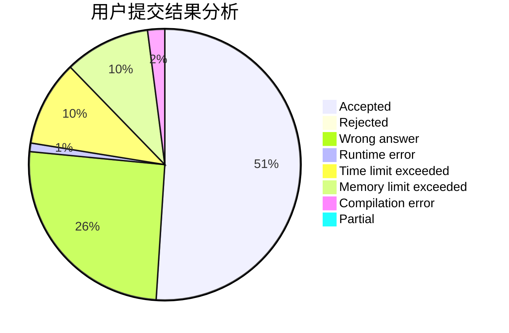
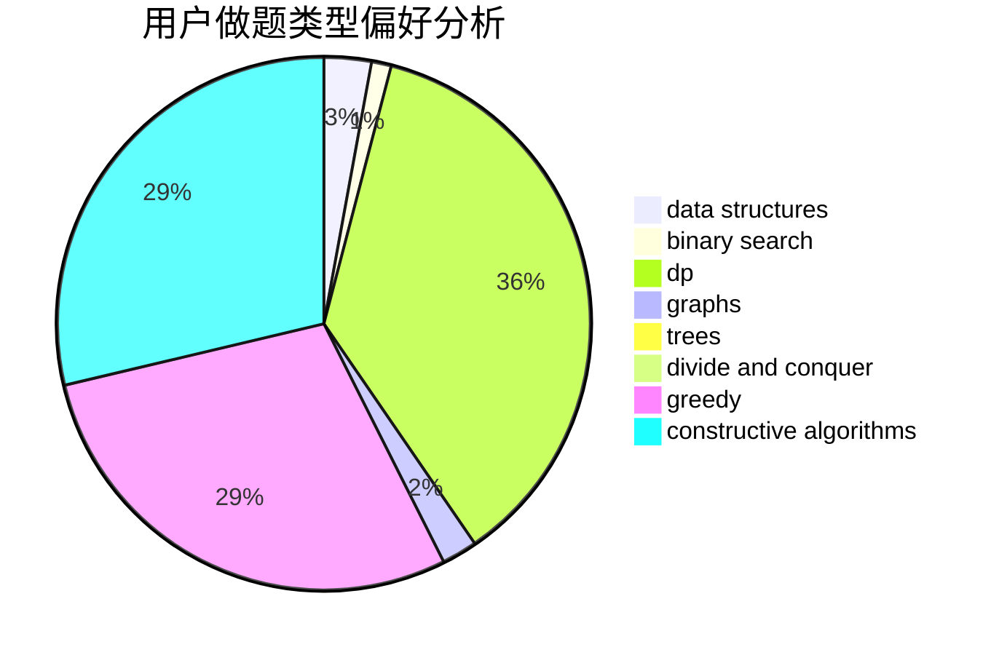
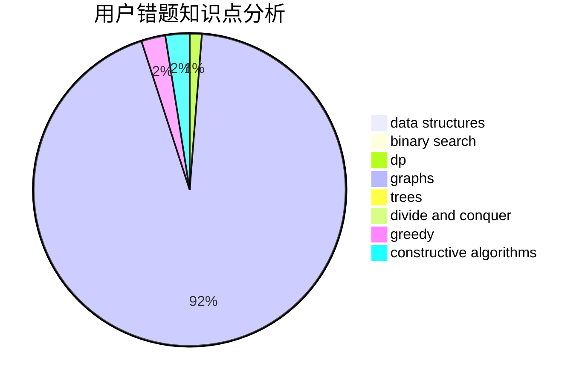

# ImmortaLimit

<!-- tabs:start -->

#### **用户提交结果分析**

#### **用户做题类型偏好分析**

#### **用户错题知识点分析**

<!-- tabs:end -->
# 推荐题目
[225E](https://codeforces.com/contest/225/problem/E)		math,
                        number theory		  
[862A](https://codeforces.com/contest/862/problem/A)		greedy,
                        implementation		  
[510E](https://codeforces.com/contest/510/problem/E)		flows		  
[3912](https://codeforces.com/contest/391/problem/2)		dsu,graphs,sortings,trees		  
[1296D](https://codeforces.com/contest/1296/problem/D)		greedy,
                        sortings		  
[701C](https://codeforces.com/contest/701/problem/C)		binary search,
                        strings,
                        two pointers		  
[798E](https://codeforces.com/contest/798/problem/E)		constructive algorithms,
                        data structures,
                        graphs,
                        sortings		  
[117C](https://codeforces.com/contest/117/problem/C)		dfs and similar,
                        graphs		  
[273D](https://codeforces.com/contest/273/problem/D)		dp		  
[935F](https://codeforces.com/contest/935/problem/F)		data structures,
                        greedy		  
