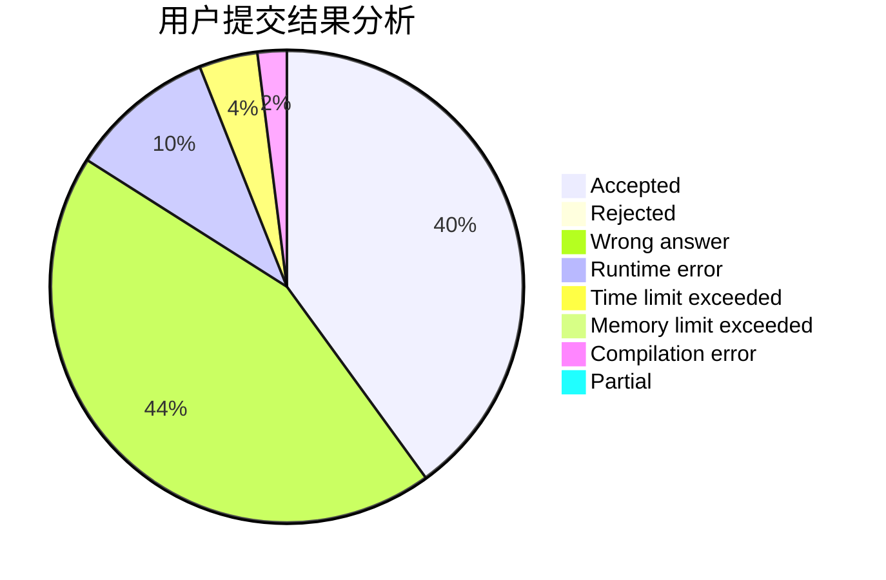
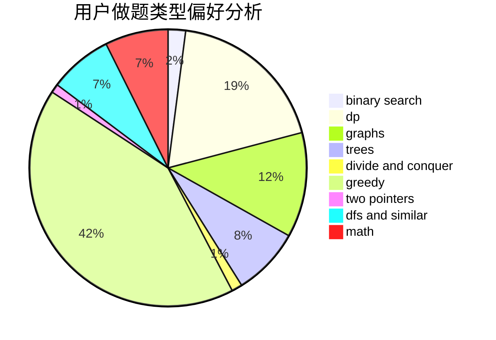

# ImmortalBird

<!-- tabs:start -->

#### **用户提交结果分析**

#### **用户做题类型偏好分析**

<!-- tabs:end -->
# 推荐题目
[1459E](https://codeforces.com/contest/1459/problem/E)
[1267I](https://codeforces.com/contest/1267/problem/I)
[1132B](https://codeforces.com/contest/1132/problem/B)
[25A](https://codeforces.com/contest/25/problem/A)
[201C](https://codeforces.com/contest/201/problem/C)
[234A](https://codeforces.com/contest/234/problem/A)
[936A](https://codeforces.com/contest/936/problem/A)
[218B](https://codeforces.com/contest/218/problem/B)
[834C](https://codeforces.com/contest/834/problem/C)
[936B](https://codeforces.com/contest/936/problem/B)
