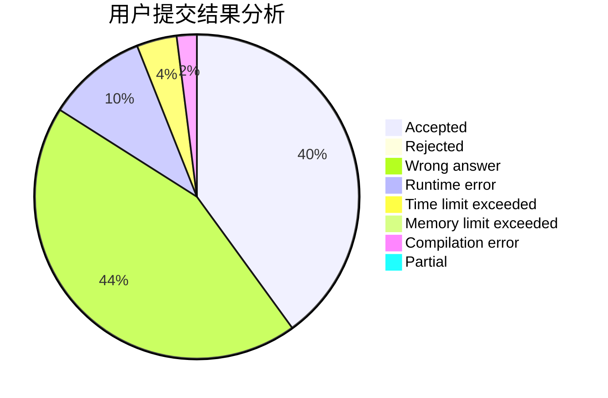
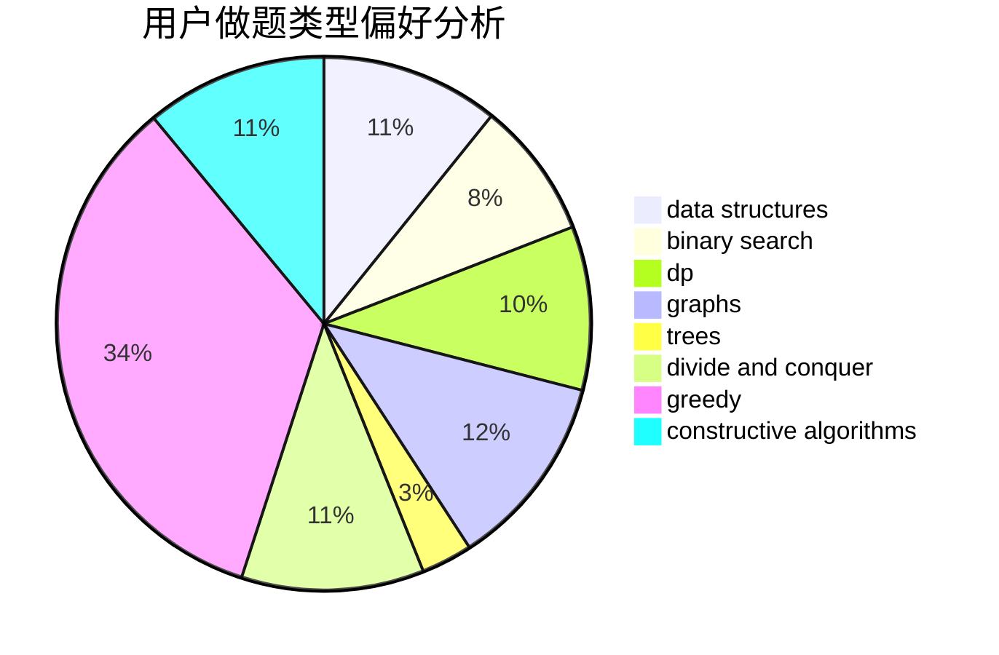
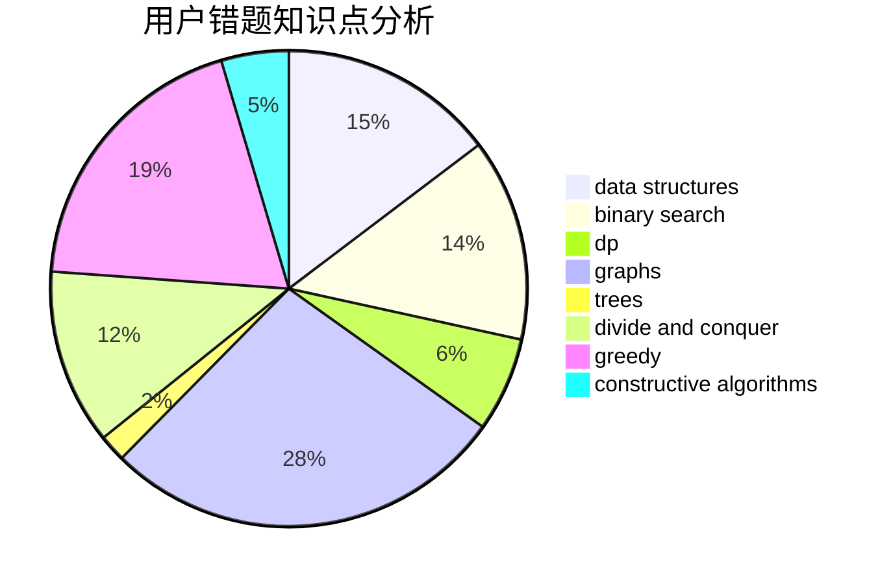

# ImmortalBird
<!-- tabs:start -->
#### **用户提交结果分析**

#### **用户做题类型偏好分析**

#### **用户错题知识点分析**

<!-- tabs:end -->
# 推荐题目
[New Colony](http://codeforces.com/problemset/problem/1481/B)		brute force,
                        greedy,
                        implementation		  
[Multithreading (Easy Version)](http://codeforces.com/problemset/problem/1450/H1)		combinatorics,
                        fft,
                        math		  
[DZY Loves Colors](http://codeforces.com/problemset/problem/444/C)		data structures		  
[Let's Play Osu!](https://codeforces.com/contest/236/problem/D)		dp,
                        math,
                        probabilities		  
[Card Game Again](http://codeforces.com/problemset/problem/818/E)		binary search,
                        data structures,
                        number theory,
                        two pointers		  
[Jamie and Alarm Snooze](http://codeforces.com/problemset/problem/916/A)		brute force,
                        implementation,
                        math		  
[Math Problem](https://codeforces.com/contest/1262/problem/A)		math		  
[Water Buying](https://codeforces.com/contest/1489/problem/B)		math		  
[After Training](http://codeforces.com/problemset/problem/195/B)		data structures,
                        implementation,
                        math		  
[Karen and Supermarket](http://codeforces.com/problemset/problem/815/C)		brute force,
                        dp,
                        trees		  
<!-- tabs:start -->
#### **data structures**
[New Colony](http://codeforces.com/problemset/problem/444/C)		data structures		  
[Multithreading (Easy Version)](http://codeforces.com/problemset/problem/818/E)		binary search,
                        data structures,
                        number theory,
                        two pointers		  
[DZY Loves Colors](http://codeforces.com/problemset/problem/195/B)		data structures,
                        implementation,
                        math		  
[Let's Play Osu!](http://codeforces.com/problemset/problem/869/E)		data structures,
                        hashing		  
[Card Game Again](http://codeforces.com/problemset/problem/103/D)		brute force,
                        data structures,
                        sortings		  
[Jamie and Alarm Snooze](http://codeforces.com/problemset/problem/878/C)		data structures,
                        graphs		  
[Math Problem](http://codeforces.com/problemset/problem/1329/D)		constructive algorithms,
                        data structures		  
[Water Buying](http://codeforces.com/problemset/problem/1492/C)		binary search,
                        data structures,
                        dp,
                        greedy,
                        two pointers		  
[After Training](http://codeforces.com/problemset/problem/1490/G)		binary search,
                        data structures,
                        math		  
[Karen and Supermarket](http://codeforces.com/problemset/problem/1479/D)		binary search,
                        bitmasks,
                        brute force,
                        data structures,
                        probabilities,
                        trees		  
#### **binary search**
[New Colony](http://codeforces.com/problemset/problem/818/E)		binary search,
                        data structures,
                        number theory,
                        two pointers		  
[Multithreading (Easy Version)](http://codeforces.com/problemset/problem/1492/C)		binary search,
                        data structures,
                        dp,
                        greedy,
                        two pointers		  
[DZY Loves Colors](http://codeforces.com/problemset/problem/1463/D)		binary search,
                        constructive algorithms,
                        greedy,
                        two pointers		  
[Let's Play Osu!](http://codeforces.com/problemset/problem/1490/G)		binary search,
                        data structures,
                        math		  
[Card Game Again](http://codeforces.com/problemset/problem/1479/D)		binary search,
                        bitmasks,
                        brute force,
                        data structures,
                        probabilities,
                        trees		  
[Jamie and Alarm Snooze](http://codeforces.com/problemset/problem/1436/E)		binary search,
                        data structures,
                        two pointers		  
[Math Problem](http://codeforces.com/problemset/problem/1461/D)		binary search,
                        brute force,
                        data structures,
                        divide and conquer,
                        implementation,
                        sortings		  
[Water Buying](http://codeforces.com/problemset/problem/1493/C)		binary search,
                        brute force,
                        constructive algorithms,
                        greedy,
                        strings		  
[After Training](http://codeforces.com/problemset/problem/1487/D)		binary search,
                        brute force,
                        math,
                        number theory		  
[Karen and Supermarket](http://codeforces.com/problemset/problem/1486/B)		binary search,
                        geometry,
                        shortest paths,
                        sortings		  
#### **dp**
[New Colony](https://codeforces.com/contest/236/problem/D)		dp,
                        math,
                        probabilities		  
[Multithreading (Easy Version)](http://codeforces.com/problemset/problem/815/C)		brute force,
                        dp,
                        trees		  
[DZY Loves Colors](http://codeforces.com/problemset/problem/176/D)		dp		  
[Let's Play Osu!](http://codeforces.com/problemset/problem/455/C)		dfs and similar,
                        dp,
                        dsu,
                        ternary search,
                        trees		  
[Card Game Again](https://codeforces.com/contest/701/problem/E)		dfs and similar,
                        dp,
                        graphs,
                        trees		  
[Jamie and Alarm Snooze](http://codeforces.com/problemset/problem/212/C)		combinatorics,
                        dp,
                        math		  
[Math Problem](http://codeforces.com/problemset/problem/703/E)		dp,
                        number theory		  
[Water Buying](http://codeforces.com/problemset/problem/86/C)		dp,
                        string suffix structures,
                        trees		  
[After Training](http://codeforces.com/problemset/problem/1404/B)		dfs and similar,
                        dp,
                        games,
                        trees		  
[Karen and Supermarket](http://codeforces.com/problemset/problem/1475/B)		brute force,
                        dp,
                        math		  
#### **graph**
[New Colony](http://codeforces.com/problemset/problem/737/E)		graph matchings,
                        graphs,
                        greedy,
                        schedules		  
[Multithreading (Easy Version)](http://codeforces.com/problemset/problem/869/D)		brute force,
                        dfs and similar,
                        graphs		  
[DZY Loves Colors](https://codeforces.com/contest/701/problem/E)		dfs and similar,
                        dp,
                        graphs,
                        trees		  
[Let's Play Osu!](http://codeforces.com/problemset/problem/878/C)		data structures,
                        graphs		  
[Card Game Again](http://codeforces.com/problemset/problem/1263/D)		dfs and similar,
                        dsu,
                        graphs		  
[Jamie and Alarm Snooze](http://codeforces.com/problemset/problem/1487/C)		brute force,
                        constructive algorithms,
                        dfs and similar,
                        graphs,
                        greedy,
                        implementation,
                        math		  
[Math Problem](http://codeforces.com/problemset/problem/1437/C)		dp,
                        flows,
                        graph matchings,
                        greedy,
                        math,
                        sortings		  
[Water Buying](http://codeforces.com/problemset/problem/1470/D)		constructive algorithms,
                        dfs and similar,
                        graph matchings,
                        graphs,
                        greedy		  
[After Training](http://codeforces.com/problemset/problem/1476/C)		dp,
                        graphs,
                        greedy		  
[Karen and Supermarket](http://codeforces.com/problemset/problem/1304/D)		constructive algorithms,
                        graphs,
                        greedy,
                        two pointers		  
#### **trees**
[New Colony](http://codeforces.com/problemset/problem/815/C)		brute force,
                        dp,
                        trees		  
[Multithreading (Easy Version)](http://codeforces.com/problemset/problem/455/C)		dfs and similar,
                        dp,
                        dsu,
                        ternary search,
                        trees		  
[DZY Loves Colors](https://codeforces.com/contest/701/problem/E)		dfs and similar,
                        dp,
                        graphs,
                        trees		  
[Let's Play Osu!](http://codeforces.com/problemset/problem/86/C)		dp,
                        string suffix structures,
                        trees		  
[Card Game Again](http://codeforces.com/problemset/problem/1118/F1)		dfs and similar,
                        trees		  
[Jamie and Alarm Snooze](http://codeforces.com/problemset/problem/1404/B)		dfs and similar,
                        dp,
                        games,
                        trees		  
[Math Problem](http://codeforces.com/problemset/problem/1479/D)		binary search,
                        bitmasks,
                        brute force,
                        data structures,
                        probabilities,
                        trees		  
[Water Buying](http://codeforces.com/problemset/problem/1511/C)		brute force,
                        data structures,
                        implementation,
                        trees		  
[After Training](http://codeforces.com/problemset/problem/1499/F)		combinatorics,
                        dfs and similar,
                        dp,
                        trees		  
[Karen and Supermarket](http://codeforces.com/problemset/problem/1491/E)		brute force,
                        dfs and similar,
                        divide and conquer,
                        number theory,
                        trees		  
#### **divide and conquer**
[New Colony](http://codeforces.com/problemset/problem/1461/D)		binary search,
                        brute force,
                        data structures,
                        divide and conquer,
                        implementation,
                        sortings		  
[Multithreading (Easy Version)](http://codeforces.com/problemset/problem/1466/G)		combinatorics,
                        divide and conquer,
                        hashing,
                        math,
                        string suffix structures,
                        strings		  
[DZY Loves Colors](http://codeforces.com/problemset/problem/1490/D)		dfs and similar,
                        divide and conquer,
                        implementation		  
[Let's Play Osu!](https://codeforces.com/contest/1483/problem/C)		data structures,
                        divide and conquer,
                        dp		  
[Card Game Again](http://codeforces.com/problemset/problem/1491/E)		brute force,
                        dfs and similar,
                        divide and conquer,
                        number theory,
                        trees		  
[Jamie and Alarm Snooze](http://codeforces.com/problemset/problem/1303/G)		data structures,
                        divide and conquer,
                        geometry,
                        trees		  
[Math Problem](http://codeforces.com/problemset/problem/1494/D)		constructive algorithms,
                        data structures,
                        dfs and similar,
                        divide and conquer,
                        dsu,
                        greedy,
                        sortings,
                        trees		  
[Water Buying](http://codeforces.com/problemset/problem/1482/E)		data structures,
                        divide and conquer,
                        dp		  
[After Training](http://codeforces.com/problemset/problem/566/C)		dfs and similar,
                        divide and conquer,
                        trees		  
[Karen and Supermarket](http://codeforces.com/problemset/problem/1428/F)		binary search,
                        data structures,
                        divide and conquer,
                        dp,
                        two pointers		  
#### **greedy**
[New Colony](http://codeforces.com/problemset/problem/1481/B)		brute force,
                        greedy,
                        implementation		  
[Multithreading (Easy Version)](http://codeforces.com/problemset/problem/737/E)		graph matchings,
                        graphs,
                        greedy,
                        schedules		  
[DZY Loves Colors](http://codeforces.com/problemset/problem/215/B)		greedy,
                        math		  
[Let's Play Osu!](http://codeforces.com/problemset/problem/1130/B)		greedy		  
[Card Game Again](http://codeforces.com/problemset/problem/916/B)		bitmasks,
                        greedy,
                        math		  
[Jamie and Alarm Snooze](https://codeforces.com/contest/1130/problem/D2)		brute force,
                        greedy		  
[Math Problem](http://codeforces.com/problemset/problem/1070/F)		greedy		  
[Water Buying](http://codeforces.com/problemset/problem/1252/E)		greedy,
                        two pointers		  
[After Training](http://codeforces.com/problemset/problem/1173/B)		constructive algorithms,
                        greedy		  
[Karen and Supermarket](http://codeforces.com/problemset/problem/1176/A)		brute force,
                        greedy,
                        implementation		  
#### **constructive algorithms**
[New Colony](http://codeforces.com/problemset/problem/634/A)		constructive algorithms,
                        implementation		  
[Multithreading (Easy Version)](http://codeforces.com/problemset/problem/1173/B)		constructive algorithms,
                        greedy		  
[DZY Loves Colors](http://codeforces.com/problemset/problem/1364/C)		brute force,
                        constructive algorithms,
                        greedy		  
[Let's Play Osu!](http://codeforces.com/problemset/problem/1329/D)		constructive algorithms,
                        data structures		  
[Card Game Again](http://codeforces.com/problemset/problem/1118/C)		constructive algorithms,
                        implementation		  
[Jamie and Alarm Snooze](http://codeforces.com/problemset/problem/1513/E)		combinatorics,
                        constructive algorithms,
                        math,
                        sortings		  
[Math Problem](http://codeforces.com/problemset/problem/1493/A)		constructive algorithms,
                        greedy		  
[Water Buying](http://codeforces.com/problemset/problem/1463/D)		binary search,
                        constructive algorithms,
                        greedy,
                        two pointers		  
[After Training](https://codeforces.com/contest/1456/problem/B)		bitmasks,
                        brute force,
                        constructive algorithms		  
[Karen and Supermarket](http://codeforces.com/problemset/problem/1492/D)		bitmasks,
                        constructive algorithms,
                        greedy,
                        math		  
#### **sortings**
[New Colony](http://codeforces.com/problemset/problem/15/A)		implementation,
                        sortings		  
[Multithreading (Easy Version)](http://codeforces.com/problemset/problem/103/D)		brute force,
                        data structures,
                        sortings		  
[DZY Loves Colors](http://codeforces.com/problemset/problem/632/C)		sortings,
                        strings		  
[Let's Play Osu!](http://codeforces.com/problemset/problem/1513/E)		combinatorics,
                        constructive algorithms,
                        math,
                        sortings		  
[Card Game Again](https://codeforces.com/contest/1496/problem/C)		geometry,
                        greedy,
                        math,
                        sortings		  
[Jamie and Alarm Snooze](http://codeforces.com/problemset/problem/1495/A)		geometry,
                        greedy,
                        math,
                        sortings		  
[Math Problem](http://codeforces.com/problemset/problem/1497/A)		brute force,
                        data structures,
                        greedy,
                        sortings		  
[Water Buying](http://codeforces.com/problemset/problem/1427/A)		math,
                        sortings		  
[After Training](http://codeforces.com/problemset/problem/1461/D)		binary search,
                        brute force,
                        data structures,
                        divide and conquer,
                        implementation,
                        sortings		  
[Karen and Supermarket](http://codeforces.com/problemset/problem/1437/C)		dp,
                        flows,
                        graph matchings,
                        greedy,
                        math,
                        sortings		  
<!-- tabs:end -->
