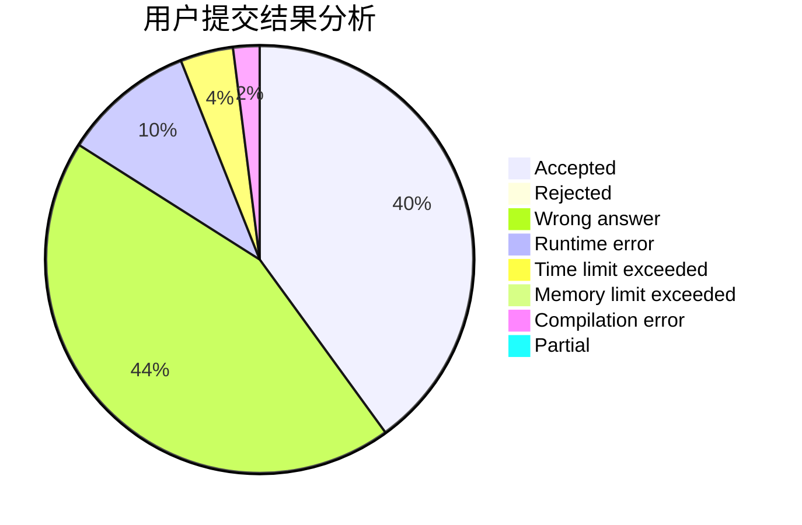
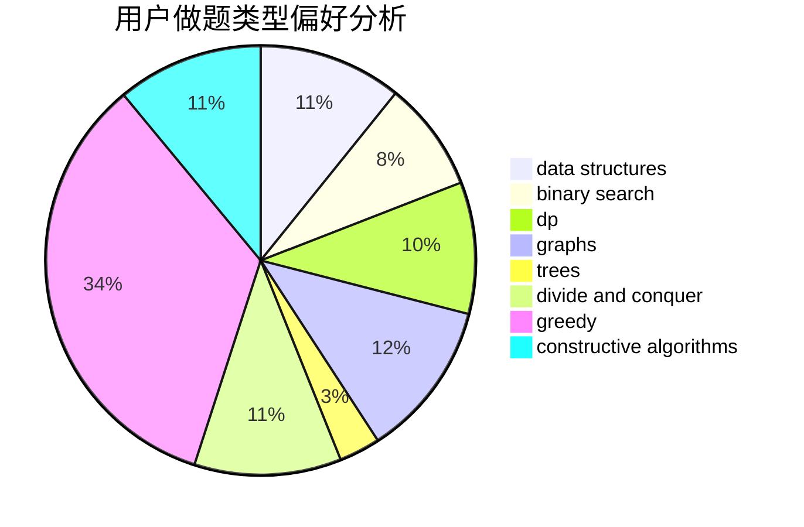
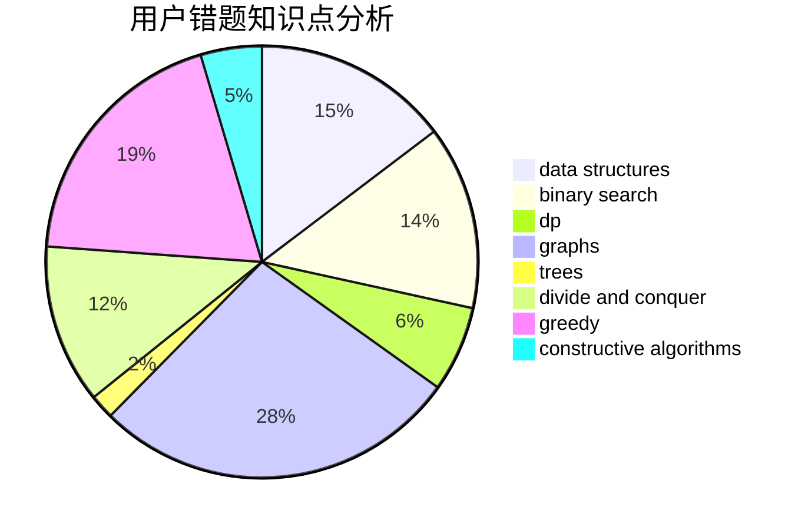

# ImmortalBird

<!-- tabs:start -->

#### **用户提交结果分析**

#### **用户做题类型偏好分析**

#### **用户错题知识点分析**

<!-- tabs:end -->
# 推荐题目
[1450H1](https://codeforces.com/contest/1450H/problem/1)		combinatorics,
                        fft,
                        math		  
[1262A](https://codeforces.com/contest/1262/problem/A)		dsu,graphs,sortings,trees		  
[1130B](https://codeforces.com/contest/1130/problem/B)		greedy		  
[236D](https://codeforces.com/contest/236/problem/D)		dsu,graphs,sortings,trees		  
[176D](https://codeforces.com/contest/176/problem/D)		dp		  
[215B](https://codeforces.com/contest/215/problem/B)		greedy,
                        math		  
[916A](https://codeforces.com/contest/916/problem/A)		brute force,
                        implementation,
                        math		  
[195B](https://codeforces.com/contest/195/problem/B)		data structures,
                        implementation,
                        math		  
[815C](https://codeforces.com/contest/815/problem/C)		brute force,
                        dp,
                        trees		  
[916B](https://codeforces.com/contest/916/problem/B)		bitmasks,
                        greedy,
                        math		  
