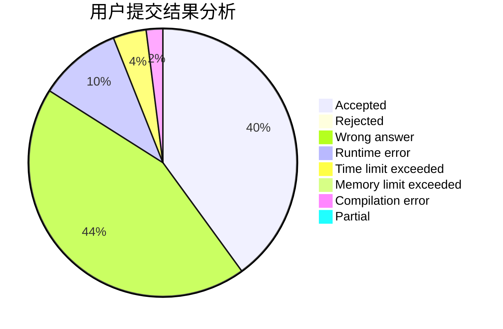
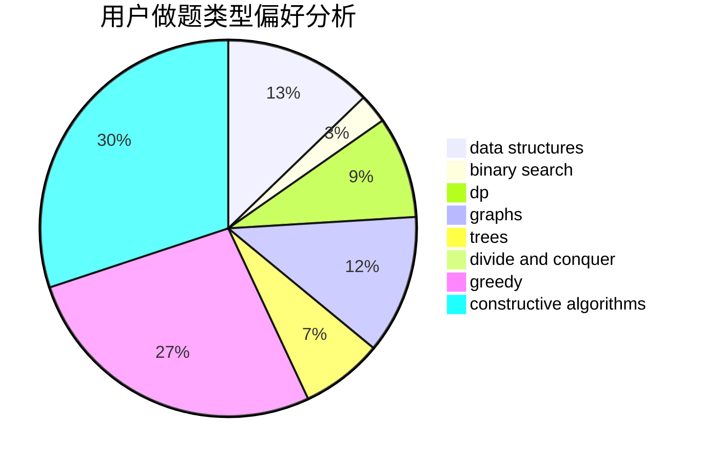
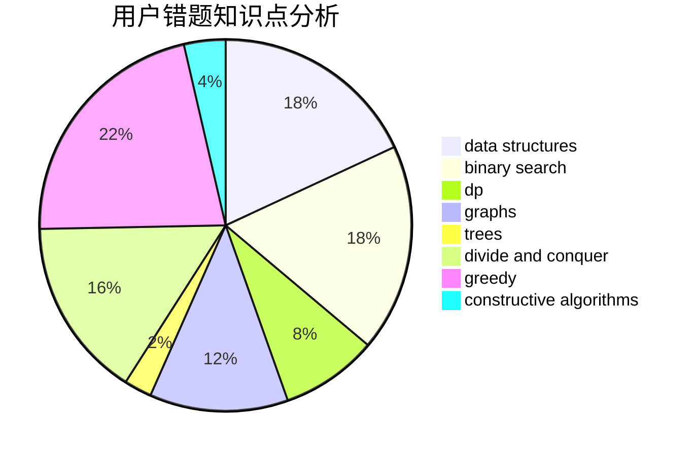

# ImmortalBird

<!-- tabs:start -->

#### **用户提交结果分析**

#### **用户做题类型偏好分析**

#### **用户错题知识点分析**

<!-- tabs:end -->
# 推荐题目
[1459E](https://codeforces.com/contest/1459/problem/E)		dsu,graphs,sortings,trees		  
[1267I](https://codeforces.com/contest/1267/problem/I)		brute force,
                        constructive algorithms,
                        implementation,
                        interactive,
                        sortings		  
[1132B](https://codeforces.com/contest/1132/problem/B)		greedy,
                        sortings		  
[25A](https://codeforces.com/contest/25/problem/A)		brute force		  
[201C](https://codeforces.com/contest/201/problem/C)		dp		  
[234A](https://codeforces.com/contest/234/problem/A)		implementation		  
[936A](https://codeforces.com/contest/936/problem/A)		binary search,
                        implementation,
                        math		  
[218B](https://codeforces.com/contest/218/problem/B)		implementation		  
[834C](https://codeforces.com/contest/834/problem/C)		dsu,graphs,sortings,trees		  
[936B](https://codeforces.com/contest/936/problem/B)		dfs and similar,
                        dp,
                        games,
                        graphs		  
