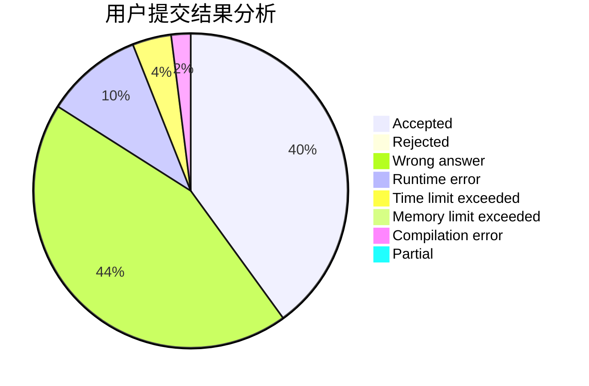
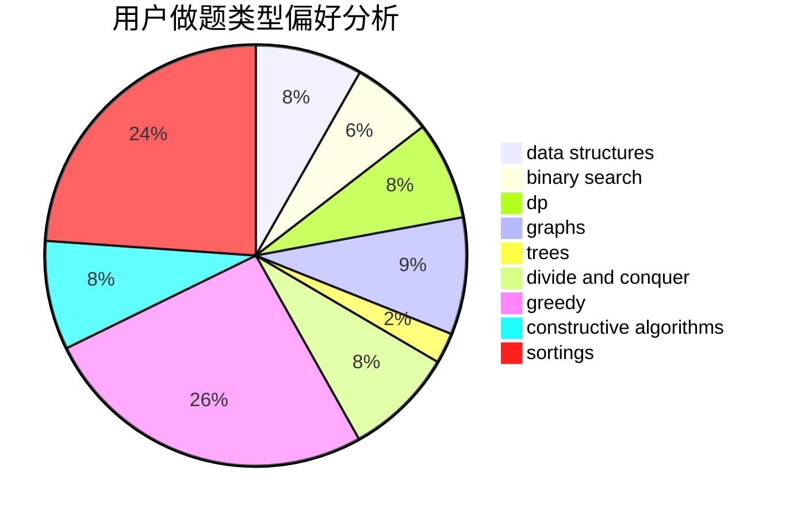
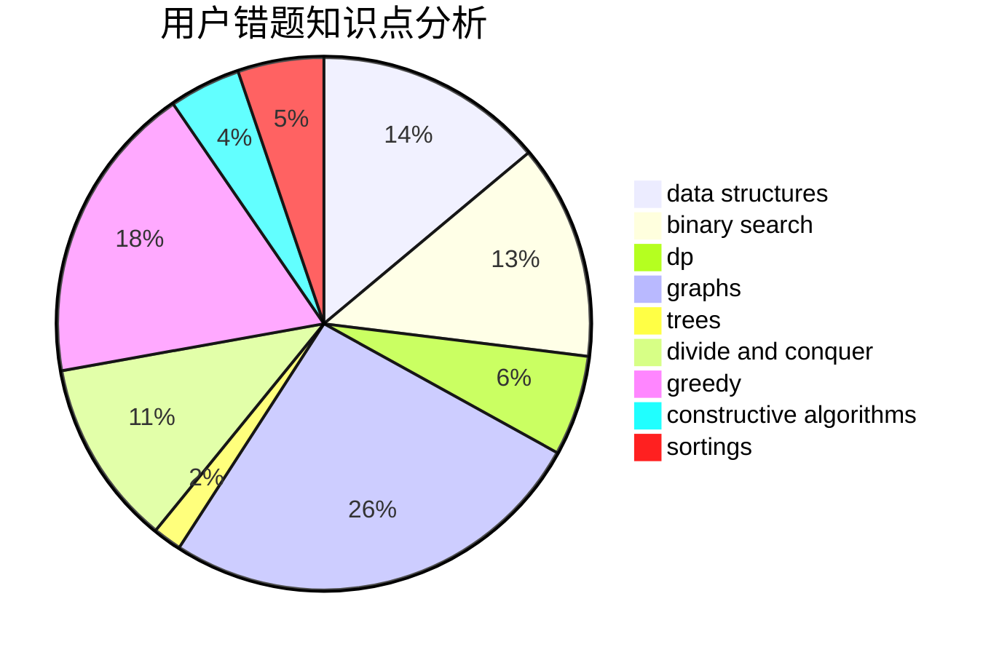

# ImmortalBird
<!-- tabs:start -->
#### **用户提交结果分析**

#### **用户做题类型偏好分析**

#### **用户错题知识点分析**

<!-- tabs:end -->
# 推荐题目
[1481B](http://codeforces.com/problemset/problem/1481/B)		brute force,
                        greedy,
                        implementation		  
[1450H1](http://codeforces.com/problemset/problem/1450/H1)		combinatorics,
                        fft,
                        math		  
[444C](http://codeforces.com/problemset/problem/444/C)		data structures		  
[236D](https://codeforces.com/contest/236/problem/D)		dp,
                        math,
                        probabilities		  
[818E](http://codeforces.com/problemset/problem/818/E)		binary search,
                        data structures,
                        number theory,
                        two pointers		  
[916A](http://codeforces.com/problemset/problem/916/A)		brute force,
                        implementation,
                        math		  
[1262A](https://codeforces.com/contest/1262/problem/A)		math		  
[1489B](https://codeforces.com/contest/1489/problem/B)		math		  
[195B](http://codeforces.com/problemset/problem/195/B)		data structures,
                        implementation,
                        math		  
[815C](http://codeforces.com/problemset/problem/815/C)		brute force,
                        dp,
                        trees		  
<!-- tabs:start -->
#### **data structures**
[444C](http://codeforces.com/problemset/problem/444/C)		data structures		  
[818E](http://codeforces.com/problemset/problem/818/E)		binary search,
                        data structures,
                        number theory,
                        two pointers		  
[195B](http://codeforces.com/problemset/problem/195/B)		data structures,
                        implementation,
                        math		  
[869E](http://codeforces.com/problemset/problem/869/E)		data structures,
                        hashing		  
[103D](http://codeforces.com/problemset/problem/103/D)		brute force,
                        data structures,
                        sortings		  
[878C](http://codeforces.com/problemset/problem/878/C)		data structures,
                        graphs		  
[1329D](http://codeforces.com/problemset/problem/1329/D)		constructive algorithms,
                        data structures		  
[1492C](http://codeforces.com/problemset/problem/1492/C)		binary search,
                        data structures,
                        dp,
                        greedy,
                        two pointers		  
[1490G](http://codeforces.com/problemset/problem/1490/G)		binary search,
                        data structures,
                        math		  
[1479D](http://codeforces.com/problemset/problem/1479/D)		binary search,
                        bitmasks,
                        brute force,
                        data structures,
                        probabilities,
                        trees		  
#### **binary search**
[818E](http://codeforces.com/problemset/problem/818/E)		binary search,
                        data structures,
                        number theory,
                        two pointers		  
[1492C](http://codeforces.com/problemset/problem/1492/C)		binary search,
                        data structures,
                        dp,
                        greedy,
                        two pointers		  
[1463D](http://codeforces.com/problemset/problem/1463/D)		binary search,
                        constructive algorithms,
                        greedy,
                        two pointers		  
[1490G](http://codeforces.com/problemset/problem/1490/G)		binary search,
                        data structures,
                        math		  
[1479D](http://codeforces.com/problemset/problem/1479/D)		binary search,
                        bitmasks,
                        brute force,
                        data structures,
                        probabilities,
                        trees		  
[1436E](http://codeforces.com/problemset/problem/1436/E)		binary search,
                        data structures,
                        two pointers		  
[1461D](http://codeforces.com/problemset/problem/1461/D)		binary search,
                        brute force,
                        data structures,
                        divide and conquer,
                        implementation,
                        sortings		  
[1493C](http://codeforces.com/problemset/problem/1493/C)		binary search,
                        brute force,
                        constructive algorithms,
                        greedy,
                        strings		  
[1487D](http://codeforces.com/problemset/problem/1487/D)		binary search,
                        brute force,
                        math,
                        number theory		  
[1486B](http://codeforces.com/problemset/problem/1486/B)		binary search,
                        geometry,
                        shortest paths,
                        sortings		  
#### **dp**
[236D](https://codeforces.com/contest/236/problem/D)		dp,
                        math,
                        probabilities		  
[815C](http://codeforces.com/problemset/problem/815/C)		brute force,
                        dp,
                        trees		  
[176D](http://codeforces.com/problemset/problem/176/D)		dp		  
[455C](http://codeforces.com/problemset/problem/455/C)		dfs and similar,
                        dp,
                        dsu,
                        ternary search,
                        trees		  
[701E](https://codeforces.com/contest/701/problem/E)		dfs and similar,
                        dp,
                        graphs,
                        trees		  
[212C](http://codeforces.com/problemset/problem/212/C)		combinatorics,
                        dp,
                        math		  
[703E](http://codeforces.com/problemset/problem/703/E)		dp,
                        number theory		  
[86C](http://codeforces.com/problemset/problem/86/C)		dp,
                        string suffix structures,
                        trees		  
[1404B](http://codeforces.com/problemset/problem/1404/B)		dfs and similar,
                        dp,
                        games,
                        trees		  
[1475B](http://codeforces.com/problemset/problem/1475/B)		brute force,
                        dp,
                        math		  
#### **graph**
[737E](http://codeforces.com/problemset/problem/737/E)		graph matchings,
                        graphs,
                        greedy,
                        schedules		  
[869D](http://codeforces.com/problemset/problem/869/D)		brute force,
                        dfs and similar,
                        graphs		  
[701E](https://codeforces.com/contest/701/problem/E)		dfs and similar,
                        dp,
                        graphs,
                        trees		  
[878C](http://codeforces.com/problemset/problem/878/C)		data structures,
                        graphs		  
[1263D](http://codeforces.com/problemset/problem/1263/D)		dfs and similar,
                        dsu,
                        graphs		  
[1487C](http://codeforces.com/problemset/problem/1487/C)		brute force,
                        constructive algorithms,
                        dfs and similar,
                        graphs,
                        greedy,
                        implementation,
                        math		  
[1437C](http://codeforces.com/problemset/problem/1437/C)		dp,
                        flows,
                        graph matchings,
                        greedy,
                        math,
                        sortings		  
[1470D](http://codeforces.com/problemset/problem/1470/D)		constructive algorithms,
                        dfs and similar,
                        graph matchings,
                        graphs,
                        greedy		  
[1476C](http://codeforces.com/problemset/problem/1476/C)		dp,
                        graphs,
                        greedy		  
[1304D](http://codeforces.com/problemset/problem/1304/D)		constructive algorithms,
                        graphs,
                        greedy,
                        two pointers		  
#### **trees**
[815C](http://codeforces.com/problemset/problem/815/C)		brute force,
                        dp,
                        trees		  
[455C](http://codeforces.com/problemset/problem/455/C)		dfs and similar,
                        dp,
                        dsu,
                        ternary search,
                        trees		  
[701E](https://codeforces.com/contest/701/problem/E)		dfs and similar,
                        dp,
                        graphs,
                        trees		  
[86C](http://codeforces.com/problemset/problem/86/C)		dp,
                        string suffix structures,
                        trees		  
[1118F1](http://codeforces.com/problemset/problem/1118/F1)		dfs and similar,
                        trees		  
[1404B](http://codeforces.com/problemset/problem/1404/B)		dfs and similar,
                        dp,
                        games,
                        trees		  
[1479D](http://codeforces.com/problemset/problem/1479/D)		binary search,
                        bitmasks,
                        brute force,
                        data structures,
                        probabilities,
                        trees		  
[1511C](http://codeforces.com/problemset/problem/1511/C)		brute force,
                        data structures,
                        implementation,
                        trees		  
[1499F](http://codeforces.com/problemset/problem/1499/F)		combinatorics,
                        dfs and similar,
                        dp,
                        trees		  
[1491E](http://codeforces.com/problemset/problem/1491/E)		brute force,
                        dfs and similar,
                        divide and conquer,
                        number theory,
                        trees		  
#### **divide and conquer**
[1461D](http://codeforces.com/problemset/problem/1461/D)		binary search,
                        brute force,
                        data structures,
                        divide and conquer,
                        implementation,
                        sortings		  
[1466G](http://codeforces.com/problemset/problem/1466/G)		combinatorics,
                        divide and conquer,
                        hashing,
                        math,
                        string suffix structures,
                        strings		  
[1490D](http://codeforces.com/problemset/problem/1490/D)		dfs and similar,
                        divide and conquer,
                        implementation		  
[1483C](https://codeforces.com/contest/1483/problem/C)		data structures,
                        divide and conquer,
                        dp		  
[1491E](http://codeforces.com/problemset/problem/1491/E)		brute force,
                        dfs and similar,
                        divide and conquer,
                        number theory,
                        trees		  
[1303G](http://codeforces.com/problemset/problem/1303/G)		data structures,
                        divide and conquer,
                        geometry,
                        trees		  
[1494D](http://codeforces.com/problemset/problem/1494/D)		constructive algorithms,
                        data structures,
                        dfs and similar,
                        divide and conquer,
                        dsu,
                        greedy,
                        sortings,
                        trees		  
[1482E](http://codeforces.com/problemset/problem/1482/E)		data structures,
                        divide and conquer,
                        dp		  
[566C](http://codeforces.com/problemset/problem/566/C)		dfs and similar,
                        divide and conquer,
                        trees		  
[1428F](http://codeforces.com/problemset/problem/1428/F)		binary search,
                        data structures,
                        divide and conquer,
                        dp,
                        two pointers		  
#### **greedy**
[1481B](http://codeforces.com/problemset/problem/1481/B)		brute force,
                        greedy,
                        implementation		  
[737E](http://codeforces.com/problemset/problem/737/E)		graph matchings,
                        graphs,
                        greedy,
                        schedules		  
[215B](http://codeforces.com/problemset/problem/215/B)		greedy,
                        math		  
[1130B](http://codeforces.com/problemset/problem/1130/B)		greedy		  
[916B](http://codeforces.com/problemset/problem/916/B)		bitmasks,
                        greedy,
                        math		  
[1130D2](https://codeforces.com/contest/1130/problem/D2)		brute force,
                        greedy		  
[1070F](http://codeforces.com/problemset/problem/1070/F)		greedy		  
[1252E](http://codeforces.com/problemset/problem/1252/E)		greedy,
                        two pointers		  
[1173B](http://codeforces.com/problemset/problem/1173/B)		constructive algorithms,
                        greedy		  
[1176A](http://codeforces.com/problemset/problem/1176/A)		brute force,
                        greedy,
                        implementation		  
#### **constructive algorithms**
[634A](http://codeforces.com/problemset/problem/634/A)		constructive algorithms,
                        implementation		  
[1173B](http://codeforces.com/problemset/problem/1173/B)		constructive algorithms,
                        greedy		  
[1364C](http://codeforces.com/problemset/problem/1364/C)		brute force,
                        constructive algorithms,
                        greedy		  
[1329D](http://codeforces.com/problemset/problem/1329/D)		constructive algorithms,
                        data structures		  
[1118C](http://codeforces.com/problemset/problem/1118/C)		constructive algorithms,
                        implementation		  
[1513E](http://codeforces.com/problemset/problem/1513/E)		combinatorics,
                        constructive algorithms,
                        math,
                        sortings		  
[1493A](http://codeforces.com/problemset/problem/1493/A)		constructive algorithms,
                        greedy		  
[1463D](http://codeforces.com/problemset/problem/1463/D)		binary search,
                        constructive algorithms,
                        greedy,
                        two pointers		  
[1456B](https://codeforces.com/contest/1456/problem/B)		bitmasks,
                        brute force,
                        constructive algorithms		  
[1492D](http://codeforces.com/problemset/problem/1492/D)		bitmasks,
                        constructive algorithms,
                        greedy,
                        math		  
#### **sortings**
[15A](http://codeforces.com/problemset/problem/15/A)		implementation,
                        sortings		  
[103D](http://codeforces.com/problemset/problem/103/D)		brute force,
                        data structures,
                        sortings		  
[632C](http://codeforces.com/problemset/problem/632/C)		sortings,
                        strings		  
[1513E](http://codeforces.com/problemset/problem/1513/E)		combinatorics,
                        constructive algorithms,
                        math,
                        sortings		  
[1496C](https://codeforces.com/contest/1496/problem/C)		geometry,
                        greedy,
                        math,
                        sortings		  
[1495A](http://codeforces.com/problemset/problem/1495/A)		geometry,
                        greedy,
                        math,
                        sortings		  
[1497A](http://codeforces.com/problemset/problem/1497/A)		brute force,
                        data structures,
                        greedy,
                        sortings		  
[1427A](http://codeforces.com/problemset/problem/1427/A)		math,
                        sortings		  
[1461D](http://codeforces.com/problemset/problem/1461/D)		binary search,
                        brute force,
                        data structures,
                        divide and conquer,
                        implementation,
                        sortings		  
[1437C](http://codeforces.com/problemset/problem/1437/C)		dp,
                        flows,
                        graph matchings,
                        greedy,
                        math,
                        sortings		  
<!-- tabs:end -->
