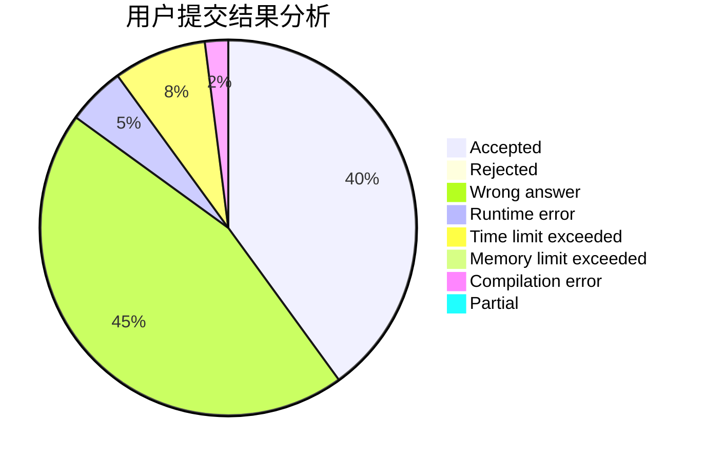
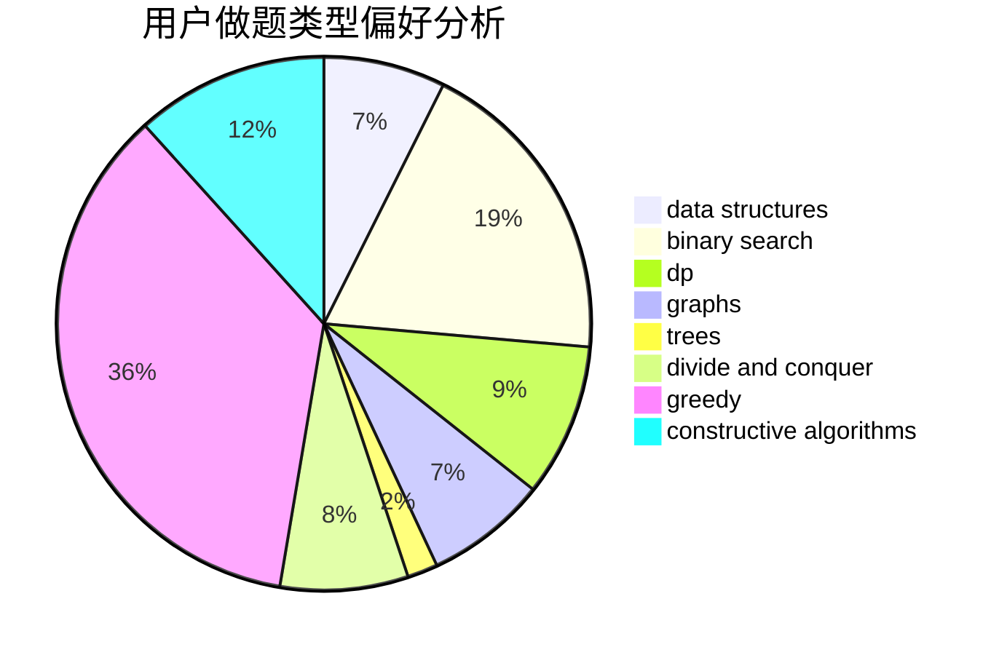

# InFaNg
<!-- tabs:start -->
#### **用户提交结果分析**

#### **用户做题类型偏好分析**

#### **用户错题知识点分析**

<!-- tabs:end -->
# 推荐题目
[Add One](http://codeforces.com/problemset/problem/1513/C)		dp,
                        matrices		  
[Regular Bracket Sequence](http://codeforces.com/problemset/problem/1469/A)		constructive algorithms,
                        greedy		  
[Garden of the Sun](http://codeforces.com/problemset/problem/1495/C)		constructive algorithms,
                        graphs		  
[MADMAX](http://codeforces.com/problemset/problem/917/B)		dfs and similar,
                        dp,
                        games,
                        graphs		  
[Capitalism](http://codeforces.com/problemset/problem/1450/E)		constructive algorithms,
                        dfs and similar,
                        graphs,
                        shortest paths		  
[Three Friends](http://codeforces.com/problemset/problem/1272/A)		brute force,
                        greedy,
                        math,
                        sortings		  
[The Labyrinth](http://codeforces.com/problemset/problem/616/C)		dfs and similar		  
[Prefix Enlightenment](http://codeforces.com/problemset/problem/1290/C)		dfs and similar,
                        dsu,
                        graphs		  
[R2D2 and Droid Army](http://codeforces.com/problemset/problem/514/D)		binary search,
                        data structures,
                        two pointers		  
[Cat Party (Easy Edition)](http://codeforces.com/problemset/problem/1163/B1)		data structures,
                        implementation		  
<!-- tabs:start -->
#### **data structures**
[R2D2 and Droid Army](http://codeforces.com/problemset/problem/514/D)		binary search,
                        data structures,
                        two pointers		  
[Cat Party (Easy Edition)](http://codeforces.com/problemset/problem/1163/B1)		data structures,
                        implementation		  
[Maximum Xor Secondary](https://codeforces.com/contest/281/problem/D)		data structures,
                        implementation,
                        two pointers		  
[Teams Formation](http://codeforces.com/problemset/problem/878/B)		data structures,
                        implementation		  
[Polycarp's phone book](https://codeforces.com/contest/860/problem/B)		data structures,
                        implementation,
                        sortings		  
[Optimal Subsequences (Easy Version)](http://codeforces.com/problemset/problem/1227/D1)		data structures,
                        greedy		  
[Playlist](http://codeforces.com/problemset/problem/1140/C)		brute force,
                        data structures,
                        sortings		  
[Range Deleting](http://codeforces.com/problemset/problem/1167/E)		binary search,
                        combinatorics,
                        data structures,
                        two pointers		  
[Phoenix and Memory](http://codeforces.com/problemset/problem/1348/F)		data structures,
                        dfs and similar,
                        graphs,
                        greedy		  
[Mike and Friends](http://codeforces.com/problemset/problem/547/E)		data structures,
                        string suffix structures,
                        strings,
                        trees		  
#### **binary search**
[R2D2 and Droid Army](http://codeforces.com/problemset/problem/514/D)		binary search,
                        data structures,
                        two pointers		  
[Alyona and a Narrow Fridge](http://codeforces.com/problemset/problem/1119/B)		binary search,
                        flows,
                        greedy,
                        sortings		  
[Two Friends](http://codeforces.com/problemset/problem/8/D)		binary search,
                        geometry		  
[Morning run](http://codeforces.com/problemset/problem/309/A)		binary search,
                        math,
                        two pointers		  
[Range Deleting](http://codeforces.com/problemset/problem/1167/E)		binary search,
                        combinatorics,
                        data structures,
                        two pointers		  
[Blood Cousins Return](http://codeforces.com/problemset/problem/246/E)		binary search,
                        data structures,
                        dfs and similar,
                        dp,
                        sortings		  
[You Are Given Some Letters...](http://codeforces.com/problemset/problem/1202/F)		binary search,
                        implementation,
                        math		  
[Two Types of Spells](http://codeforces.com/problemset/problem/1398/E)		binary search,
                        data structures,
                        greedy,
                        implementation,
                        math,
                        sortings		  
[Fly](https://codeforces.com/contest/1011/problem/C)		binary search,
                        math		  
[Problemsolving Marathon](http://codeforces.com/problemset/problem/1488/D)		*special problem,
                        binary search,
                        greedy		  
#### **dp**
[Add One](http://codeforces.com/problemset/problem/1513/C)		dp,
                        matrices		  
[MADMAX](http://codeforces.com/problemset/problem/917/B)		dfs and similar,
                        dp,
                        games,
                        graphs		  
[Almost Identity Permutations](http://codeforces.com/problemset/problem/888/D)		combinatorics,
                        dp,
                        math		  
[Flowers](http://codeforces.com/problemset/problem/474/D)		dp		  
[Mateusz and Escape Room](https://codeforces.com/contest/1229/problem/F)		dp		  
[Blood Cousins Return](http://codeforces.com/problemset/problem/246/E)		binary search,
                        data structures,
                        dfs and similar,
                        dp,
                        sortings		  
[The Monster](http://codeforces.com/problemset/problem/917/A)		dp,
                        greedy,
                        implementation,
                        math		  
[Free Market](http://codeforces.com/problemset/problem/364/B)		dp,
                        greedy		  
[Maximum splitting](http://codeforces.com/problemset/problem/870/C)		dp,
                        greedy,
                        math,
                        number theory		  
[Museums Tour](http://codeforces.com/problemset/problem/1137/C)		dp,
                        graphs,
                        implementation		  
#### **graph**
[Garden of the Sun](http://codeforces.com/problemset/problem/1495/C)		constructive algorithms,
                        graphs		  
[MADMAX](http://codeforces.com/problemset/problem/917/B)		dfs and similar,
                        dp,
                        games,
                        graphs		  
[Capitalism](http://codeforces.com/problemset/problem/1450/E)		constructive algorithms,
                        dfs and similar,
                        graphs,
                        shortest paths		  
[Prefix Enlightenment](http://codeforces.com/problemset/problem/1290/C)		dfs and similar,
                        dsu,
                        graphs		  
[Jamie and Interesting Graph](http://codeforces.com/problemset/problem/916/C)		constructive algorithms,
                        graphs,
                        shortest paths		  
[Orac and Game of Life](https://codeforces.com/contest/1350/problem/E)		dfs and similar,
                        graphs,
                        implementation,
                        shortest paths		  
[Phoenix and Memory](http://codeforces.com/problemset/problem/1348/F)		data structures,
                        dfs and similar,
                        graphs,
                        greedy		  
[Graph Subset Problem](http://codeforces.com/problemset/problem/1439/B)		constructive algorithms,
                        data structures,
                        graphs		  
[Museums Tour](http://codeforces.com/problemset/problem/1137/C)		dp,
                        graphs,
                        implementation		  
[Envy](http://codeforces.com/problemset/problem/891/C)		data structures,
                        dsu,
                        graphs		  
#### **trees**
[Mike and Friends](http://codeforces.com/problemset/problem/547/E)		data structures,
                        string suffix structures,
                        strings,
                        trees		  
[Jamie and Tree](http://codeforces.com/problemset/problem/916/E)		data structures,
                        trees		  
[Jamie and To-do List](http://codeforces.com/problemset/problem/916/D)		data structures,
                        interactive,
                        trees		  
[Tree-Tac-Toe](http://codeforces.com/problemset/problem/1110/G)		constructive algorithms,
                        games,
                        trees		  
[Indie Album](http://codeforces.com/problemset/problem/1207/G)		data structures,
                        dfs and similar,
                        hashing,
                        string suffix structures,
                        strings,
                        trees		  
[Odd Mineral Resource](http://codeforces.com/problemset/problem/1479/D)		binary search,
                        bitmasks,
                        brute force,
                        data structures,
                        probabilities,
                        trees		  
[Yet Another Card Deck](http://codeforces.com/problemset/problem/1511/C)		brute force,
                        data structures,
                        implementation,
                        trees		  
[Diameter Cuts](http://codeforces.com/problemset/problem/1499/F)		combinatorics,
                        dfs and similar,
                        dp,
                        trees		  
[Fib-tree](http://codeforces.com/problemset/problem/1491/E)		brute force,
                        dfs and similar,
                        divide and conquer,
                        number theory,
                        trees		  
[13th Labour of Heracles](http://codeforces.com/problemset/problem/1466/D)		data structures,
                        greedy,
                        sortings,
                        trees		  
#### **divide and conquer**
[SmartGarden](http://codeforces.com/problemset/problem/1250/M)		constructive algorithms,
                        divide and conquer		  
[Battalion Strength](http://codeforces.com/problemset/problem/1316/F)		data structures,
                        divide and conquer,
                        probabilities		  
[Divide and Summarize](http://codeforces.com/problemset/problem/1461/D)		binary search,
                        brute force,
                        data structures,
                        divide and conquer,
                        implementation,
                        sortings		  
[Song of the Sirens](http://codeforces.com/problemset/problem/1466/G)		combinatorics,
                        divide and conquer,
                        hashing,
                        math,
                        string suffix structures,
                        strings		  
[Permutation Transformation](http://codeforces.com/problemset/problem/1490/D)		dfs and similar,
                        divide and conquer,
                        implementation		  
[Skyline Photo](https://codeforces.com/contest/1483/problem/C)		data structures,
                        divide and conquer,
                        dp		  
[Fib-tree](http://codeforces.com/problemset/problem/1491/E)		brute force,
                        dfs and similar,
                        divide and conquer,
                        number theory,
                        trees		  
[Sum of Prefix Sums](http://codeforces.com/problemset/problem/1303/G)		data structures,
                        divide and conquer,
                        geometry,
                        trees		  
[Dogeforces](http://codeforces.com/problemset/problem/1494/D)		constructive algorithms,
                        data structures,
                        dfs and similar,
                        divide and conquer,
                        dsu,
                        greedy,
                        sortings,
                        trees		  
[Logistical Questions](http://codeforces.com/problemset/problem/566/C)		dfs and similar,
                        divide and conquer,
                        trees		  
#### **greedy**
[Regular Bracket Sequence](http://codeforces.com/problemset/problem/1469/A)		constructive algorithms,
                        greedy		  
[Three Friends](http://codeforces.com/problemset/problem/1272/A)		brute force,
                        greedy,
                        math,
                        sortings		  
[Alyona and a Narrow Fridge](http://codeforces.com/problemset/problem/1119/B)		binary search,
                        flows,
                        greedy,
                        sortings		  
[Optimal Subsequences (Easy Version)](http://codeforces.com/problemset/problem/1227/D1)		data structures,
                        greedy		  
[Sereja and Stairs](http://codeforces.com/problemset/problem/381/B)		greedy,
                        implementation,
                        sortings		  
[Toy Train (Simplified)](https://codeforces.com/contest/1130/problem/D1)		brute force,
                        greedy		  
[Phoenix and Memory](http://codeforces.com/problemset/problem/1348/F)		data structures,
                        dfs and similar,
                        graphs,
                        greedy		  
[Brackets in Implications](http://codeforces.com/problemset/problem/550/E)		constructive algorithms,
                        greedy,
                        implementation,
                        math		  
[The Monster](http://codeforces.com/problemset/problem/917/A)		dp,
                        greedy,
                        implementation,
                        math		  
[Free Market](http://codeforces.com/problemset/problem/364/B)		dp,
                        greedy		  
#### **constructive algorithms**
[Regular Bracket Sequence](http://codeforces.com/problemset/problem/1469/A)		constructive algorithms,
                        greedy		  
[Garden of the Sun](http://codeforces.com/problemset/problem/1495/C)		constructive algorithms,
                        graphs		  
[Capitalism](http://codeforces.com/problemset/problem/1450/E)		constructive algorithms,
                        dfs and similar,
                        graphs,
                        shortest paths		  
[SmartGarden](http://codeforces.com/problemset/problem/1250/M)		constructive algorithms,
                        divide and conquer		  
[Jamie and Interesting Graph](http://codeforces.com/problemset/problem/916/C)		constructive algorithms,
                        graphs,
                        shortest paths		  
[Dasha and Stairs](http://codeforces.com/problemset/problem/761/A)		brute force,
                        constructive algorithms,
                        implementation,
                        math		  
[Brackets in Implications](http://codeforces.com/problemset/problem/550/E)		constructive algorithms,
                        greedy,
                        implementation,
                        math		  
[Graph Subset Problem](http://codeforces.com/problemset/problem/1439/B)		constructive algorithms,
                        data structures,
                        graphs		  
[Nauuo and Chess](http://codeforces.com/problemset/problem/1173/B)		constructive algorithms,
                        greedy		  
[Tree-Tac-Toe](http://codeforces.com/problemset/problem/1110/G)		constructive algorithms,
                        games,
                        trees		  
#### **sortings**
[Three Friends](http://codeforces.com/problemset/problem/1272/A)		brute force,
                        greedy,
                        math,
                        sortings		  
[Alyona and a Narrow Fridge](http://codeforces.com/problemset/problem/1119/B)		binary search,
                        flows,
                        greedy,
                        sortings		  
[Fair Game](http://codeforces.com/problemset/problem/864/A)		implementation,
                        sortings		  
[Polycarp's phone book](https://codeforces.com/contest/860/problem/B)		data structures,
                        implementation,
                        sortings		  
[Sereja and Stairs](http://codeforces.com/problemset/problem/381/B)		greedy,
                        implementation,
                        sortings		  
[Playlist](http://codeforces.com/problemset/problem/1140/C)		brute force,
                        data structures,
                        sortings		  
[Blood Cousins Return](http://codeforces.com/problemset/problem/246/E)		binary search,
                        data structures,
                        dfs and similar,
                        dp,
                        sortings		  
[Two Types of Spells](http://codeforces.com/problemset/problem/1398/E)		binary search,
                        data structures,
                        greedy,
                        implementation,
                        math,
                        sortings		  
[Train Hard, Win Easy](http://codeforces.com/problemset/problem/1043/E)		constructive algorithms,
                        greedy,
                        math,
                        sortings		  
[Young Explorers](http://codeforces.com/problemset/problem/1355/B)		dp,
                        greedy,
                        sortings		  
<!-- tabs:end -->
