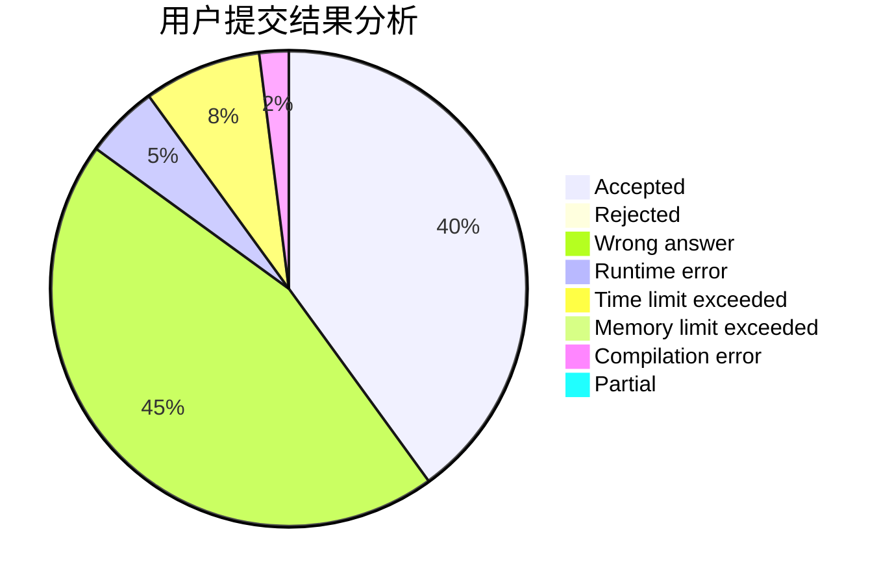
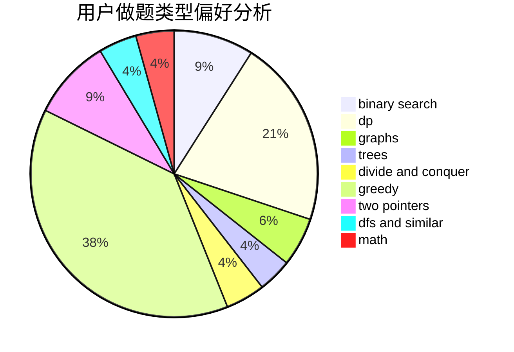

# InFaNg

<!-- tabs:start -->

#### **用户提交结果分析**

#### **用户做题类型偏好分析**

<!-- tabs:end -->
# 推荐题目
[1296F](https://codeforces.com/contest/1296/problem/F)
[916B](https://codeforces.com/contest/916/problem/B)
[492E](https://codeforces.com/contest/492/problem/E)
[937A](https://codeforces.com/contest/937/problem/A)
[540B](https://codeforces.com/contest/540/problem/B)
[1139D](https://codeforces.com/contest/1139/problem/D)
[268A](https://codeforces.com/contest/268/problem/A)
[1164P](https://codeforces.com/contest/1164/problem/P)
[765C](https://codeforces.com/contest/765/problem/C)
[883I](https://codeforces.com/contest/883/problem/I)
