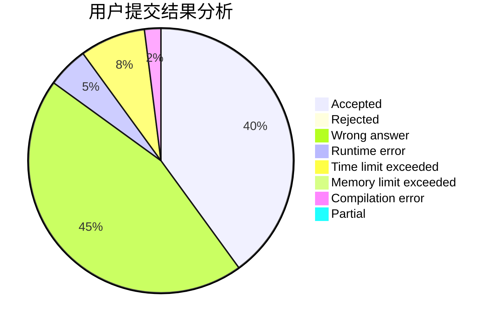
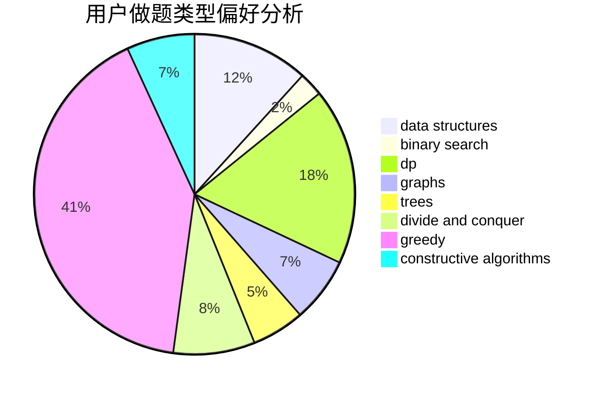

# InFaNg

<!-- tabs:start -->

#### **用户提交结果分析**

#### **用户做题类型偏好分析**

#### **用户错题知识点分析**

<!-- tabs:end -->
# 推荐题目
[1296F](https://codeforces.com/contest/1296/problem/F)		constructive algorithms,
                        dfs and similar,
                        greedy,
                        sortings,
                        trees		  
[916B](https://codeforces.com/contest/916/problem/B)		bitmasks,
                        greedy,
                        math		  
[492E](https://codeforces.com/contest/492/problem/E)		math		  
[937A](https://codeforces.com/contest/937/problem/A)		implementation,
                        sortings		  
[540B](https://codeforces.com/contest/540/problem/B)		greedy,
                        implementation		  
[1139D](https://codeforces.com/contest/1139/problem/D)		dp,
                        math,
                        number theory,
                        probabilities		  
[268A](https://codeforces.com/contest/268/problem/A)		brute force		  
[1164P](https://codeforces.com/contest/1164/problem/P)		dsu,graphs,sortings,trees		  
[765C](https://codeforces.com/contest/765/problem/C)		math		  
[883I](https://codeforces.com/contest/883/problem/I)		binary search,
                        dp		  
