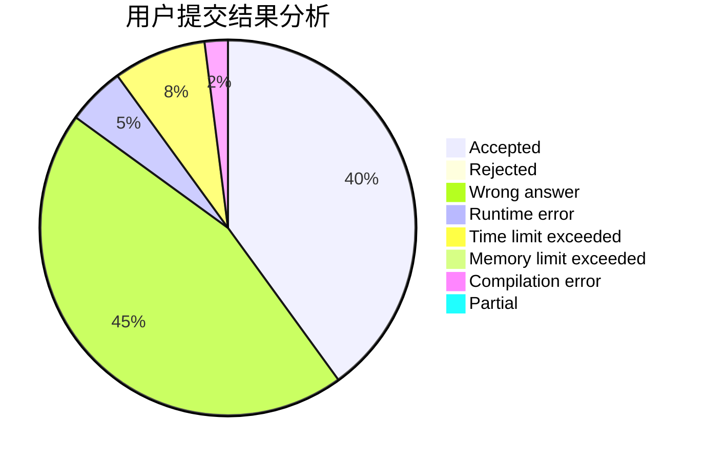
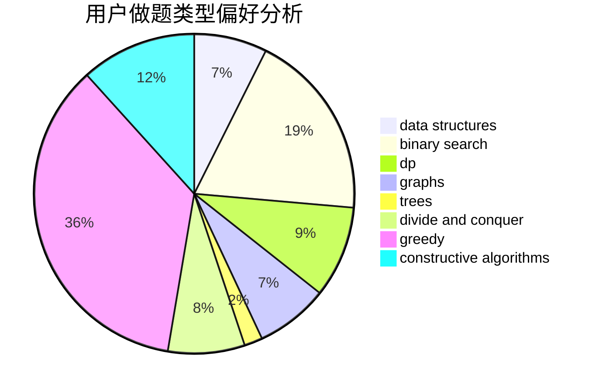

# InFaNg

<!-- tabs:start -->

#### **用户提交结果分析**

#### **用户做题类型偏好分析**

#### **用户错题知识点分析**

<!-- tabs:end -->
# 推荐题目
[1290C](https://codeforces.com/contest/1290/problem/C)		dfs and similar,
                        dsu,
                        graphs		  
[8D](https://codeforces.com/contest/8/problem/D)		binary search,
                        geometry		  
[474D](https://codeforces.com/contest/474/problem/D)		dp		  
[916E](https://codeforces.com/contest/916/problem/E)		data structures,
                        trees		  
[514D](https://codeforces.com/contest/514/problem/D)		binary search,
                        data structures,
                        two pointers		  
[1137C](https://codeforces.com/contest/1137/problem/C)		dp,
                        graphs,
                        implementation		  
[246E](https://codeforces.com/contest/246/problem/E)		binary search,
                        data structures,
                        dfs and similar,
                        dp,
                        sortings		  
[1163B1](https://codeforces.com/contest/1163B/problem/1)		data structures,
                        implementation		  
[746A](https://codeforces.com/contest/746/problem/A)		implementation,
                        math		  
[864A](https://codeforces.com/contest/864/problem/A)		implementation,
                        sortings		  
