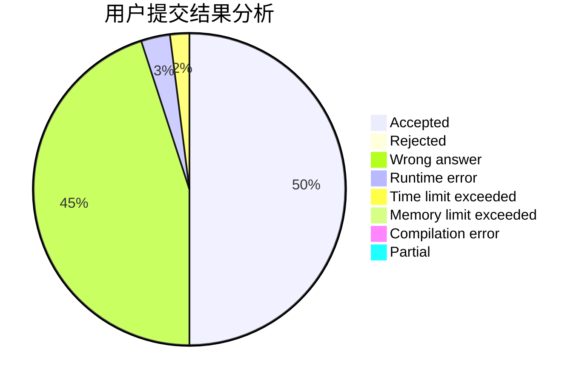
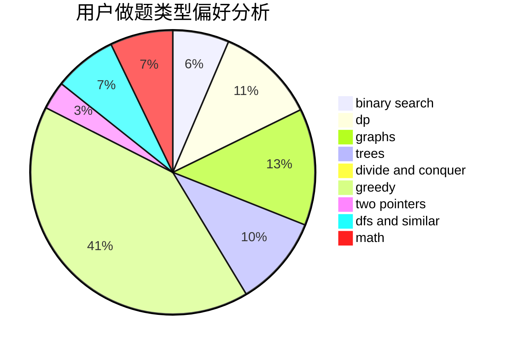

# Indigosky

<!-- tabs:start -->

#### **用户提交结果分析**

#### **用户做题类型偏好分析**

<!-- tabs:end -->
# 推荐题目
[1423J](https://codeforces.com/contest/1423/problem/J)
[869E](https://codeforces.com/contest/869/problem/E)
[638A](https://codeforces.com/contest/638/problem/A)
[1257C](https://codeforces.com/contest/1257/problem/C)
[228B](https://codeforces.com/contest/228/problem/B)
[1341E](https://codeforces.com/contest/1341/problem/E)
[1210E](https://codeforces.com/contest/1210/problem/E)
[1136C](https://codeforces.com/contest/1136/problem/C)
[938A](https://codeforces.com/contest/938/problem/A)
[1151C](https://codeforces.com/contest/1151/problem/C)
