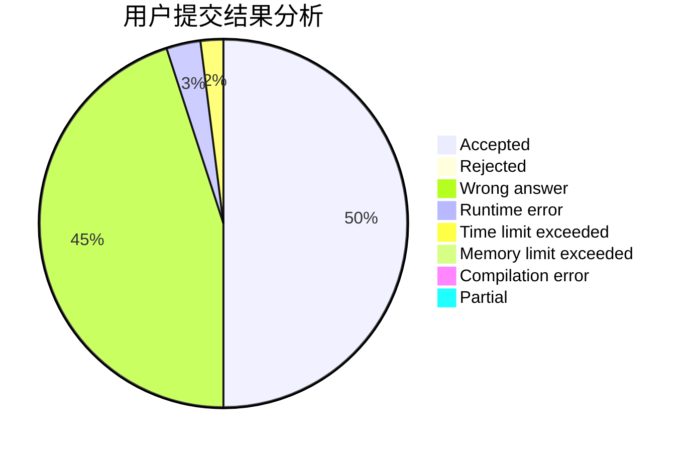
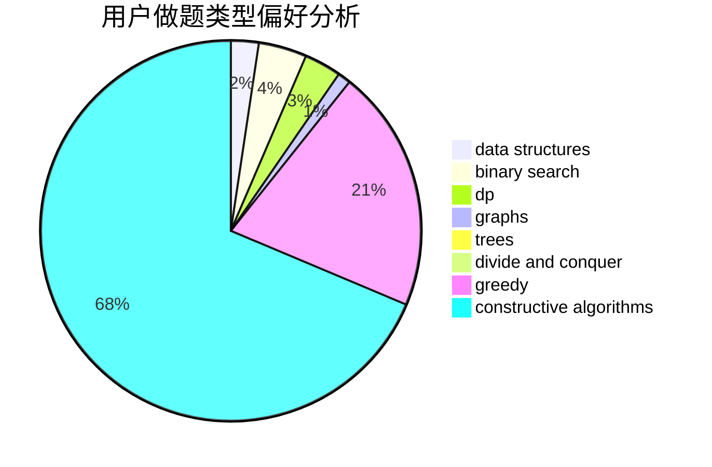
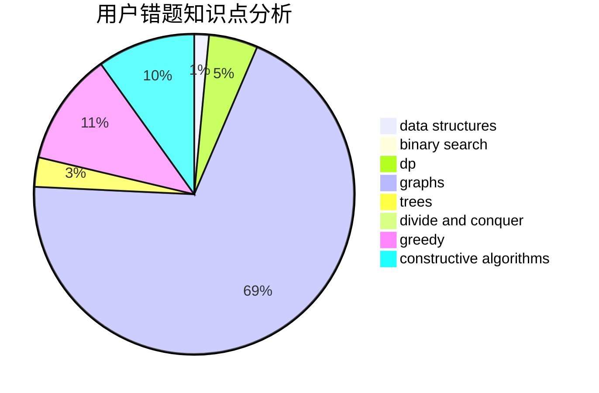

# Indigosky

<!-- tabs:start -->

#### **用户提交结果分析**

#### **用户做题类型偏好分析**

#### **用户错题知识点分析**

<!-- tabs:end -->
# 推荐题目
[1423J](https://codeforces.com/contest/1423/problem/J)		bitmasks,
                        constructive algorithms,
                        dp,
                        math		  
[869E](https://codeforces.com/contest/869/problem/E)		data structures,
                        hashing		  
[638A](https://codeforces.com/contest/638/problem/A)		*special problem,
                        constructive algorithms,
                        math		  
[1257C](https://codeforces.com/contest/1257/problem/C)		greedy,
                        implementation,
                        sortings,
                        strings,
                        two pointers		  
[228B](https://codeforces.com/contest/228/problem/B)		brute force,
                        implementation		  
[1341E](https://codeforces.com/contest/1341/problem/E)		dsu,graphs,sortings,trees		  
[1210E](https://codeforces.com/contest/1210/problem/E)		math		  
[1136C](https://codeforces.com/contest/1136/problem/C)		constructive algorithms,
                        sortings		  
[938A](https://codeforces.com/contest/938/problem/A)		implementation		  
[1151C](https://codeforces.com/contest/1151/problem/C)		constructive algorithms,
                        math		  
