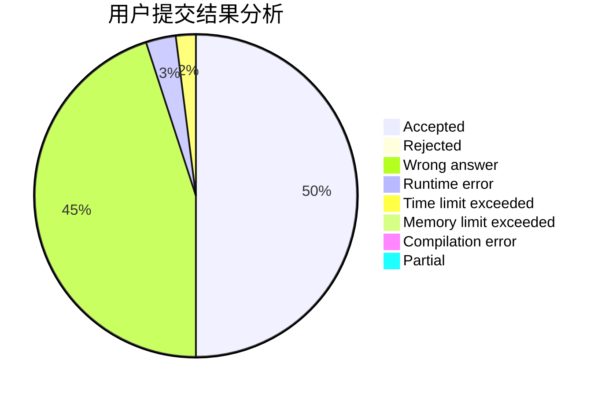
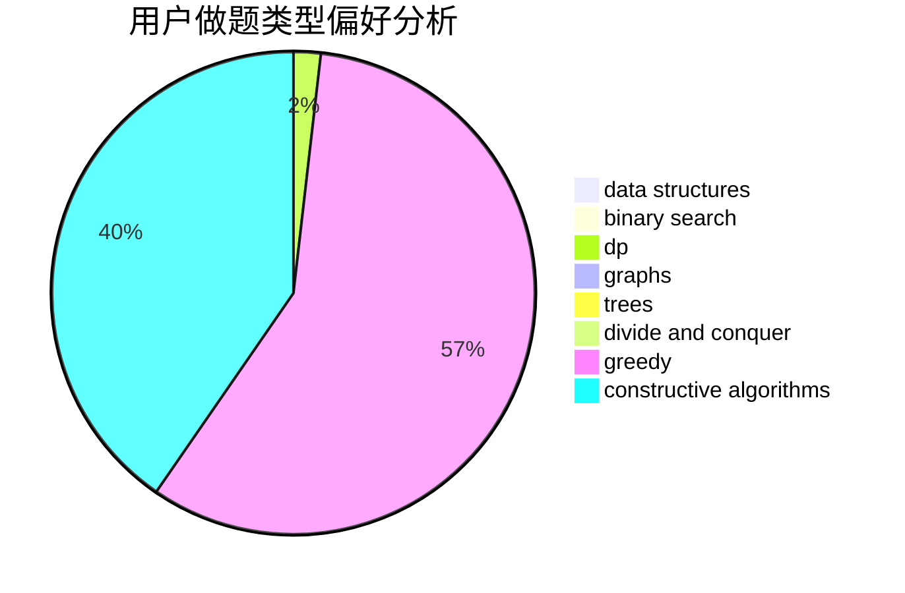
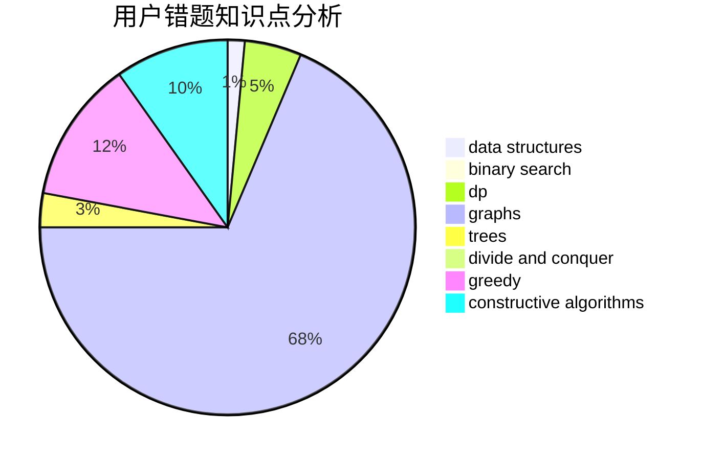

# Indigosky

<!-- tabs:start -->

#### **用户提交结果分析**

#### **用户做题类型偏好分析**

#### **用户错题知识点分析**

<!-- tabs:end -->
# 推荐题目
[1415F](https://codeforces.com/contest/1415/problem/F)		dp		  
[850F](https://codeforces.com/contest/850/problem/F)		math		  
[618B](https://codeforces.com/contest/618/problem/B)		constructive algorithms		  
[1252A](https://codeforces.com/contest/1252/problem/A)		nan		  
[204C](https://codeforces.com/contest/204/problem/C)		math,
                        probabilities		  
[1334F](https://codeforces.com/contest/1334/problem/F)		binary search,
                        data structures,
                        dp,
                        greedy		  
[1206D](https://codeforces.com/contest/1206/problem/D)		dsu,graphs,sortings,trees		  
[1132D](https://codeforces.com/contest/1132/problem/D)		binary search,
                        greedy		  
[917C](https://codeforces.com/contest/917/problem/C)		combinatorics,
                        dp,
                        matrices		  
[1149E](https://codeforces.com/contest/1149/problem/E)		games,
                        graphs		  
