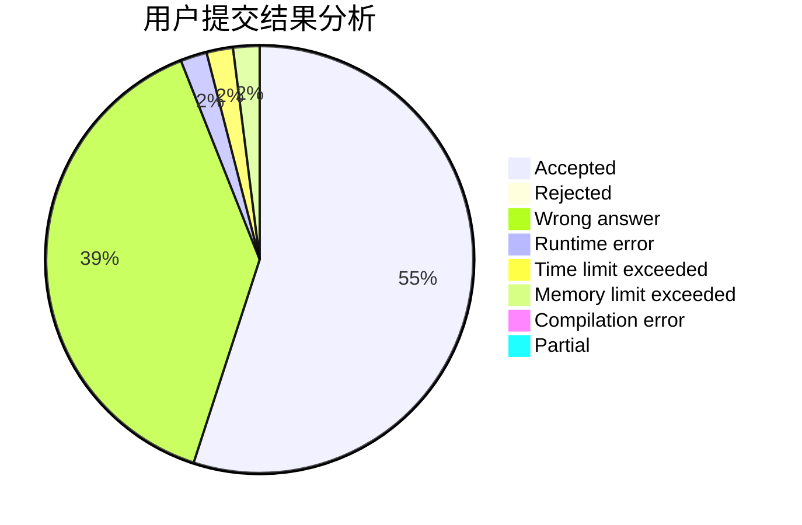
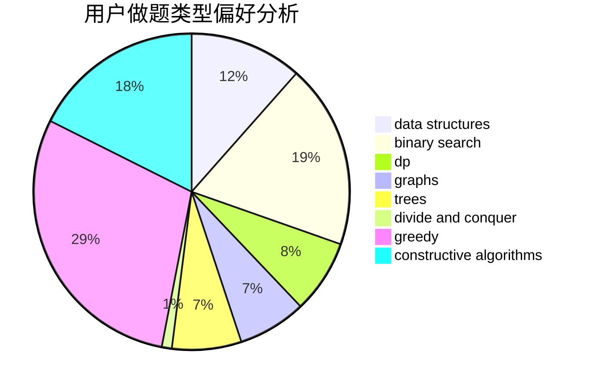
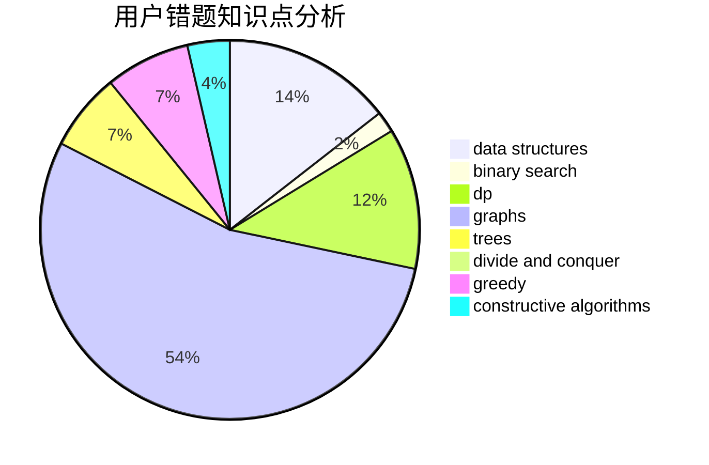

# Inf_Voltage

<!-- tabs:start -->

#### **用户提交结果分析**

#### **用户做题类型偏好分析**

#### **用户错题知识点分析**

<!-- tabs:end -->
# 推荐题目
[743C](https://codeforces.com/contest/743/problem/C)		brute force,
                        constructive algorithms,
                        math,
                        number theory		  
[263A](https://codeforces.com/contest/263/problem/A)		implementation		  
[1360D](https://codeforces.com/contest/1360/problem/D)		math,
                        number theory		  
[1310C](https://codeforces.com/contest/1310/problem/C)		binary search,
                        dp,
                        strings		  
[20A](https://codeforces.com/contest/20/problem/A)		implementation		  
[825E](https://codeforces.com/contest/825/problem/E)		data structures,
                        dfs and similar,
                        graphs,
                        greedy		  
[1320A](https://codeforces.com/contest/1320/problem/A)		data structures,
                        dp,
                        greedy,
                        math,
                        sortings		  
[570D](https://codeforces.com/contest/570/problem/D)		binary search,
                        bitmasks,
                        constructive algorithms,
                        dfs and similar,
                        graphs,
                        trees		  
[675D](https://codeforces.com/contest/675/problem/D)		data structures,
                        trees		  
[191C](https://codeforces.com/contest/191/problem/C)		data structures,
                        dfs and similar,
                        trees		  
