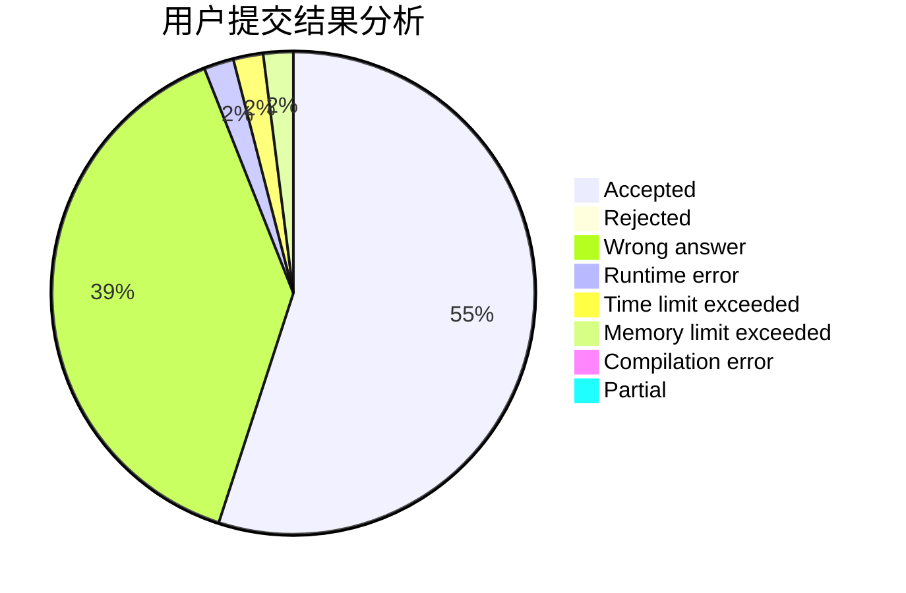
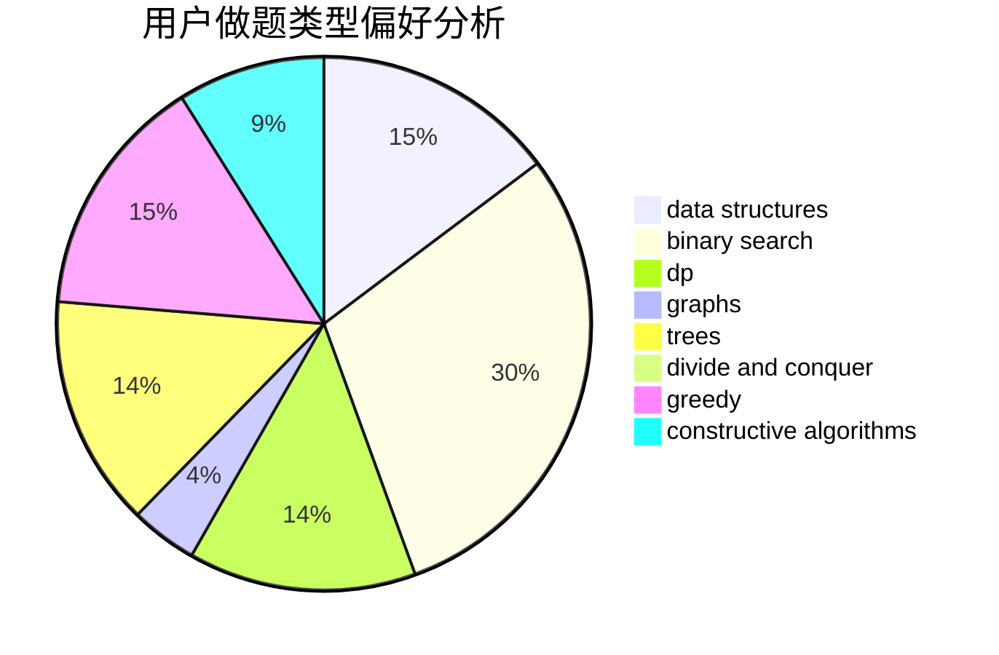
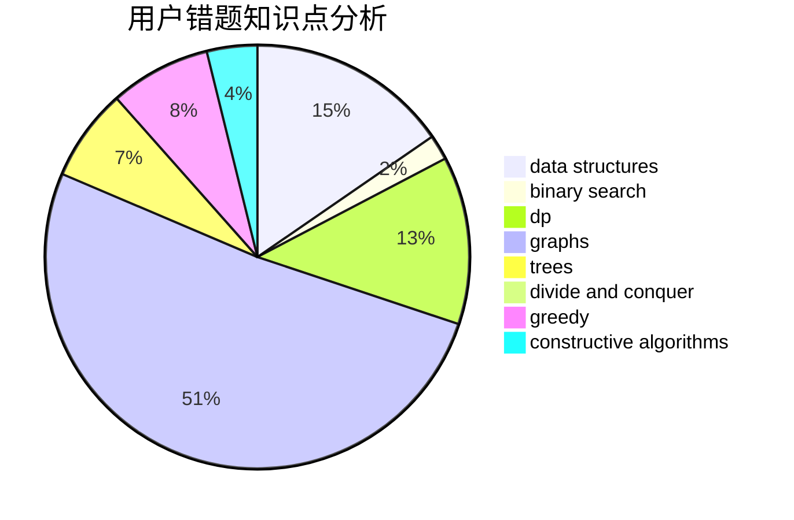

# Inf_Voltage

<!-- tabs:start -->

#### **用户提交结果分析**

#### **用户做题类型偏好分析**

#### **用户错题知识点分析**

<!-- tabs:end -->
# 推荐题目
[763D](https://codeforces.com/contest/763/problem/D)		data structures,
                        graphs,
                        hashing,
                        shortest paths,
                        trees		  
[27D](https://codeforces.com/contest/27/problem/D)		2-sat,
                        dfs and similar,
                        dsu,
                        graphs		  
[1368C](https://codeforces.com/contest/1368/problem/C)		constructive algorithms		  
[1316F](https://codeforces.com/contest/1316/problem/F)		data structures,
                        divide and conquer,
                        probabilities		  
[231C](https://codeforces.com/contest/231/problem/C)		binary search,
                        sortings,
                        two pointers		  
[845A](https://codeforces.com/contest/845/problem/A)		implementation,
                        sortings		  
[1327A](https://codeforces.com/contest/1327/problem/A)		math		  
[591A](https://codeforces.com/contest/591/problem/A)		implementation,
                        math		  
[6C](https://codeforces.com/contest/6/problem/C)		greedy,
                        two pointers		  
[216A](https://codeforces.com/contest/216/problem/A)		implementation,
                        math		  
