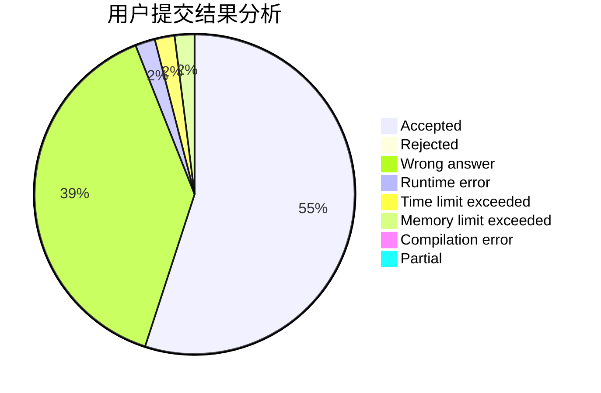
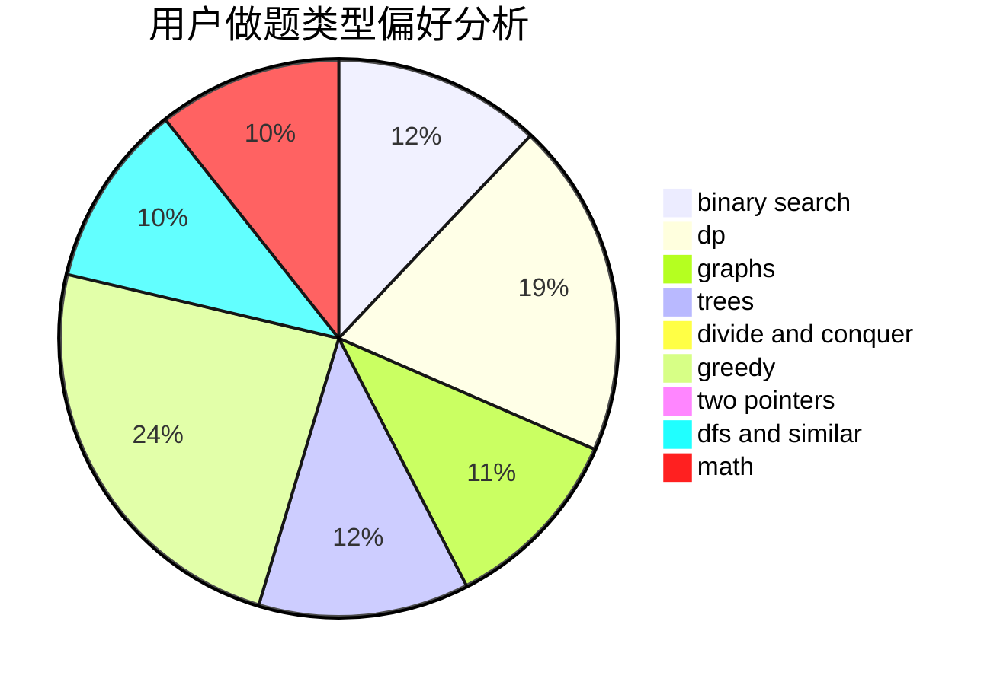

# Inf_Voltage

<!-- tabs:start -->

#### **用户提交结果分析**

#### **用户做题类型偏好分析**

<!-- tabs:end -->
# 推荐题目
[763D](https://codeforces.com/contest/763/problem/D)
[27D](https://codeforces.com/contest/27/problem/D)
[1368C](https://codeforces.com/contest/1368/problem/C)
[1316F](https://codeforces.com/contest/1316/problem/F)
[231C](https://codeforces.com/contest/231/problem/C)
[845A](https://codeforces.com/contest/845/problem/A)
[1327A](https://codeforces.com/contest/1327/problem/A)
[591A](https://codeforces.com/contest/591/problem/A)
[6C](https://codeforces.com/contest/6/problem/C)
[216A](https://codeforces.com/contest/216/problem/A)
