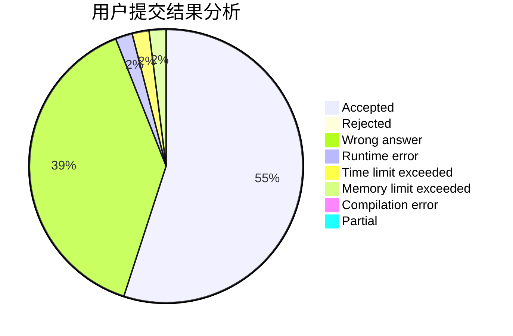
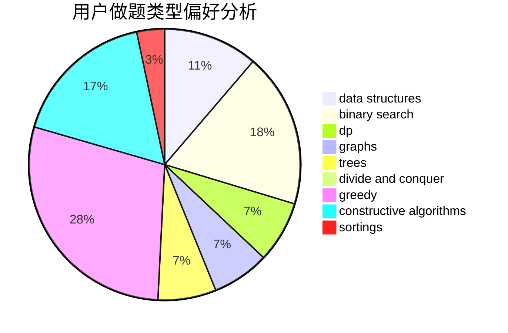
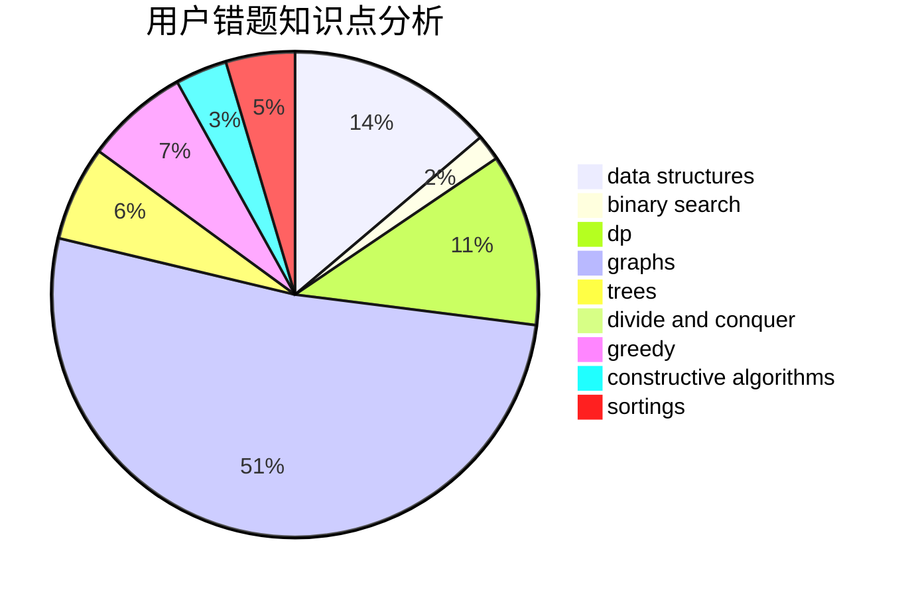

# Inf_Voltage
<!-- tabs:start -->
#### **用户提交结果分析**

#### **用户做题类型偏好分析**

#### **用户错题知识点分析**

<!-- tabs:end -->
# 推荐题目
[263A](http://codeforces.com/problemset/problem/263/A)		implementation		  
[1326A](http://codeforces.com/problemset/problem/1326/A)		constructive algorithms,
                        number theory		  
[1360D](http://codeforces.com/problemset/problem/1360/D)		math,
                        number theory		  
[743C](http://codeforces.com/problemset/problem/743/C)		brute force,
                        constructive algorithms,
                        math,
                        number theory		  
[1253D](http://codeforces.com/problemset/problem/1253/D)		constructive algorithms,
                        dfs and similar,
                        dsu,
                        graphs,
                        greedy,
                        sortings		  
[825E](http://codeforces.com/problemset/problem/825/E)		data structures,
                        dfs and similar,
                        graphs,
                        greedy		  
[667A](http://codeforces.com/problemset/problem/667/A)		geometry,
                        math		  
[1310C](http://codeforces.com/problemset/problem/1310/C)		binary search,
                        dp,
                        strings		  
[1034A](http://codeforces.com/problemset/problem/1034/A)		number theory		  
[501A](http://codeforces.com/problemset/problem/501/A)		implementation		  
<!-- tabs:start -->
#### **data structures**
[825E](http://codeforces.com/problemset/problem/825/E)		data structures,
                        dfs and similar,
                        graphs,
                        greedy		  
[191C](http://codeforces.com/problemset/problem/191/C)		data structures,
                        dfs and similar,
                        trees		  
[777C](http://codeforces.com/problemset/problem/777/C)		binary search,
                        data structures,
                        dp,
                        greedy,
                        implementation,
                        two pointers		  
[1108E2](http://codeforces.com/problemset/problem/1108/E2)		data structures,
                        implementation		  
[675D](http://codeforces.com/problemset/problem/675/D)		data structures,
                        trees		  
[917E](http://codeforces.com/problemset/problem/917/E)		data structures,
                        string suffix structures,
                        strings,
                        trees		  
[1483F](https://codeforces.com/contest/1483/problem/F)		data structures,
                        string suffix structures,
                        trees		  
[1320A](http://codeforces.com/problemset/problem/1320/A)		data structures,
                        dp,
                        greedy,
                        math,
                        sortings		  
[1393B](http://codeforces.com/problemset/problem/1393/B)		constructive algorithms,
                        data structures,
                        greedy,
                        implementation		  
[453E](http://codeforces.com/problemset/problem/453/E)		data structures		  
#### **binary search**
[1310C](http://codeforces.com/problemset/problem/1310/C)		binary search,
                        dp,
                        strings		  
[777C](http://codeforces.com/problemset/problem/777/C)		binary search,
                        data structures,
                        dp,
                        greedy,
                        implementation,
                        two pointers		  
[570D](http://codeforces.com/problemset/problem/570/D)		binary search,
                        bitmasks,
                        constructive algorithms,
                        dfs and similar,
                        graphs,
                        trees		  
[1251D](http://codeforces.com/problemset/problem/1251/D)		binary search,
                        greedy,
                        sortings		  
[1492C](http://codeforces.com/problemset/problem/1492/C)		binary search,
                        data structures,
                        dp,
                        greedy,
                        two pointers		  
[1463D](http://codeforces.com/problemset/problem/1463/D)		binary search,
                        constructive algorithms,
                        greedy,
                        two pointers		  
[1490G](http://codeforces.com/problemset/problem/1490/G)		binary search,
                        data structures,
                        math		  
[1479D](http://codeforces.com/problemset/problem/1479/D)		binary search,
                        bitmasks,
                        brute force,
                        data structures,
                        probabilities,
                        trees		  
[1436E](http://codeforces.com/problemset/problem/1436/E)		binary search,
                        data structures,
                        two pointers		  
[1461D](http://codeforces.com/problemset/problem/1461/D)		binary search,
                        brute force,
                        data structures,
                        divide and conquer,
                        implementation,
                        sortings		  
#### **dp**
[1310C](http://codeforces.com/problemset/problem/1310/C)		binary search,
                        dp,
                        strings		  
[1117D](http://codeforces.com/problemset/problem/1117/D)		dp,
                        math,
                        matrices		  
[1027E](http://codeforces.com/problemset/problem/1027/E)		combinatorics,
                        dp,
                        math		  
[777C](http://codeforces.com/problemset/problem/777/C)		binary search,
                        data structures,
                        dp,
                        greedy,
                        implementation,
                        two pointers		  
[1288C](http://codeforces.com/problemset/problem/1288/C)		combinatorics,
                        dp		  
[747F](http://codeforces.com/problemset/problem/747/F)		brute force,
                        combinatorics,
                        dp,
                        math		  
[771E](http://codeforces.com/problemset/problem/771/E)		dp,
                        greedy		  
[1320A](http://codeforces.com/problemset/problem/1320/A)		data structures,
                        dp,
                        greedy,
                        math,
                        sortings		  
[27E](http://codeforces.com/problemset/problem/27/E)		brute force,
                        dp,
                        number theory		  
[917D](http://codeforces.com/problemset/problem/917/D)		dp,
                        math,
                        matrices,
                        trees		  
#### **graph**
[1253D](http://codeforces.com/problemset/problem/1253/D)		constructive algorithms,
                        dfs and similar,
                        dsu,
                        graphs,
                        greedy,
                        sortings		  
[825E](http://codeforces.com/problemset/problem/825/E)		data structures,
                        dfs and similar,
                        graphs,
                        greedy		  
[570D](http://codeforces.com/problemset/problem/570/D)		binary search,
                        bitmasks,
                        constructive algorithms,
                        dfs and similar,
                        graphs,
                        trees		  
[438A](https://codeforces.com/contest/438/problem/A)		graphs,
                        greedy,
                        sortings		  
[1344C](http://codeforces.com/problemset/problem/1344/C)		dfs and similar,
                        dp,
                        graphs,
                        math		  
[1105D](http://codeforces.com/problemset/problem/1105/D)		dfs and similar,
                        graphs,
                        implementation,
                        shortest paths		  
[160D](http://codeforces.com/problemset/problem/160/D)		dfs and similar,
                        dsu,
                        graphs,
                        sortings		  
[1487C](http://codeforces.com/problemset/problem/1487/C)		brute force,
                        constructive algorithms,
                        dfs and similar,
                        graphs,
                        greedy,
                        implementation,
                        math		  
[1437C](http://codeforces.com/problemset/problem/1437/C)		dp,
                        flows,
                        graph matchings,
                        greedy,
                        math,
                        sortings		  
[1470D](http://codeforces.com/problemset/problem/1470/D)		constructive algorithms,
                        dfs and similar,
                        graph matchings,
                        graphs,
                        greedy		  
#### **trees**
[191C](http://codeforces.com/problemset/problem/191/C)		data structures,
                        dfs and similar,
                        trees		  
[570D](http://codeforces.com/problemset/problem/570/D)		binary search,
                        bitmasks,
                        constructive algorithms,
                        dfs and similar,
                        graphs,
                        trees		  
[675D](http://codeforces.com/problemset/problem/675/D)		data structures,
                        trees		  
[917E](http://codeforces.com/problemset/problem/917/E)		data structures,
                        string suffix structures,
                        strings,
                        trees		  
[1483F](https://codeforces.com/contest/1483/problem/F)		data structures,
                        string suffix structures,
                        trees		  
[917D](http://codeforces.com/problemset/problem/917/D)		dp,
                        math,
                        matrices,
                        trees		  
[1479D](http://codeforces.com/problemset/problem/1479/D)		binary search,
                        bitmasks,
                        brute force,
                        data structures,
                        probabilities,
                        trees		  
[1511C](http://codeforces.com/problemset/problem/1511/C)		brute force,
                        data structures,
                        implementation,
                        trees		  
[1499F](http://codeforces.com/problemset/problem/1499/F)		combinatorics,
                        dfs and similar,
                        dp,
                        trees		  
[1491E](http://codeforces.com/problemset/problem/1491/E)		brute force,
                        dfs and similar,
                        divide and conquer,
                        number theory,
                        trees		  
#### **divide and conquer**
[1250M](http://codeforces.com/problemset/problem/1250/M)		constructive algorithms,
                        divide and conquer		  
[1338C](http://codeforces.com/problemset/problem/1338/C)		bitmasks,
                        brute force,
                        constructive algorithms,
                        divide and conquer,
                        math		  
[1461D](http://codeforces.com/problemset/problem/1461/D)		binary search,
                        brute force,
                        data structures,
                        divide and conquer,
                        implementation,
                        sortings		  
[1466G](http://codeforces.com/problemset/problem/1466/G)		combinatorics,
                        divide and conquer,
                        hashing,
                        math,
                        string suffix structures,
                        strings		  
[1490D](http://codeforces.com/problemset/problem/1490/D)		dfs and similar,
                        divide and conquer,
                        implementation		  
[1483C](https://codeforces.com/contest/1483/problem/C)		data structures,
                        divide and conquer,
                        dp		  
[1491E](http://codeforces.com/problemset/problem/1491/E)		brute force,
                        dfs and similar,
                        divide and conquer,
                        number theory,
                        trees		  
[1303G](http://codeforces.com/problemset/problem/1303/G)		data structures,
                        divide and conquer,
                        geometry,
                        trees		  
[1494D](http://codeforces.com/problemset/problem/1494/D)		constructive algorithms,
                        data structures,
                        dfs and similar,
                        divide and conquer,
                        dsu,
                        greedy,
                        sortings,
                        trees		  
[1482E](http://codeforces.com/problemset/problem/1482/E)		data structures,
                        divide and conquer,
                        dp		  
#### **greedy**
[1253D](http://codeforces.com/problemset/problem/1253/D)		constructive algorithms,
                        dfs and similar,
                        dsu,
                        graphs,
                        greedy,
                        sortings		  
[825E](http://codeforces.com/problemset/problem/825/E)		data structures,
                        dfs and similar,
                        graphs,
                        greedy		  
[777C](http://codeforces.com/problemset/problem/777/C)		binary search,
                        data structures,
                        dp,
                        greedy,
                        implementation,
                        two pointers		  
[438A](https://codeforces.com/contest/438/problem/A)		graphs,
                        greedy,
                        sortings		  
[771E](http://codeforces.com/problemset/problem/771/E)		dp,
                        greedy		  
[1320A](http://codeforces.com/problemset/problem/1320/A)		data structures,
                        dp,
                        greedy,
                        math,
                        sortings		  
[298D](https://codeforces.com/contest/298/problem/D)		constructive algorithms,
                        greedy		  
[1393B](http://codeforces.com/problemset/problem/1393/B)		constructive algorithms,
                        data structures,
                        greedy,
                        implementation		  
[1251D](http://codeforces.com/problemset/problem/1251/D)		binary search,
                        greedy,
                        sortings		  
[1492C](http://codeforces.com/problemset/problem/1492/C)		binary search,
                        data structures,
                        dp,
                        greedy,
                        two pointers		  
#### **constructive algorithms**
[1326A](http://codeforces.com/problemset/problem/1326/A)		constructive algorithms,
                        number theory		  
[743C](http://codeforces.com/problemset/problem/743/C)		brute force,
                        constructive algorithms,
                        math,
                        number theory		  
[1253D](http://codeforces.com/problemset/problem/1253/D)		constructive algorithms,
                        dfs and similar,
                        dsu,
                        graphs,
                        greedy,
                        sortings		  
[570D](http://codeforces.com/problemset/problem/570/D)		binary search,
                        bitmasks,
                        constructive algorithms,
                        dfs and similar,
                        graphs,
                        trees		  
[1250M](http://codeforces.com/problemset/problem/1250/M)		constructive algorithms,
                        divide and conquer		  
[369B](http://codeforces.com/problemset/problem/369/B)		constructive algorithms,
                        implementation,
                        math		  
[305A](http://codeforces.com/problemset/problem/305/A)		brute force,
                        constructive algorithms,
                        implementation		  
[679A](http://codeforces.com/problemset/problem/679/A)		constructive algorithms,
                        interactive,
                        math		  
[1338C](http://codeforces.com/problemset/problem/1338/C)		bitmasks,
                        brute force,
                        constructive algorithms,
                        divide and conquer,
                        math		  
[298D](https://codeforces.com/contest/298/problem/D)		constructive algorithms,
                        greedy		  
#### **sortings**
[1253D](http://codeforces.com/problemset/problem/1253/D)		constructive algorithms,
                        dfs and similar,
                        dsu,
                        graphs,
                        greedy,
                        sortings		  
[53D](http://codeforces.com/problemset/problem/53/D)		sortings		  
[438A](https://codeforces.com/contest/438/problem/A)		graphs,
                        greedy,
                        sortings		  
[1297B](http://codeforces.com/problemset/problem/1297/B)		*special problem,
                        implementation,
                        sortings		  
[1320A](http://codeforces.com/problemset/problem/1320/A)		data structures,
                        dp,
                        greedy,
                        math,
                        sortings		  
[1251D](http://codeforces.com/problemset/problem/1251/D)		binary search,
                        greedy,
                        sortings		  
[160D](http://codeforces.com/problemset/problem/160/D)		dfs and similar,
                        dsu,
                        graphs,
                        sortings		  
[1496C](https://codeforces.com/contest/1496/problem/C)		geometry,
                        greedy,
                        math,
                        sortings		  
[1495A](http://codeforces.com/problemset/problem/1495/A)		geometry,
                        greedy,
                        math,
                        sortings		  
[1497A](http://codeforces.com/problemset/problem/1497/A)		brute force,
                        data structures,
                        greedy,
                        sortings		  
<!-- tabs:end -->
