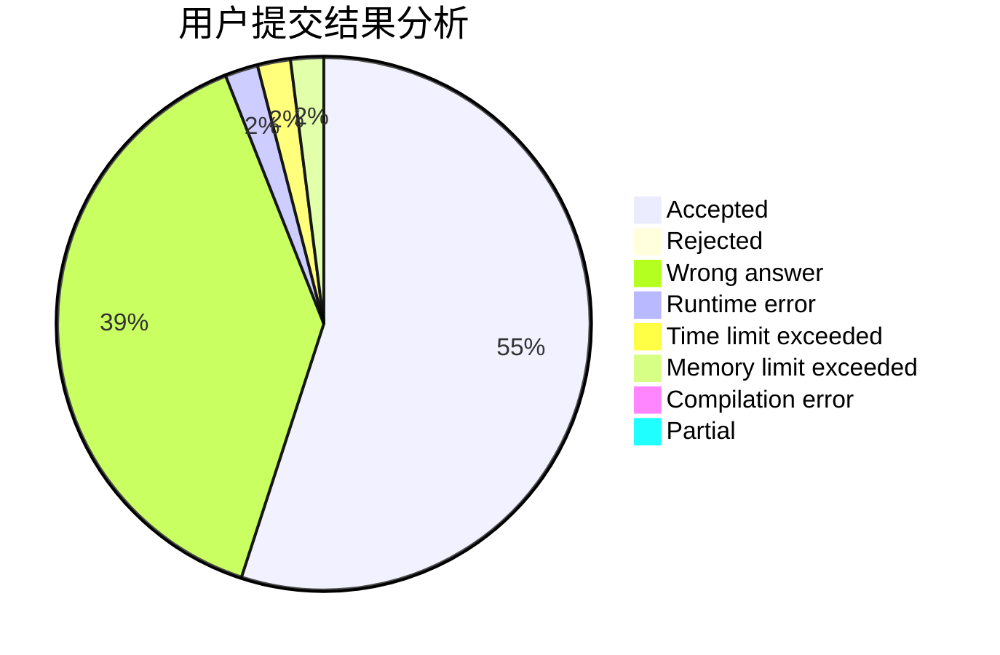
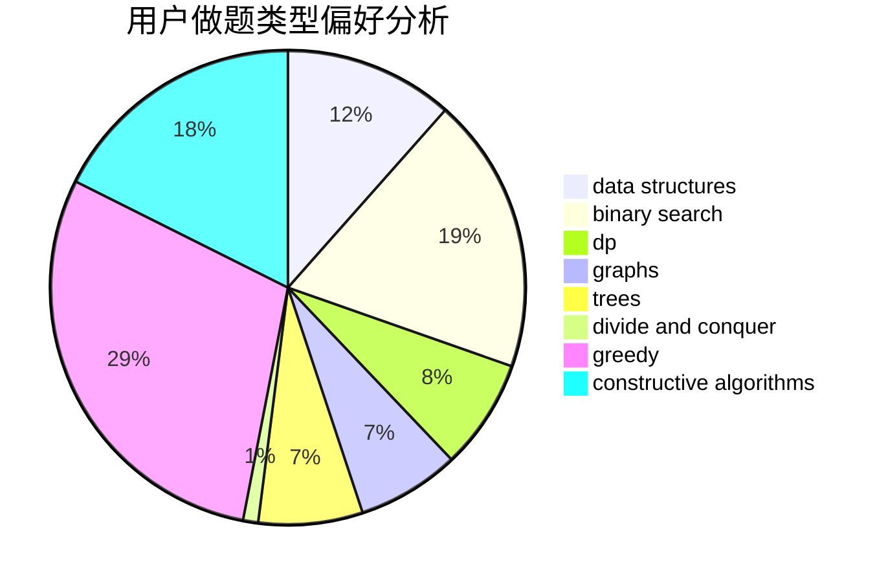
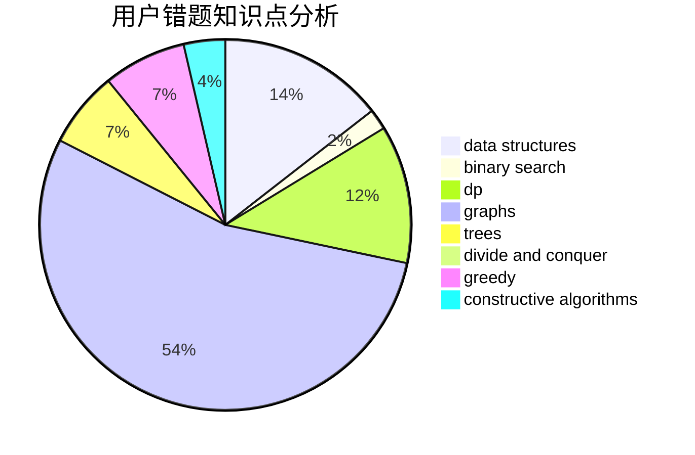

# Inf_Voltage
<!-- tabs:start -->
#### **用户提交结果分析**

#### **用户做题类型偏好分析**

#### **用户错题知识点分析**

<!-- tabs:end -->
# 推荐题目
[Beautiful Matrix](http://codeforces.com/problemset/problem/263/A)		implementation		  
[Bad Ugly Numbers](http://codeforces.com/problemset/problem/1326/A)		constructive algorithms,
                        number theory		  
[Buying Shovels](http://codeforces.com/problemset/problem/1360/D)		math,
                        number theory		  
[Vladik and fractions](http://codeforces.com/problemset/problem/743/C)		brute force,
                        constructive algorithms,
                        math,
                        number theory		  
[Harmonious Graph](http://codeforces.com/problemset/problem/1253/D)		constructive algorithms,
                        dfs and similar,
                        dsu,
                        graphs,
                        greedy,
                        sortings		  
[Minimal Labels](http://codeforces.com/problemset/problem/825/E)		data structures,
                        dfs and similar,
                        graphs,
                        greedy		  
[Pouring Rain](http://codeforces.com/problemset/problem/667/A)		geometry,
                        math		  
[Au Pont Rouge](http://codeforces.com/problemset/problem/1310/C)		binary search,
                        dp,
                        strings		  
[Enlarge GCD](http://codeforces.com/problemset/problem/1034/A)		number theory		  
[Contest](http://codeforces.com/problemset/problem/501/A)		implementation		  
<!-- tabs:start -->
#### **data structures**
[Minimal Labels](http://codeforces.com/problemset/problem/825/E)		data structures,
                        dfs and similar,
                        graphs,
                        greedy		  
[Fools and Roads](http://codeforces.com/problemset/problem/191/C)		data structures,
                        dfs and similar,
                        trees		  
[Alyona and Spreadsheet](http://codeforces.com/problemset/problem/777/C)		binary search,
                        data structures,
                        dp,
                        greedy,
                        implementation,
                        two pointers		  
[Array and Segments (Hard version)](http://codeforces.com/problemset/problem/1108/E2)		data structures,
                        implementation		  
[Дерево](http://codeforces.com/problemset/problem/675/D)		data structures,
                        trees		  
[Upside Down](http://codeforces.com/problemset/problem/917/E)		data structures,
                        string suffix structures,
                        strings,
                        trees		  
[Exam](https://codeforces.com/contest/1483/problem/F)		data structures,
                        string suffix structures,
                        trees		  
[Journey Planning](http://codeforces.com/problemset/problem/1320/A)		data structures,
                        dp,
                        greedy,
                        math,
                        sortings		  
[Applejack and Storages](http://codeforces.com/problemset/problem/1393/B)		constructive algorithms,
                        data structures,
                        greedy,
                        implementation		  
[Little Pony and Lord Tirek](http://codeforces.com/problemset/problem/453/E)		data structures		  
#### **binary search**
[Au Pont Rouge](http://codeforces.com/problemset/problem/1310/C)		binary search,
                        dp,
                        strings		  
[Alyona and Spreadsheet](http://codeforces.com/problemset/problem/777/C)		binary search,
                        data structures,
                        dp,
                        greedy,
                        implementation,
                        two pointers		  
[Tree Requests](http://codeforces.com/problemset/problem/570/D)		binary search,
                        bitmasks,
                        constructive algorithms,
                        dfs and similar,
                        graphs,
                        trees		  
[Salary Changing](http://codeforces.com/problemset/problem/1251/D)		binary search,
                        greedy,
                        sortings		  
[Maximum width](http://codeforces.com/problemset/problem/1492/C)		binary search,
                        data structures,
                        dp,
                        greedy,
                        two pointers		  
[Pairs](http://codeforces.com/problemset/problem/1463/D)		binary search,
                        constructive algorithms,
                        greedy,
                        two pointers		  
[Old Floppy Drive](http://codeforces.com/problemset/problem/1490/G)		binary search,
                        data structures,
                        math		  
[Odd Mineral Resource](http://codeforces.com/problemset/problem/1479/D)		binary search,
                        bitmasks,
                        brute force,
                        data structures,
                        probabilities,
                        trees		  
[Complicated Computations](http://codeforces.com/problemset/problem/1436/E)		binary search,
                        data structures,
                        two pointers		  
[Divide and Summarize](http://codeforces.com/problemset/problem/1461/D)		binary search,
                        brute force,
                        data structures,
                        divide and conquer,
                        implementation,
                        sortings		  
#### **dp**
[Au Pont Rouge](http://codeforces.com/problemset/problem/1310/C)		binary search,
                        dp,
                        strings		  
[Magic Gems](http://codeforces.com/problemset/problem/1117/D)		dp,
                        math,
                        matrices		  
[Inverse Coloring](http://codeforces.com/problemset/problem/1027/E)		combinatorics,
                        dp,
                        math		  
[Alyona and Spreadsheet](http://codeforces.com/problemset/problem/777/C)		binary search,
                        data structures,
                        dp,
                        greedy,
                        implementation,
                        two pointers		  
[Two Arrays](http://codeforces.com/problemset/problem/1288/C)		combinatorics,
                        dp		  
[Igor and Interesting Numbers](http://codeforces.com/problemset/problem/747/F)		brute force,
                        combinatorics,
                        dp,
                        math		  
[Bear and Rectangle Strips](http://codeforces.com/problemset/problem/771/E)		dp,
                        greedy		  
[Journey Planning](http://codeforces.com/problemset/problem/1320/A)		data structures,
                        dp,
                        greedy,
                        math,
                        sortings		  
[Number With The Given Amount Of Divisors](http://codeforces.com/problemset/problem/27/E)		brute force,
                        dp,
                        number theory		  
[Stranger Trees](http://codeforces.com/problemset/problem/917/D)		dp,
                        math,
                        matrices,
                        trees		  
#### **graph**
[Harmonious Graph](http://codeforces.com/problemset/problem/1253/D)		constructive algorithms,
                        dfs and similar,
                        dsu,
                        graphs,
                        greedy,
                        sortings		  
[Minimal Labels](http://codeforces.com/problemset/problem/825/E)		data structures,
                        dfs and similar,
                        graphs,
                        greedy		  
[Tree Requests](http://codeforces.com/problemset/problem/570/D)		binary search,
                        bitmasks,
                        constructive algorithms,
                        dfs and similar,
                        graphs,
                        trees		  
[The Child and Toy](https://codeforces.com/contest/438/problem/A)		graphs,
                        greedy,
                        sortings		  
[Quantifier Question](http://codeforces.com/problemset/problem/1344/C)		dfs and similar,
                        dp,
                        graphs,
                        math		  
[Kilani and the Game](http://codeforces.com/problemset/problem/1105/D)		dfs and similar,
                        graphs,
                        implementation,
                        shortest paths		  
[Edges in MST](http://codeforces.com/problemset/problem/160/D)		dfs and similar,
                        dsu,
                        graphs,
                        sortings		  
[Minimum Ties](http://codeforces.com/problemset/problem/1487/C)		brute force,
                        constructive algorithms,
                        dfs and similar,
                        graphs,
                        greedy,
                        implementation,
                        math		  
[Chef Monocarp](http://codeforces.com/problemset/problem/1437/C)		dp,
                        flows,
                        graph matchings,
                        greedy,
                        math,
                        sortings		  
[Strange Housing](http://codeforces.com/problemset/problem/1470/D)		constructive algorithms,
                        dfs and similar,
                        graph matchings,
                        graphs,
                        greedy		  
#### **trees**
[Fools and Roads](http://codeforces.com/problemset/problem/191/C)		data structures,
                        dfs and similar,
                        trees		  
[Tree Requests](http://codeforces.com/problemset/problem/570/D)		binary search,
                        bitmasks,
                        constructive algorithms,
                        dfs and similar,
                        graphs,
                        trees		  
[Дерево](http://codeforces.com/problemset/problem/675/D)		data structures,
                        trees		  
[Upside Down](http://codeforces.com/problemset/problem/917/E)		data structures,
                        string suffix structures,
                        strings,
                        trees		  
[Exam](https://codeforces.com/contest/1483/problem/F)		data structures,
                        string suffix structures,
                        trees		  
[Stranger Trees](http://codeforces.com/problemset/problem/917/D)		dp,
                        math,
                        matrices,
                        trees		  
[Odd Mineral Resource](http://codeforces.com/problemset/problem/1479/D)		binary search,
                        bitmasks,
                        brute force,
                        data structures,
                        probabilities,
                        trees		  
[Yet Another Card Deck](http://codeforces.com/problemset/problem/1511/C)		brute force,
                        data structures,
                        implementation,
                        trees		  
[Diameter Cuts](http://codeforces.com/problemset/problem/1499/F)		combinatorics,
                        dfs and similar,
                        dp,
                        trees		  
[Fib-tree](http://codeforces.com/problemset/problem/1491/E)		brute force,
                        dfs and similar,
                        divide and conquer,
                        number theory,
                        trees		  
#### **divide and conquer**
[SmartGarden](http://codeforces.com/problemset/problem/1250/M)		constructive algorithms,
                        divide and conquer		  
[Perfect Triples](http://codeforces.com/problemset/problem/1338/C)		bitmasks,
                        brute force,
                        constructive algorithms,
                        divide and conquer,
                        math		  
[Divide and Summarize](http://codeforces.com/problemset/problem/1461/D)		binary search,
                        brute force,
                        data structures,
                        divide and conquer,
                        implementation,
                        sortings		  
[Song of the Sirens](http://codeforces.com/problemset/problem/1466/G)		combinatorics,
                        divide and conquer,
                        hashing,
                        math,
                        string suffix structures,
                        strings		  
[Permutation Transformation](http://codeforces.com/problemset/problem/1490/D)		dfs and similar,
                        divide and conquer,
                        implementation		  
[Skyline Photo](https://codeforces.com/contest/1483/problem/C)		data structures,
                        divide and conquer,
                        dp		  
[Fib-tree](http://codeforces.com/problemset/problem/1491/E)		brute force,
                        dfs and similar,
                        divide and conquer,
                        number theory,
                        trees		  
[Sum of Prefix Sums](http://codeforces.com/problemset/problem/1303/G)		data structures,
                        divide and conquer,
                        geometry,
                        trees		  
[Dogeforces](http://codeforces.com/problemset/problem/1494/D)		constructive algorithms,
                        data structures,
                        dfs and similar,
                        divide and conquer,
                        dsu,
                        greedy,
                        sortings,
                        trees		  
[Logistical Questions](http://codeforces.com/problemset/problem/566/C)		dfs and similar,
                        divide and conquer,
                        trees		  
#### **greedy**
[Harmonious Graph](http://codeforces.com/problemset/problem/1253/D)		constructive algorithms,
                        dfs and similar,
                        dsu,
                        graphs,
                        greedy,
                        sortings		  
[Minimal Labels](http://codeforces.com/problemset/problem/825/E)		data structures,
                        dfs and similar,
                        graphs,
                        greedy		  
[Alyona and Spreadsheet](http://codeforces.com/problemset/problem/777/C)		binary search,
                        data structures,
                        dp,
                        greedy,
                        implementation,
                        two pointers		  
[The Child and Toy](https://codeforces.com/contest/438/problem/A)		graphs,
                        greedy,
                        sortings		  
[Bear and Rectangle Strips](http://codeforces.com/problemset/problem/771/E)		dp,
                        greedy		  
[Journey Planning](http://codeforces.com/problemset/problem/1320/A)		data structures,
                        dp,
                        greedy,
                        math,
                        sortings		  
[Fish Weight](https://codeforces.com/contest/298/problem/D)		constructive algorithms,
                        greedy		  
[Applejack and Storages](http://codeforces.com/problemset/problem/1393/B)		constructive algorithms,
                        data structures,
                        greedy,
                        implementation		  
[Salary Changing](http://codeforces.com/problemset/problem/1251/D)		binary search,
                        greedy,
                        sortings		  
[Maximum width](http://codeforces.com/problemset/problem/1492/C)		binary search,
                        data structures,
                        dp,
                        greedy,
                        two pointers		  
#### **constructive algorithms**
[Bad Ugly Numbers](http://codeforces.com/problemset/problem/1326/A)		constructive algorithms,
                        number theory		  
[Vladik and fractions](http://codeforces.com/problemset/problem/743/C)		brute force,
                        constructive algorithms,
                        math,
                        number theory		  
[Harmonious Graph](http://codeforces.com/problemset/problem/1253/D)		constructive algorithms,
                        dfs and similar,
                        dsu,
                        graphs,
                        greedy,
                        sortings		  
[Tree Requests](http://codeforces.com/problemset/problem/570/D)		binary search,
                        bitmasks,
                        constructive algorithms,
                        dfs and similar,
                        graphs,
                        trees		  
[SmartGarden](http://codeforces.com/problemset/problem/1250/M)		constructive algorithms,
                        divide and conquer		  
[Valera and Contest](http://codeforces.com/problemset/problem/369/B)		constructive algorithms,
                        implementation,
                        math		  
[Strange Addition](http://codeforces.com/problemset/problem/305/A)		brute force,
                        constructive algorithms,
                        implementation		  
[Bear and Prime 100](http://codeforces.com/problemset/problem/679/A)		constructive algorithms,
                        interactive,
                        math		  
[Perfect Triples](http://codeforces.com/problemset/problem/1338/C)		bitmasks,
                        brute force,
                        constructive algorithms,
                        divide and conquer,
                        math		  
[Fish Weight](https://codeforces.com/contest/298/problem/D)		constructive algorithms,
                        greedy		  
#### **sortings**
[Harmonious Graph](http://codeforces.com/problemset/problem/1253/D)		constructive algorithms,
                        dfs and similar,
                        dsu,
                        graphs,
                        greedy,
                        sortings		  
[Physical Education](http://codeforces.com/problemset/problem/53/D)		sortings		  
[The Child and Toy](https://codeforces.com/contest/438/problem/A)		graphs,
                        greedy,
                        sortings		  
[Cartoons](http://codeforces.com/problemset/problem/1297/B)		*special problem,
                        implementation,
                        sortings		  
[Journey Planning](http://codeforces.com/problemset/problem/1320/A)		data structures,
                        dp,
                        greedy,
                        math,
                        sortings		  
[Salary Changing](http://codeforces.com/problemset/problem/1251/D)		binary search,
                        greedy,
                        sortings		  
[Edges in MST](http://codeforces.com/problemset/problem/160/D)		dfs and similar,
                        dsu,
                        graphs,
                        sortings		  
[Diamond Miner](https://codeforces.com/contest/1496/problem/C)		geometry,
                        greedy,
                        math,
                        sortings		  
[Meximization](http://codeforces.com/problemset/problem/1497/A)		brute force,
                        data structures,
                        greedy,
                        sortings		  
[Avoiding Zero](http://codeforces.com/problemset/problem/1427/A)		math,
                        sortings		  
<!-- tabs:end -->
