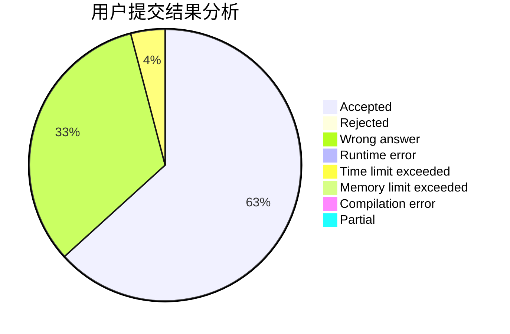
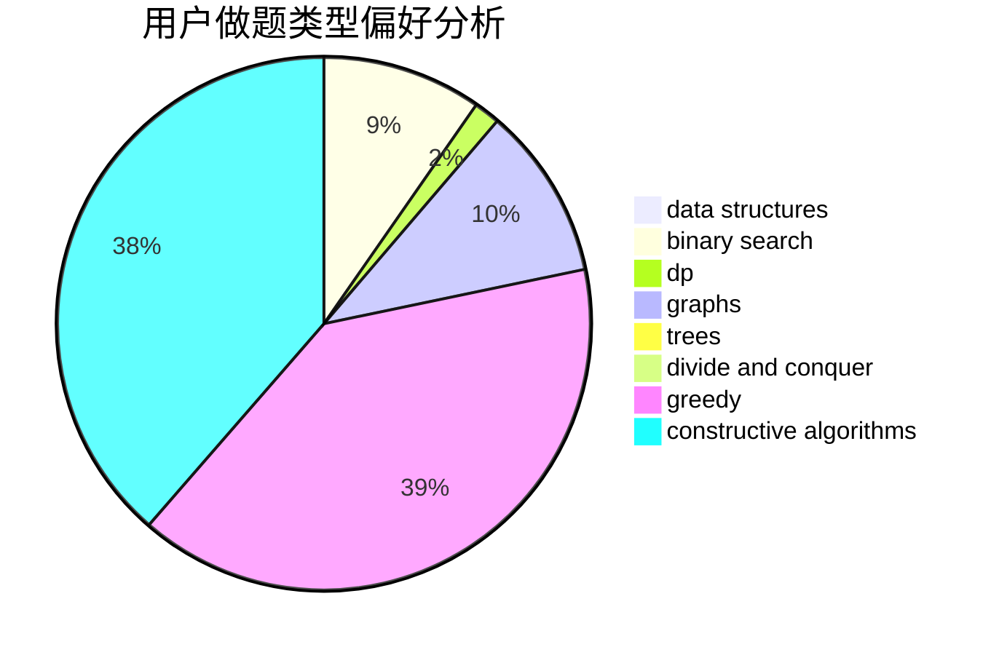

# 2inf

<!-- tabs:start -->

#### **用户提交结果分析**

#### **用户做题类型偏好分析**

#### **用户错题知识点分析**

<!-- tabs:end -->
# 推荐题目
[1336E2](https://codeforces.com/contest/1336E/problem/2)		bitmasks,
                        brute force,
                        combinatorics,
                        math		  
[1115G3](https://codeforces.com/contest/1115G/problem/3)		*special problem		  
[1335C](https://codeforces.com/contest/1335/problem/C)		binary search,
                        greedy,
                        implementation,
                        sortings		  
[1000E](https://codeforces.com/contest/1000/problem/E)		dfs and similar,
                        graphs,
                        trees		  
[1336C](https://codeforces.com/contest/1336/problem/C)		dp,
                        strings		  
[1305C](https://codeforces.com/contest/1305/problem/C)		brute force,
                        combinatorics,
                        math,
                        number theory		  
[1335E2](https://codeforces.com/contest/1335E/problem/2)		brute force,
                        data structures,
                        dp,
                        two pointers		  
[1157F](https://codeforces.com/contest/1157/problem/F)		constructive algorithms,
                        dp,
                        greedy,
                        two pointers		  
[1336D](https://codeforces.com/contest/1336/problem/D)		constructive algorithms,
                        interactive		  
[1336F](https://codeforces.com/contest/1336/problem/F)		data structures,
                        divide and conquer,
                        graphs,
                        trees		  
