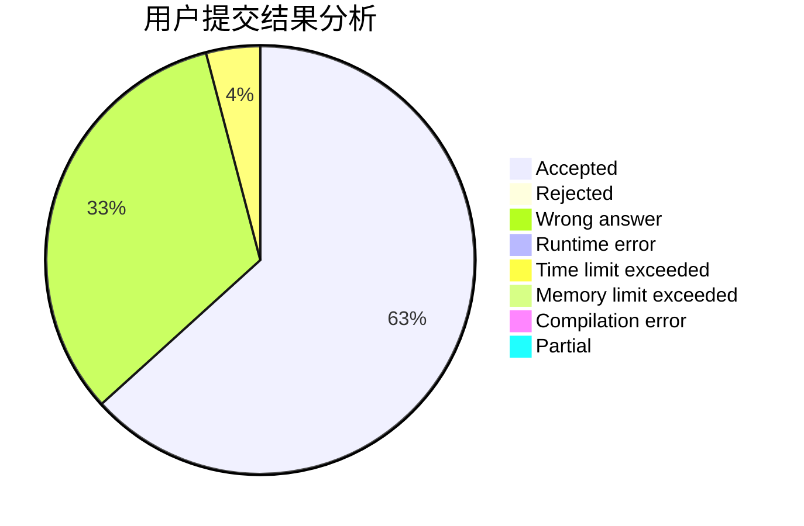
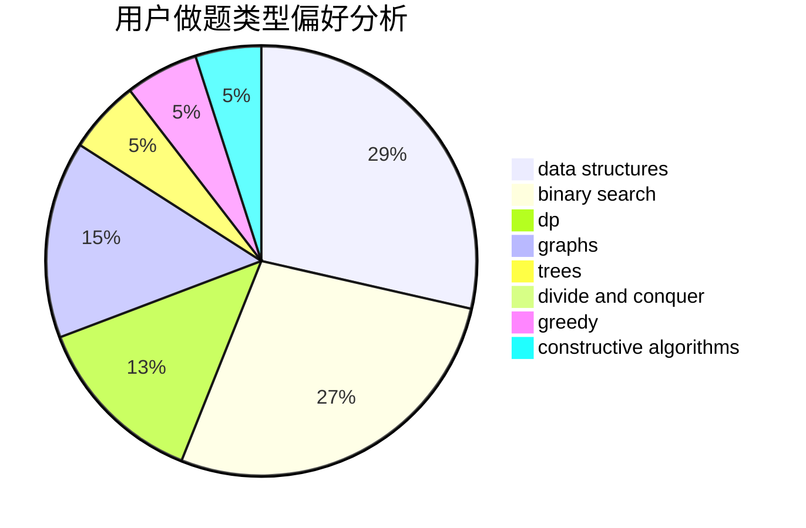

# 2inf

<!-- tabs:start -->

#### **用户提交结果分析**

#### **用户做题类型偏好分析**

#### **用户错题知识点分析**

<!-- tabs:end -->
# 推荐题目
[1344A](https://codeforces.com/contest/1344/problem/A)		math,
                        number theory,
                        sortings		  
[11163](https://codeforces.com/contest/1116/problem/3)		dsu,graphs,sortings,trees		  
[1342C](https://codeforces.com/contest/1342/problem/C)		math,
                        number theory		  
[1000E](https://codeforces.com/contest/1000/problem/E)		dfs and similar,
                        graphs,
                        trees		  
[1343D](https://codeforces.com/contest/1343/problem/D)		brute force,
                        data structures,
                        greedy,
                        two pointers		  
[1314B](https://codeforces.com/contest/1314/problem/B)		dsu,graphs,sortings,trees		  
[1342F](https://codeforces.com/contest/1342/problem/F)		bitmasks,
                        brute force,
                        dp		  
[115B](https://codeforces.com/contest/115/problem/B)		greedy,
                        sortings		  
[1343E](https://codeforces.com/contest/1343/problem/E)		brute force,
                        graphs,
                        greedy,
                        shortest paths,
                        sortings		  
[1344B](https://codeforces.com/contest/1344/problem/B)		constructive algorithms,
                        dfs and similar,
                        dsu,
                        graphs		  
