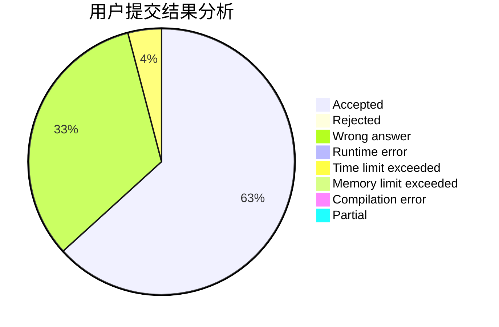
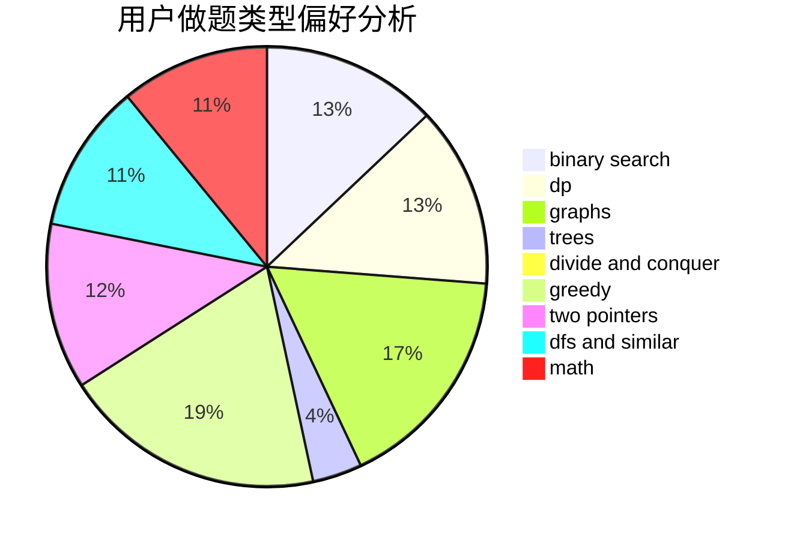

# 2inf

<!-- tabs:start -->

#### **用户提交结果分析**

#### **用户做题类型偏好分析**

<!-- tabs:end -->
# 推荐题目
[1344A](https://codeforces.com/contest/1344/problem/A)
[11163](https://codeforces.com/contest/1116/problem/3)
[1342C](https://codeforces.com/contest/1342/problem/C)
[1000E](https://codeforces.com/contest/1000/problem/E)
[1343D](https://codeforces.com/contest/1343/problem/D)
[1314B](https://codeforces.com/contest/1314/problem/B)
[1342F](https://codeforces.com/contest/1342/problem/F)
[115B](https://codeforces.com/contest/115/problem/B)
[1343E](https://codeforces.com/contest/1343/problem/E)
[1344B](https://codeforces.com/contest/1344/problem/B)
