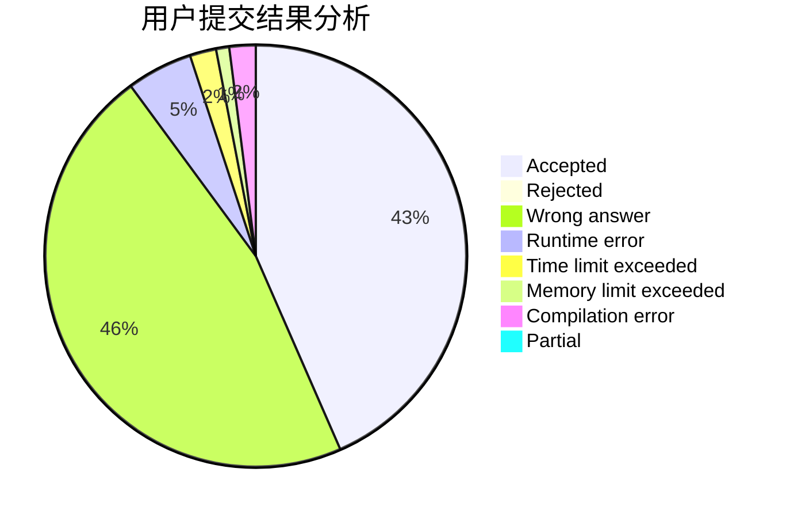
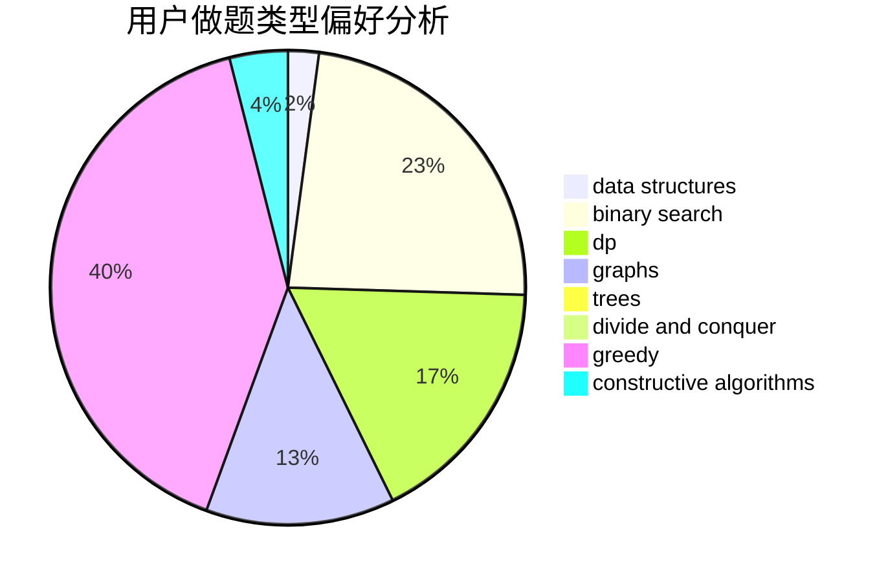
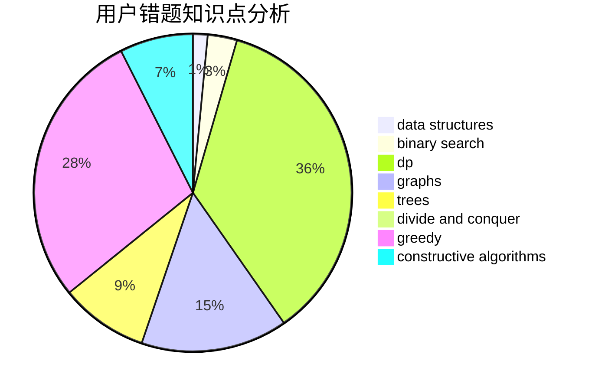

# Infinempty

<!-- tabs:start -->

#### **用户提交结果分析**

#### **用户做题类型偏好分析**

#### **用户错题知识点分析**

<!-- tabs:end -->
# 推荐题目
[869B](https://codeforces.com/contest/869/problem/B)		math		  
[519E](https://codeforces.com/contest/519/problem/E)		binary search,
                        data structures,
                        dfs and similar,
                        dp,
                        trees		  
[1182A](https://codeforces.com/contest/1182/problem/A)		dp,
                        math		  
[1083B](https://codeforces.com/contest/1083/problem/B)		greedy,
                        strings		  
[1085A](https://codeforces.com/contest/1085/problem/A)		implementation,
                        strings		  
[551A](https://codeforces.com/contest/551/problem/A)		brute force,
                        implementation,
                        sortings		  
[611B](https://codeforces.com/contest/611/problem/B)		bitmasks,
                        brute force,
                        implementation		  
[545E](https://codeforces.com/contest/545/problem/E)		graphs,
                        greedy,
                        shortest paths		  
[570E](https://codeforces.com/contest/570/problem/E)		combinatorics,
                        dp		  
[814A](https://codeforces.com/contest/814/problem/A)		constructive algorithms,
                        greedy,
                        implementation,
                        sortings		  
