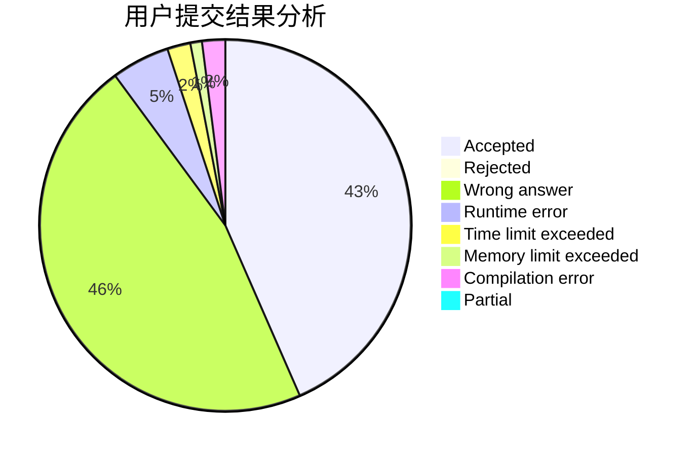
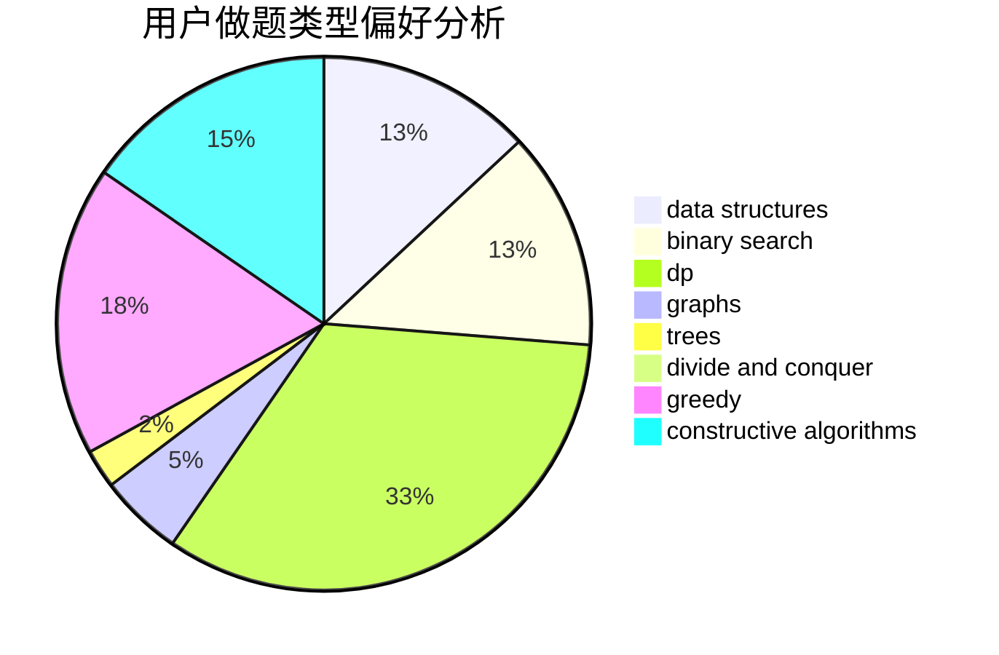
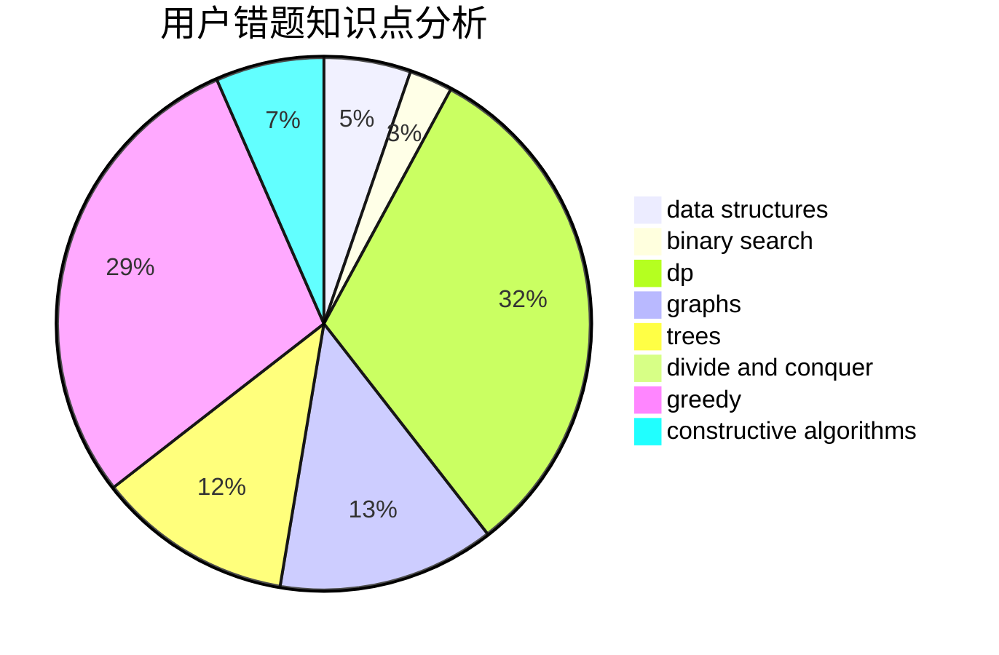

# Infinempty
<!-- tabs:start -->
#### **用户提交结果分析**

#### **用户做题类型偏好分析**

#### **用户错题知识点分析**

<!-- tabs:end -->
# 推荐题目
[Stairs and Lines](http://codeforces.com/problemset/problem/498/E)		dp,
                        matrices		  
[Arpa and a game with Mojtaba](http://codeforces.com/problemset/problem/850/C)		bitmasks,
                        dp,
                        games		  
[Pangram](http://codeforces.com/problemset/problem/520/A)		implementation,
                        strings		  
[So Mean](http://codeforces.com/problemset/problem/1299/E)		interactive,
                        math		  
[Speed Dial](http://codeforces.com/problemset/problem/1082/F)		dp,
                        strings,
                        trees		  
[Password](http://codeforces.com/problemset/problem/79/D)		bitmasks,
                        dp,
                        shortest paths		  
[Tolik and His Uncle](http://codeforces.com/problemset/problem/1179/B)		constructive algorithms		  
[Soldier and Number Game](http://codeforces.com/problemset/problem/546/D)		constructive algorithms,
                        dp,
                        math,
                        number theory		  
[Minimum path](https://codeforces.com/contest/1071/problem/B)		greedy		  
[Chip 'n Dale Rescue Rangers](https://codeforces.com/contest/591/problem/D)		binary search,
                        geometry,
                        math		  
<!-- tabs:start -->
#### **data structures**
[Stairs and Lines](http://codeforces.com/problemset/problem/1492/C)		binary search,
                        data structures,
                        dp,
                        greedy,
                        two pointers		  
[Arpa and a game with Mojtaba](http://codeforces.com/problemset/problem/1490/G)		binary search,
                        data structures,
                        math		  
[Pangram](http://codeforces.com/problemset/problem/1479/D)		binary search,
                        bitmasks,
                        brute force,
                        data structures,
                        probabilities,
                        trees		  
[So Mean](http://codeforces.com/problemset/problem/1497/A)		brute force,
                        data structures,
                        greedy,
                        sortings		  
[Speed Dial](http://codeforces.com/problemset/problem/1491/C)		brute force,
                        data structures,
                        dp,
                        greedy,
                        implementation		  
[Password](http://codeforces.com/problemset/problem/1492/B)		data structures,
                        greedy,
                        math		  
[Tolik and His Uncle](http://codeforces.com/problemset/problem/1436/E)		binary search,
                        data structures,
                        two pointers		  
[Soldier and Number Game](http://codeforces.com/problemset/problem/1461/D)		binary search,
                        brute force,
                        data structures,
                        divide and conquer,
                        implementation,
                        sortings		  
[Minimum path](http://codeforces.com/problemset/problem/1511/C)		brute force,
                        data structures,
                        implementation,
                        trees		  
[Chip 'n Dale Rescue Rangers](http://codeforces.com/problemset/problem/1497/E1)		data structures,
                        dp,
                        greedy,
                        math,
                        number theory,
                        two pointers		  
#### **binary search**
[Stairs and Lines](https://codeforces.com/contest/591/problem/D)		binary search,
                        geometry,
                        math		  
[Arpa and a game with Mojtaba](http://codeforces.com/problemset/problem/1285/F)		binary search,
                        combinatorics,
                        number theory		  
[Pangram](http://codeforces.com/problemset/problem/1360/H)		binary search,
                        bitmasks,
                        brute force,
                        constructive algorithms		  
[So Mean](http://codeforces.com/problemset/problem/1492/C)		binary search,
                        data structures,
                        dp,
                        greedy,
                        two pointers		  
[Speed Dial](http://codeforces.com/problemset/problem/1463/D)		binary search,
                        constructive algorithms,
                        greedy,
                        two pointers		  
[Password](http://codeforces.com/problemset/problem/1490/G)		binary search,
                        data structures,
                        math		  
[Tolik and His Uncle](http://codeforces.com/problemset/problem/1479/D)		binary search,
                        bitmasks,
                        brute force,
                        data structures,
                        probabilities,
                        trees		  
[Soldier and Number Game](http://codeforces.com/problemset/problem/1436/E)		binary search,
                        data structures,
                        two pointers		  
[Minimum path](http://codeforces.com/problemset/problem/1461/D)		binary search,
                        brute force,
                        data structures,
                        divide and conquer,
                        implementation,
                        sortings		  
[Chip 'n Dale Rescue Rangers](http://codeforces.com/problemset/problem/1493/C)		binary search,
                        brute force,
                        constructive algorithms,
                        greedy,
                        strings		  
#### **dp**
[Stairs and Lines](http://codeforces.com/problemset/problem/498/E)		dp,
                        matrices		  
[Arpa and a game with Mojtaba](http://codeforces.com/problemset/problem/850/C)		bitmasks,
                        dp,
                        games		  
[Pangram](http://codeforces.com/problemset/problem/1082/F)		dp,
                        strings,
                        trees		  
[So Mean](http://codeforces.com/problemset/problem/79/D)		bitmasks,
                        dp,
                        shortest paths		  
[Speed Dial](http://codeforces.com/problemset/problem/546/D)		constructive algorithms,
                        dp,
                        math,
                        number theory		  
[Password](http://codeforces.com/problemset/problem/855/E)		bitmasks,
                        dp		  
[Tolik and His Uncle](http://codeforces.com/problemset/problem/294/B)		dp,
                        greedy		  
[Soldier and Number Game](http://codeforces.com/problemset/problem/1384/B2)		constructive algorithms,
                        dp,
                        greedy,
                        implementation		  
[Minimum path](http://codeforces.com/problemset/problem/1492/C)		binary search,
                        data structures,
                        dp,
                        greedy,
                        two pointers		  
[Chip 'n Dale Rescue Rangers](https://codeforces.com/contest/1457/problem/C)		brute force,
                        dp,
                        implementation		  
#### **graph**
[Stairs and Lines](http://codeforces.com/problemset/problem/1009/D)		brute force,
                        constructive algorithms,
                        graphs,
                        greedy,
                        math		  
[Arpa and a game with Mojtaba](http://codeforces.com/problemset/problem/1487/C)		brute force,
                        constructive algorithms,
                        dfs and similar,
                        graphs,
                        greedy,
                        implementation,
                        math		  
[Pangram](http://codeforces.com/problemset/problem/1437/C)		dp,
                        flows,
                        graph matchings,
                        greedy,
                        math,
                        sortings		  
[So Mean](http://codeforces.com/problemset/problem/1470/D)		constructive algorithms,
                        dfs and similar,
                        graph matchings,
                        graphs,
                        greedy		  
[Speed Dial](http://codeforces.com/problemset/problem/1476/C)		dp,
                        graphs,
                        greedy		  
[Password](http://codeforces.com/problemset/problem/1304/D)		constructive algorithms,
                        graphs,
                        greedy,
                        two pointers		  
[Tolik and His Uncle](http://codeforces.com/problemset/problem/1475/C)		combinatorics,
                        graphs,
                        math		  
[Soldier and Number Game](http://codeforces.com/problemset/problem/553/E)		dp,
                        fft,
                        graphs,
                        math,
                        probabilities		  
[Minimum path](http://codeforces.com/problemset/problem/1495/C)		constructive algorithms,
                        graphs		  
[Chip 'n Dale Rescue Rangers](http://codeforces.com/problemset/problem/1510/K)		brute force,
                        graphs,
                        implementation		  
#### **trees**
[Stairs and Lines](http://codeforces.com/problemset/problem/1082/F)		dp,
                        strings,
                        trees		  
[Arpa and a game with Mojtaba](http://codeforces.com/problemset/problem/526/G)		greedy,
                        trees		  
[Pangram](http://codeforces.com/problemset/problem/1479/D)		binary search,
                        bitmasks,
                        brute force,
                        data structures,
                        probabilities,
                        trees		  
[So Mean](http://codeforces.com/problemset/problem/1511/C)		brute force,
                        data structures,
                        implementation,
                        trees		  
[Speed Dial](http://codeforces.com/problemset/problem/1499/F)		combinatorics,
                        dfs and similar,
                        dp,
                        trees		  
[Password](http://codeforces.com/problemset/problem/1491/E)		brute force,
                        dfs and similar,
                        divide and conquer,
                        number theory,
                        trees		  
[Tolik and His Uncle](http://codeforces.com/problemset/problem/1466/D)		data structures,
                        greedy,
                        sortings,
                        trees		  
[Soldier and Number Game](http://codeforces.com/problemset/problem/1495/D)		combinatorics,
                        dfs and similar,
                        graphs,
                        math,
                        shortest paths,
                        trees		  
[Minimum path](http://codeforces.com/problemset/problem/1303/G)		data structures,
                        divide and conquer,
                        geometry,
                        trees		  
[Chip 'n Dale Rescue Rangers](http://codeforces.com/problemset/problem/1454/E)		combinatorics,
                        dfs and similar,
                        graphs,
                        trees		  
#### **divide and conquer**
[Stairs and Lines](http://codeforces.com/problemset/problem/1461/D)		binary search,
                        brute force,
                        data structures,
                        divide and conquer,
                        implementation,
                        sortings		  
[Arpa and a game with Mojtaba](http://codeforces.com/problemset/problem/1466/G)		combinatorics,
                        divide and conquer,
                        hashing,
                        math,
                        string suffix structures,
                        strings		  
[Pangram](http://codeforces.com/problemset/problem/1490/D)		dfs and similar,
                        divide and conquer,
                        implementation		  
[So Mean](https://codeforces.com/contest/1483/problem/C)		data structures,
                        divide and conquer,
                        dp		  
[Speed Dial](http://codeforces.com/problemset/problem/1491/E)		brute force,
                        dfs and similar,
                        divide and conquer,
                        number theory,
                        trees		  
[Password](http://codeforces.com/problemset/problem/1303/G)		data structures,
                        divide and conquer,
                        geometry,
                        trees		  
[Tolik and His Uncle](http://codeforces.com/problemset/problem/1494/D)		constructive algorithms,
                        data structures,
                        dfs and similar,
                        divide and conquer,
                        dsu,
                        greedy,
                        sortings,
                        trees		  
[Soldier and Number Game](http://codeforces.com/problemset/problem/1482/E)		data structures,
                        divide and conquer,
                        dp		  
[Minimum path](http://codeforces.com/problemset/problem/566/C)		dfs and similar,
                        divide and conquer,
                        trees		  
[Chip 'n Dale Rescue Rangers](http://codeforces.com/problemset/problem/1428/F)		binary search,
                        data structures,
                        divide and conquer,
                        dp,
                        two pointers		  
#### **greedy**
[Stairs and Lines](https://codeforces.com/contest/1071/problem/B)		greedy		  
[Arpa and a game with Mojtaba](http://codeforces.com/problemset/problem/1294/E)		greedy,
                        implementation,
                        math		  
[Pangram](http://codeforces.com/problemset/problem/1009/D)		brute force,
                        constructive algorithms,
                        graphs,
                        greedy,
                        math		  
[So Mean](http://codeforces.com/problemset/problem/294/B)		dp,
                        greedy		  
[Speed Dial](http://codeforces.com/problemset/problem/1084/B)		greedy,
                        implementation		  
[Password](http://codeforces.com/problemset/problem/526/G)		greedy,
                        trees		  
[Tolik and His Uncle](http://codeforces.com/problemset/problem/1384/B2)		constructive algorithms,
                        dp,
                        greedy,
                        implementation		  
[Soldier and Number Game](http://codeforces.com/problemset/problem/1178/A)		greedy		  
[Minimum path](http://codeforces.com/problemset/problem/1492/C)		binary search,
                        data structures,
                        dp,
                        greedy,
                        two pointers		  
[Chip 'n Dale Rescue Rangers](https://codeforces.com/contest/1496/problem/C)		geometry,
                        greedy,
                        math,
                        sortings		  
#### **constructive algorithms**
[Stairs and Lines](http://codeforces.com/problemset/problem/1179/B)		constructive algorithms		  
[Arpa and a game with Mojtaba](http://codeforces.com/problemset/problem/546/D)		constructive algorithms,
                        dp,
                        math,
                        number theory		  
[Pangram](http://codeforces.com/problemset/problem/1009/D)		brute force,
                        constructive algorithms,
                        graphs,
                        greedy,
                        math		  
[So Mean](http://codeforces.com/problemset/problem/1360/H)		binary search,
                        bitmasks,
                        brute force,
                        constructive algorithms		  
[Speed Dial](http://codeforces.com/problemset/problem/1451/E2)		bitmasks,
                        constructive algorithms,
                        interactive,
                        math		  
[Password](http://codeforces.com/problemset/problem/1384/B2)		constructive algorithms,
                        dp,
                        greedy,
                        implementation		  
[Tolik and His Uncle](http://codeforces.com/problemset/problem/1493/A)		constructive algorithms,
                        greedy		  
[Soldier and Number Game](http://codeforces.com/problemset/problem/1463/D)		binary search,
                        constructive algorithms,
                        greedy,
                        two pointers		  
[Minimum path](https://codeforces.com/contest/1456/problem/B)		bitmasks,
                        brute force,
                        constructive algorithms		  
[Chip 'n Dale Rescue Rangers](http://codeforces.com/problemset/problem/1492/D)		bitmasks,
                        constructive algorithms,
                        greedy,
                        math		  
#### **sortings**
[Stairs and Lines](http://codeforces.com/problemset/problem/1220/A)		implementation,
                        sortings,
                        strings		  
[Arpa and a game with Mojtaba](https://codeforces.com/contest/1496/problem/C)		geometry,
                        greedy,
                        math,
                        sortings		  
[Pangram](http://codeforces.com/problemset/problem/1495/A)		geometry,
                        greedy,
                        math,
                        sortings		  
[So Mean](http://codeforces.com/problemset/problem/1497/A)		brute force,
                        data structures,
                        greedy,
                        sortings		  
[Speed Dial](http://codeforces.com/problemset/problem/1427/A)		math,
                        sortings		  
[Password](http://codeforces.com/problemset/problem/1461/D)		binary search,
                        brute force,
                        data structures,
                        divide and conquer,
                        implementation,
                        sortings		  
[Tolik and His Uncle](http://codeforces.com/problemset/problem/1437/C)		dp,
                        flows,
                        graph matchings,
                        greedy,
                        math,
                        sortings		  
[Soldier and Number Game](http://codeforces.com/problemset/problem/1473/A)		greedy,
                        implementation,
                        math,
                        sortings		  
[Minimum path](http://codeforces.com/problemset/problem/1486/B)		binary search,
                        geometry,
                        shortest paths,
                        sortings		  
[Chip 'n Dale Rescue Rangers](http://codeforces.com/problemset/problem/1480/B)		greedy,
                        implementation,
                        sortings		  
<!-- tabs:end -->
