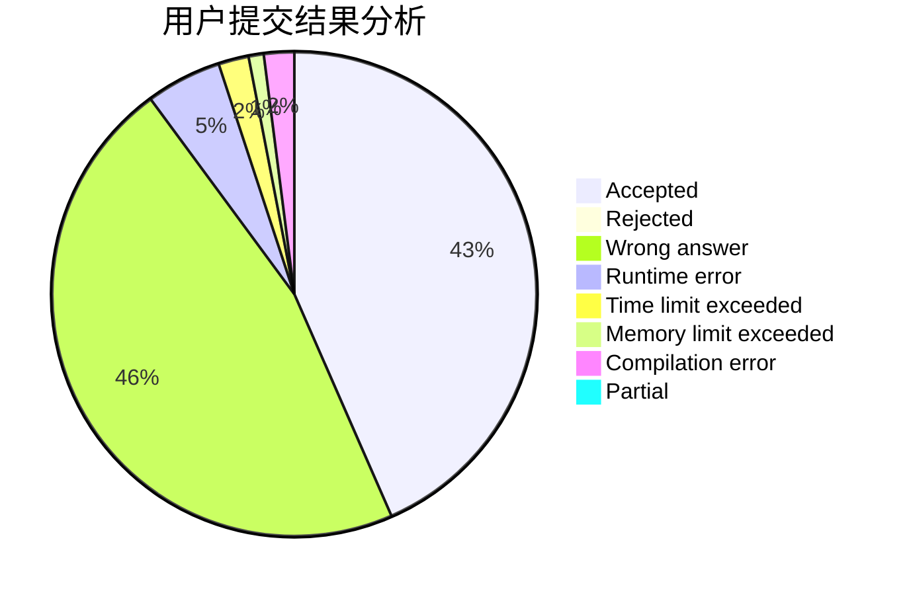
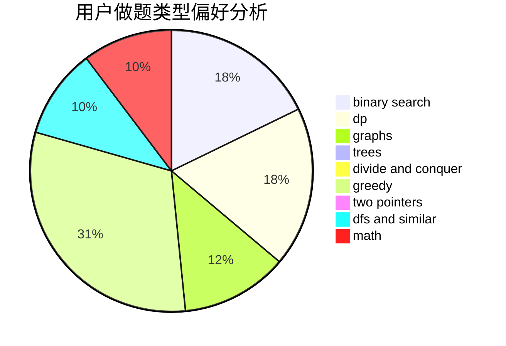

# Infinempty

<!-- tabs:start -->

#### **用户提交结果分析**

#### **用户做题类型偏好分析**

<!-- tabs:end -->
# 推荐题目
[869B](https://codeforces.com/contest/869/problem/B)
[519E](https://codeforces.com/contest/519/problem/E)
[1182A](https://codeforces.com/contest/1182/problem/A)
[1083B](https://codeforces.com/contest/1083/problem/B)
[1085A](https://codeforces.com/contest/1085/problem/A)
[551A](https://codeforces.com/contest/551/problem/A)
[611B](https://codeforces.com/contest/611/problem/B)
[545E](https://codeforces.com/contest/545/problem/E)
[570E](https://codeforces.com/contest/570/problem/E)
[814A](https://codeforces.com/contest/814/problem/A)
