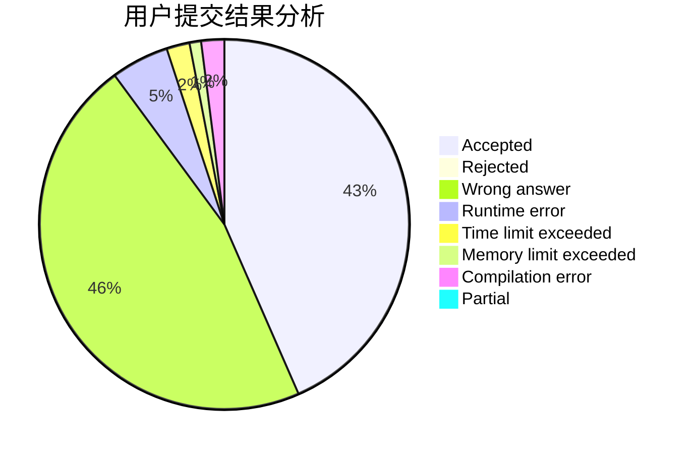
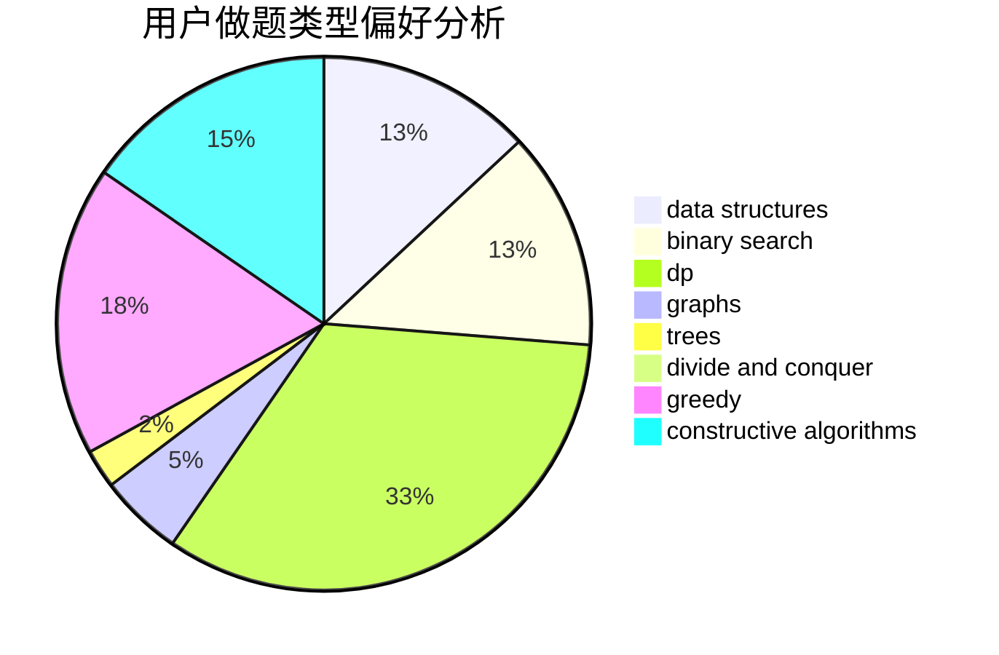
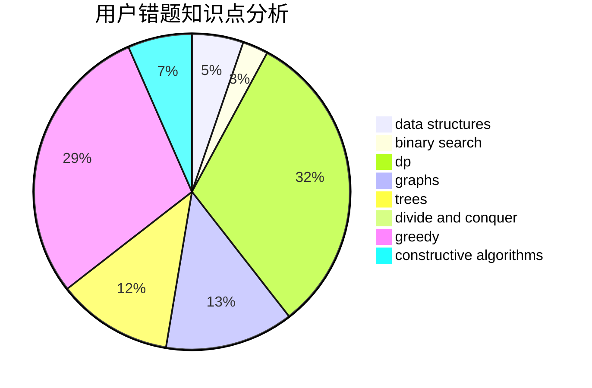

# Infinempty

<!-- tabs:start -->

#### **用户提交结果分析**

#### **用户做题类型偏好分析**

#### **用户错题知识点分析**

<!-- tabs:end -->
# 推荐题目
[850C](https://codeforces.com/contest/850/problem/C)		bitmasks,
                        dp,
                        games		  
[498E](https://codeforces.com/contest/498/problem/E)		dp,
                        matrices		  
[1179B](https://codeforces.com/contest/1179/problem/B)		constructive algorithms		  
[1082F](https://codeforces.com/contest/1082/problem/F)		dp,
                        strings,
                        trees		  
[1084B](https://codeforces.com/contest/1084/problem/B)		greedy,
                        implementation		  
[526G](https://codeforces.com/contest/526/problem/G)		greedy,
                        trees		  
[591D](https://codeforces.com/contest/591/problem/D)		dsu,graphs,sortings,trees		  
[520A](https://codeforces.com/contest/520/problem/A)		implementation,
                        strings		  
[546D](https://codeforces.com/contest/546/problem/D)		constructive algorithms,
                        dp,
                        math,
                        number theory		  
[79D](https://codeforces.com/contest/79/problem/D)		bitmasks,
                        dp,
                        shortest paths		  
