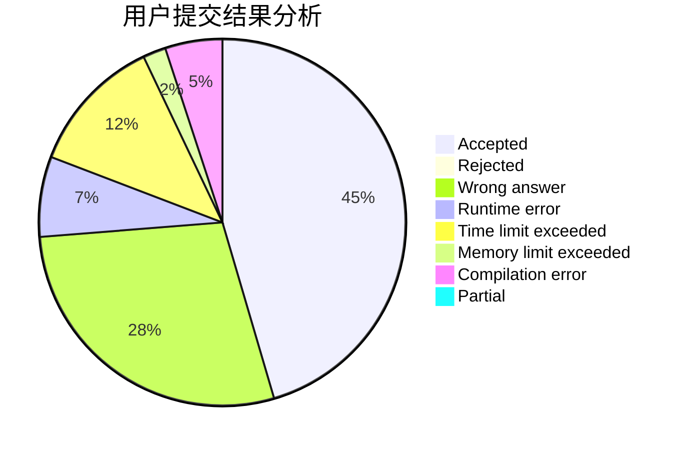
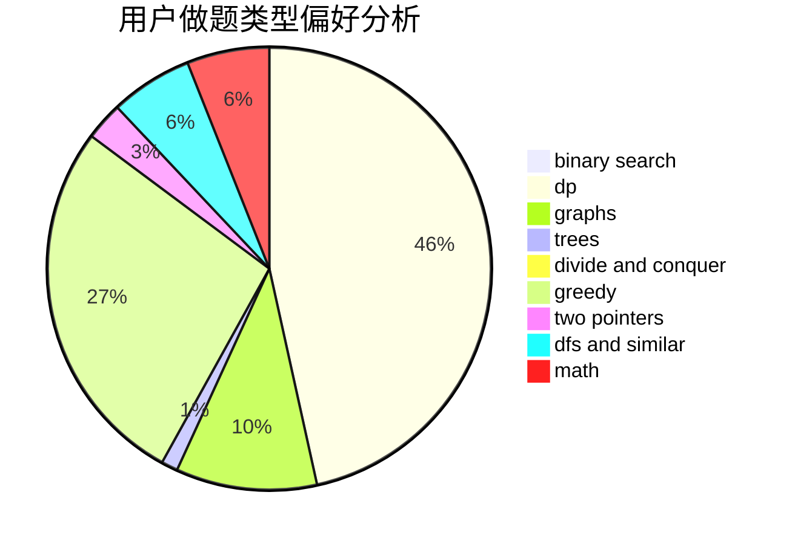

# Infinity25

<!-- tabs:start -->

#### **用户提交结果分析**

#### **用户做题类型偏好分析**

<!-- tabs:end -->
# 推荐题目
[1461A](https://codeforces.com/contest/1461/problem/A)
[1395C](https://codeforces.com/contest/1395/problem/C)
[1296F](https://codeforces.com/contest/1296/problem/F)
[1197B](https://codeforces.com/contest/1197/problem/B)
[366D](https://codeforces.com/contest/366/problem/D)
[821C](https://codeforces.com/contest/821/problem/C)
[791A](https://codeforces.com/contest/791/problem/A)
[388B](https://codeforces.com/contest/388/problem/B)
[895E](https://codeforces.com/contest/895/problem/E)
[898B](https://codeforces.com/contest/898/problem/B)
