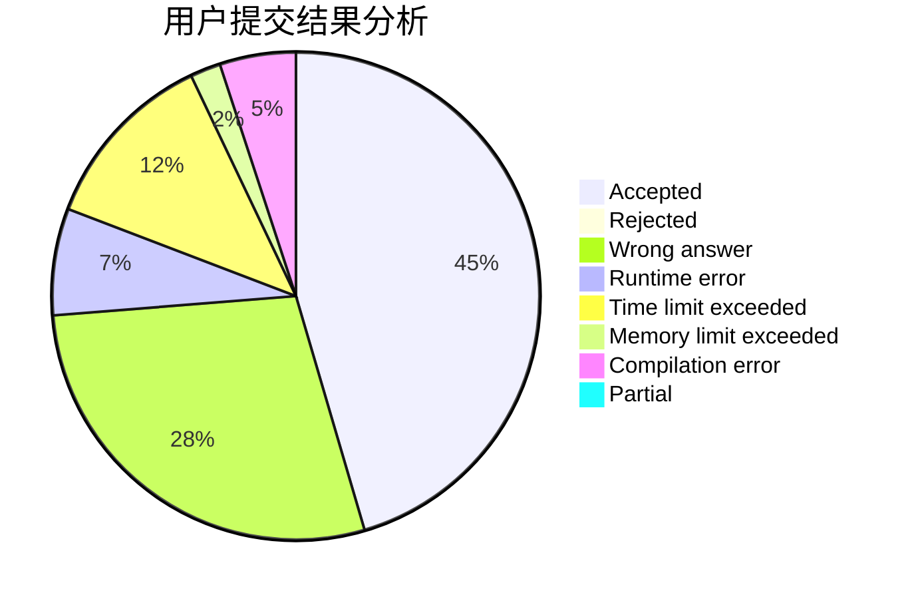
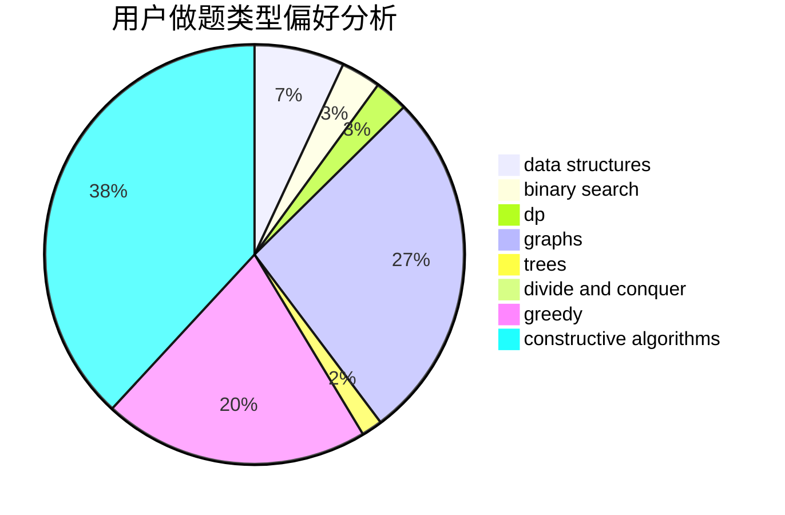
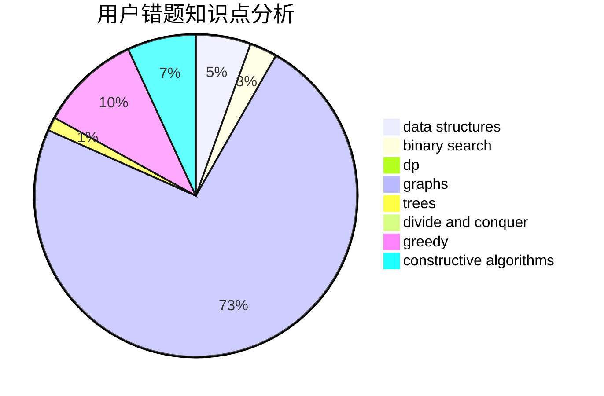

# Infinity25
<!-- tabs:start -->
#### **用户提交结果分析**

#### **用户做题类型偏好分析**

#### **用户错题知识点分析**

<!-- tabs:end -->
# 推荐题目
[3-palindrome](http://codeforces.com/problemset/problem/805/B)		constructive algorithms		  
[Prefix Enlightenment](http://codeforces.com/problemset/problem/1290/C)		dfs and similar,
                        dsu,
                        graphs		  
[Levko and Array Recovery](http://codeforces.com/problemset/problem/360/A)		greedy,
                        implementation		  
[Online Courses In BSU](http://codeforces.com/problemset/problem/770/C)		*special problem,
                        dfs and similar,
                        graphs,
                        implementation		  
[Tokitsukaze and Discard Items](https://codeforces.com/contest/1191/problem/C)		implementation,
                        two pointers		  
[Genetic engineering](http://codeforces.com/problemset/problem/86/C)		dp,
                        string suffix structures,
                        trees		  
[Museums Tour](https://codeforces.com/contest/1138/problem/E)		dp,
                        graphs,
                        implementation		  
[Block Tower](http://codeforces.com/problemset/problem/327/D)		constructive algorithms,
                        dfs and similar,
                        graphs		  
[Chess Championship](http://codeforces.com/problemset/problem/736/E)		constructive algorithms,
                        flows,
                        greedy,
                        math		  
[Make It Good](http://codeforces.com/problemset/problem/1385/C)		greedy		  
<!-- tabs:start -->
#### **data structures**
[3-palindrome](http://codeforces.com/problemset/problem/875/E)		binary search,
                        data structures,
                        dp		  
[Prefix Enlightenment](http://codeforces.com/problemset/problem/339/D)		data structures,
                        trees		  
[Levko and Array Recovery](http://codeforces.com/problemset/problem/487/E)		data structures,
                        dfs and similar,
                        graphs,
                        trees		  
[Online Courses In BSU](http://codeforces.com/problemset/problem/1379/F2)		data structures,
                        divide and conquer		  
[Tokitsukaze and Discard Items](http://codeforces.com/problemset/problem/19/D)		data structures		  
[Genetic engineering](https://codeforces.com/contest/867/problem/E)		constructive algorithms,
                        data structures,
                        greedy		  
[Museums Tour](http://codeforces.com/problemset/problem/817/E)		bitmasks,
                        data structures,
                        trees		  
[Block Tower](http://codeforces.com/problemset/problem/1492/C)		binary search,
                        data structures,
                        dp,
                        greedy,
                        two pointers		  
[Chess Championship](http://codeforces.com/problemset/problem/1490/G)		binary search,
                        data structures,
                        math		  
[Make It Good](http://codeforces.com/problemset/problem/1479/D)		binary search,
                        bitmasks,
                        brute force,
                        data structures,
                        probabilities,
                        trees		  
#### **binary search**
[3-palindrome](https://codeforces.com/contest/897/problem/C)		binary search,
                        dfs and similar		  
[Prefix Enlightenment](http://codeforces.com/problemset/problem/875/E)		binary search,
                        data structures,
                        dp		  
[Levko and Array Recovery](http://codeforces.com/problemset/problem/1492/C)		binary search,
                        data structures,
                        dp,
                        greedy,
                        two pointers		  
[Online Courses In BSU](http://codeforces.com/problemset/problem/1463/D)		binary search,
                        constructive algorithms,
                        greedy,
                        two pointers		  
[Tokitsukaze and Discard Items](http://codeforces.com/problemset/problem/1490/G)		binary search,
                        data structures,
                        math		  
[Genetic engineering](http://codeforces.com/problemset/problem/1479/D)		binary search,
                        bitmasks,
                        brute force,
                        data structures,
                        probabilities,
                        trees		  
[Museums Tour](http://codeforces.com/problemset/problem/1436/E)		binary search,
                        data structures,
                        two pointers		  
[Block Tower](http://codeforces.com/problemset/problem/1461/D)		binary search,
                        brute force,
                        data structures,
                        divide and conquer,
                        implementation,
                        sortings		  
[Chess Championship](http://codeforces.com/problemset/problem/1493/C)		binary search,
                        brute force,
                        constructive algorithms,
                        greedy,
                        strings		  
[Make It Good](http://codeforces.com/problemset/problem/1487/D)		binary search,
                        brute force,
                        math,
                        number theory		  
#### **dp**
[3-palindrome](http://codeforces.com/problemset/problem/86/C)		dp,
                        string suffix structures,
                        trees		  
[Prefix Enlightenment](https://codeforces.com/contest/1138/problem/E)		dp,
                        graphs,
                        implementation		  
[Levko and Array Recovery](http://codeforces.com/problemset/problem/138/D)		dp,
                        games		  
[Online Courses In BSU](http://codeforces.com/problemset/problem/875/E)		binary search,
                        data structures,
                        dp		  
[Tokitsukaze and Discard Items](http://codeforces.com/problemset/problem/1400/F)		brute force,
                        dfs and similar,
                        dp,
                        string suffix structures,
                        strings		  
[Genetic engineering](http://codeforces.com/problemset/problem/1492/C)		binary search,
                        data structures,
                        dp,
                        greedy,
                        two pointers		  
[Museums Tour](https://codeforces.com/contest/1457/problem/C)		brute force,
                        dp,
                        implementation		  
[Block Tower](http://codeforces.com/problemset/problem/1491/C)		brute force,
                        data structures,
                        dp,
                        greedy,
                        implementation		  
[Chess Championship](http://codeforces.com/problemset/problem/1437/C)		dp,
                        flows,
                        graph matchings,
                        greedy,
                        math,
                        sortings		  
[Make It Good](http://codeforces.com/problemset/problem/1499/B)		brute force,
                        dp,
                        greedy,
                        implementation		  
#### **graph**
[3-palindrome](http://codeforces.com/problemset/problem/1290/C)		dfs and similar,
                        dsu,
                        graphs		  
[Prefix Enlightenment](http://codeforces.com/problemset/problem/770/C)		*special problem,
                        dfs and similar,
                        graphs,
                        implementation		  
[Levko and Array Recovery](https://codeforces.com/contest/1138/problem/E)		dp,
                        graphs,
                        implementation		  
[Online Courses In BSU](http://codeforces.com/problemset/problem/327/D)		constructive algorithms,
                        dfs and similar,
                        graphs		  
[Tokitsukaze and Discard Items](http://codeforces.com/problemset/problem/1205/B)		bitmasks,
                        brute force,
                        graphs,
                        shortest paths		  
[Genetic engineering](http://codeforces.com/problemset/problem/118/E)		dfs and similar,
                        graphs		  
[Museums Tour](http://codeforces.com/problemset/problem/487/E)		data structures,
                        dfs and similar,
                        graphs,
                        trees		  
[Block Tower](http://codeforces.com/problemset/problem/1316/D)		constructive algorithms,
                        dfs and similar,
                        graphs,
                        implementation		  
[Chess Championship](http://codeforces.com/problemset/problem/1487/C)		brute force,
                        constructive algorithms,
                        dfs and similar,
                        graphs,
                        greedy,
                        implementation,
                        math		  
[Make It Good](http://codeforces.com/problemset/problem/1437/C)		dp,
                        flows,
                        graph matchings,
                        greedy,
                        math,
                        sortings		  
#### **trees**
[3-palindrome](http://codeforces.com/problemset/problem/86/C)		dp,
                        string suffix structures,
                        trees		  
[Prefix Enlightenment](http://codeforces.com/problemset/problem/715/C)		dfs and similar,
                        divide and conquer,
                        dsu,
                        trees		  
[Levko and Array Recovery](http://codeforces.com/problemset/problem/339/D)		data structures,
                        trees		  
[Online Courses In BSU](http://codeforces.com/problemset/problem/487/E)		data structures,
                        dfs and similar,
                        graphs,
                        trees		  
[Tokitsukaze and Discard Items](http://codeforces.com/problemset/problem/817/E)		bitmasks,
                        data structures,
                        trees		  
[Genetic engineering](http://codeforces.com/problemset/problem/1479/D)		binary search,
                        bitmasks,
                        brute force,
                        data structures,
                        probabilities,
                        trees		  
[Museums Tour](http://codeforces.com/problemset/problem/1511/C)		brute force,
                        data structures,
                        implementation,
                        trees		  
[Block Tower](http://codeforces.com/problemset/problem/1499/F)		combinatorics,
                        dfs and similar,
                        dp,
                        trees		  
[Chess Championship](http://codeforces.com/problemset/problem/1491/E)		brute force,
                        dfs and similar,
                        divide and conquer,
                        number theory,
                        trees		  
[Make It Good](http://codeforces.com/problemset/problem/1466/D)		data structures,
                        greedy,
                        sortings,
                        trees		  
#### **divide and conquer**
[3-palindrome](http://codeforces.com/problemset/problem/715/C)		dfs and similar,
                        divide and conquer,
                        dsu,
                        trees		  
[Prefix Enlightenment](http://codeforces.com/problemset/problem/1379/F2)		data structures,
                        divide and conquer		  
[Levko and Array Recovery](http://codeforces.com/problemset/problem/1461/D)		binary search,
                        brute force,
                        data structures,
                        divide and conquer,
                        implementation,
                        sortings		  
[Online Courses In BSU](http://codeforces.com/problemset/problem/1466/G)		combinatorics,
                        divide and conquer,
                        hashing,
                        math,
                        string suffix structures,
                        strings		  
[Tokitsukaze and Discard Items](http://codeforces.com/problemset/problem/1490/D)		dfs and similar,
                        divide and conquer,
                        implementation		  
[Genetic engineering](https://codeforces.com/contest/1483/problem/C)		data structures,
                        divide and conquer,
                        dp		  
[Museums Tour](http://codeforces.com/problemset/problem/1491/E)		brute force,
                        dfs and similar,
                        divide and conquer,
                        number theory,
                        trees		  
[Block Tower](http://codeforces.com/problemset/problem/1303/G)		data structures,
                        divide and conquer,
                        geometry,
                        trees		  
[Chess Championship](http://codeforces.com/problemset/problem/1494/D)		constructive algorithms,
                        data structures,
                        dfs and similar,
                        divide and conquer,
                        dsu,
                        greedy,
                        sortings,
                        trees		  
[Make It Good](http://codeforces.com/problemset/problem/1482/E)		data structures,
                        divide and conquer,
                        dp		  
#### **greedy**
[3-palindrome](http://codeforces.com/problemset/problem/360/A)		greedy,
                        implementation		  
[Prefix Enlightenment](http://codeforces.com/problemset/problem/736/E)		constructive algorithms,
                        flows,
                        greedy,
                        math		  
[Levko and Array Recovery](http://codeforces.com/problemset/problem/1385/C)		greedy		  
[Online Courses In BSU](http://codeforces.com/problemset/problem/205/B)		brute force,
                        greedy		  
[Tokitsukaze and Discard Items](http://codeforces.com/problemset/problem/16/B)		greedy,
                        implementation,
                        sortings		  
[Genetic engineering](http://codeforces.com/problemset/problem/1077/E)		greedy,
                        sortings		  
[Museums Tour](https://codeforces.com/contest/1501/problem/E)		bitmasks,
                        brute force,
                        constructive algorithms,
                        greedy,
                        two pointers		  
[Block Tower](https://codeforces.com/contest/1265/problem/C)		greedy,
                        implementation		  
[Chess Championship](http://codeforces.com/problemset/problem/1292/B)		brute force,
                        constructive algorithms,
                        geometry,
                        greedy,
                        implementation		  
[Make It Good](https://codeforces.com/contest/867/problem/E)		constructive algorithms,
                        data structures,
                        greedy		  
#### **constructive algorithms**
[3-palindrome](http://codeforces.com/problemset/problem/805/B)		constructive algorithms		  
[Prefix Enlightenment](http://codeforces.com/problemset/problem/327/D)		constructive algorithms,
                        dfs and similar,
                        graphs		  
[Levko and Array Recovery](http://codeforces.com/problemset/problem/736/E)		constructive algorithms,
                        flows,
                        greedy,
                        math		  
[Online Courses In BSU](http://codeforces.com/problemset/problem/1451/E1)		bitmasks,
                        constructive algorithms,
                        interactive,
                        math		  
[Tokitsukaze and Discard Items](http://codeforces.com/problemset/problem/877/C)		constructive algorithms		  
[Genetic engineering](https://codeforces.com/contest/1501/problem/E)		bitmasks,
                        brute force,
                        constructive algorithms,
                        greedy,
                        two pointers		  
[Museums Tour](http://codeforces.com/problemset/problem/1333/A)		constructive algorithms		  
[Block Tower](http://codeforces.com/problemset/problem/1316/D)		constructive algorithms,
                        dfs and similar,
                        graphs,
                        implementation		  
[Chess Championship](http://codeforces.com/problemset/problem/1292/B)		brute force,
                        constructive algorithms,
                        geometry,
                        greedy,
                        implementation		  
[Make It Good](https://codeforces.com/contest/867/problem/E)		constructive algorithms,
                        data structures,
                        greedy		  
#### **sortings**
[3-palindrome](http://codeforces.com/problemset/problem/16/B)		greedy,
                        implementation,
                        sortings		  
[Prefix Enlightenment](http://codeforces.com/problemset/problem/1077/E)		greedy,
                        sortings		  
[Levko and Array Recovery](https://codeforces.com/contest/1496/problem/C)		geometry,
                        greedy,
                        math,
                        sortings		  
[Online Courses In BSU](http://codeforces.com/problemset/problem/1495/A)		geometry,
                        greedy,
                        math,
                        sortings		  
[Tokitsukaze and Discard Items](http://codeforces.com/problemset/problem/1497/A)		brute force,
                        data structures,
                        greedy,
                        sortings		  
[Genetic engineering](http://codeforces.com/problemset/problem/1427/A)		math,
                        sortings		  
[Museums Tour](http://codeforces.com/problemset/problem/1461/D)		binary search,
                        brute force,
                        data structures,
                        divide and conquer,
                        implementation,
                        sortings		  
[Block Tower](http://codeforces.com/problemset/problem/1437/C)		dp,
                        flows,
                        graph matchings,
                        greedy,
                        math,
                        sortings		  
[Chess Championship](http://codeforces.com/problemset/problem/1473/A)		greedy,
                        implementation,
                        math,
                        sortings		  
[Make It Good](http://codeforces.com/problemset/problem/1486/B)		binary search,
                        geometry,
                        shortest paths,
                        sortings		  
<!-- tabs:end -->
