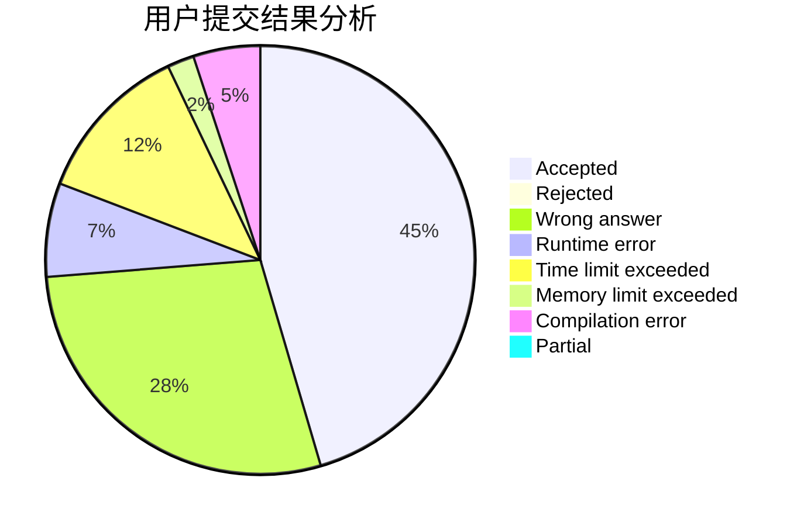
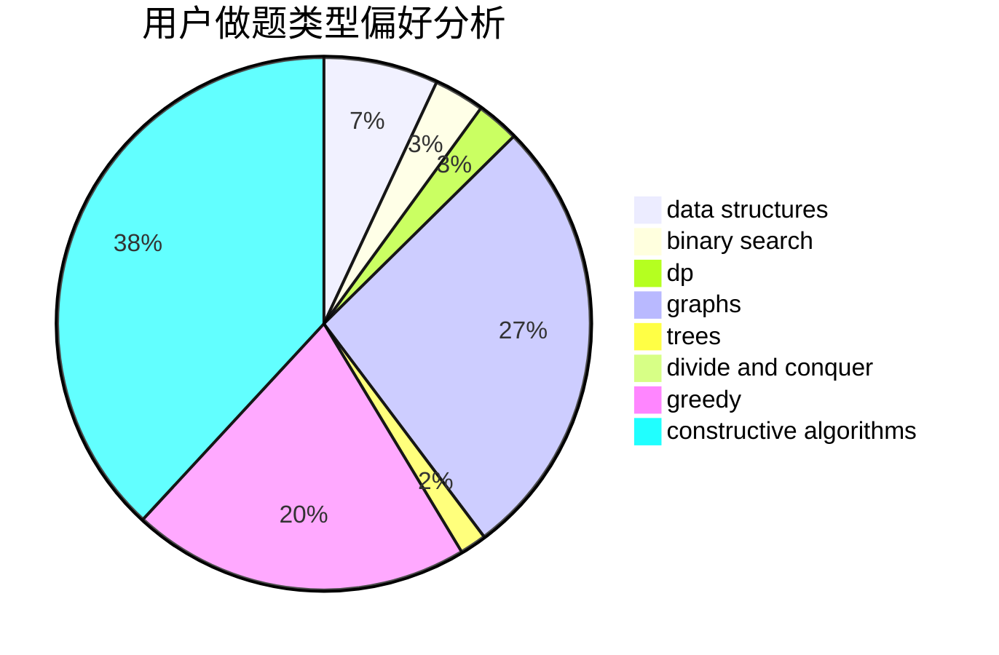
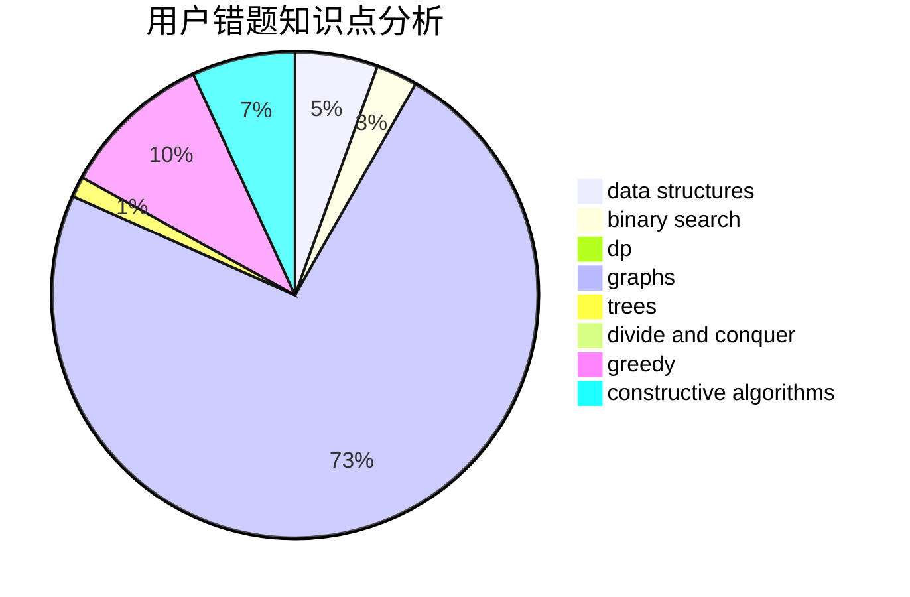

# Infinity25

<!-- tabs:start -->

#### **用户提交结果分析**

#### **用户做题类型偏好分析**

#### **用户错题知识点分析**

<!-- tabs:end -->
# 推荐题目
[1451E1](https://codeforces.com/contest/1451E/problem/1)		bitmasks,
                        constructive algorithms,
                        interactive,
                        math		  
[1385C](https://codeforces.com/contest/1385/problem/C)		greedy		  
[1290C](https://codeforces.com/contest/1290/problem/C)		dfs and similar,
                        dsu,
                        graphs		  
[1191C](https://codeforces.com/contest/1191/problem/C)		dsu,graphs,sortings,trees		  
[339D](https://codeforces.com/contest/339/problem/D)		data structures,
                        trees		  
[805B](https://codeforces.com/contest/805/problem/B)		constructive algorithms		  
[770C](https://codeforces.com/contest/770/problem/C)		*special problem,
                        dfs and similar,
                        graphs,
                        implementation		  
[360A](https://codeforces.com/contest/360/problem/A)		greedy,
                        implementation		  
[875E](https://codeforces.com/contest/875/problem/E)		binary search,
                        data structures,
                        dp		  
[877C](https://codeforces.com/contest/877/problem/C)		constructive algorithms		  
