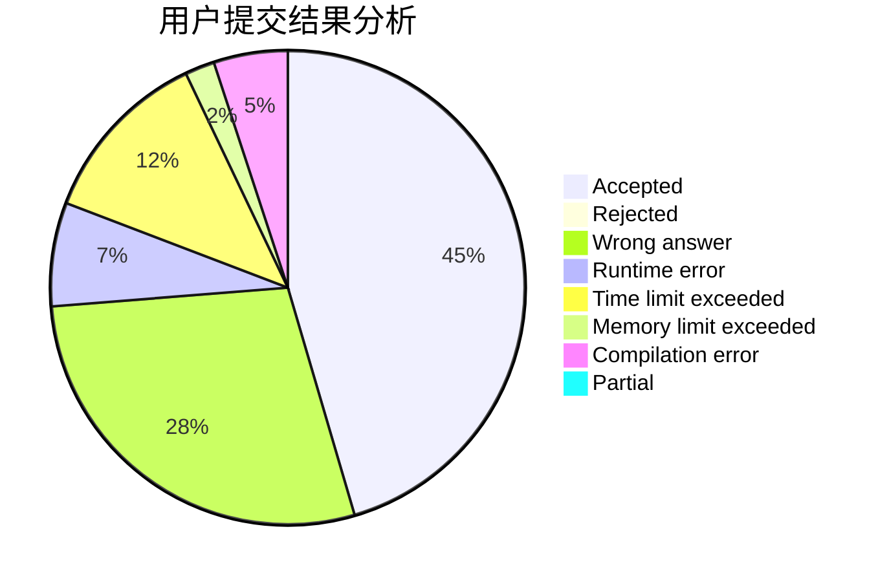
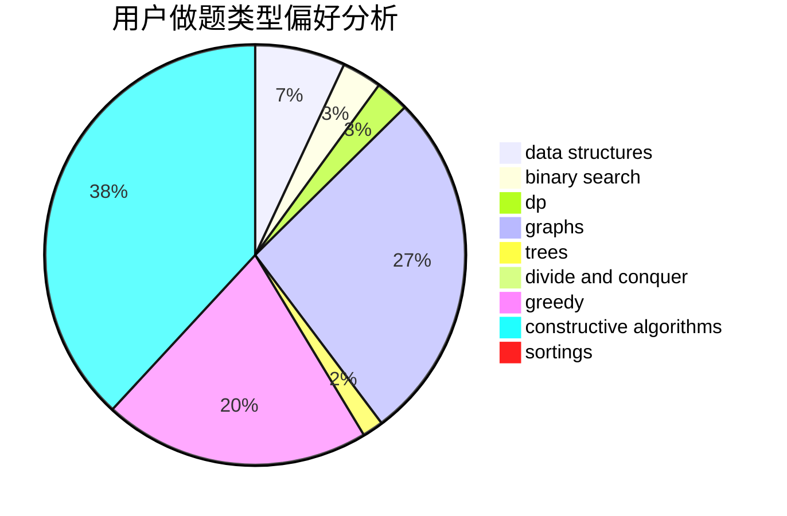
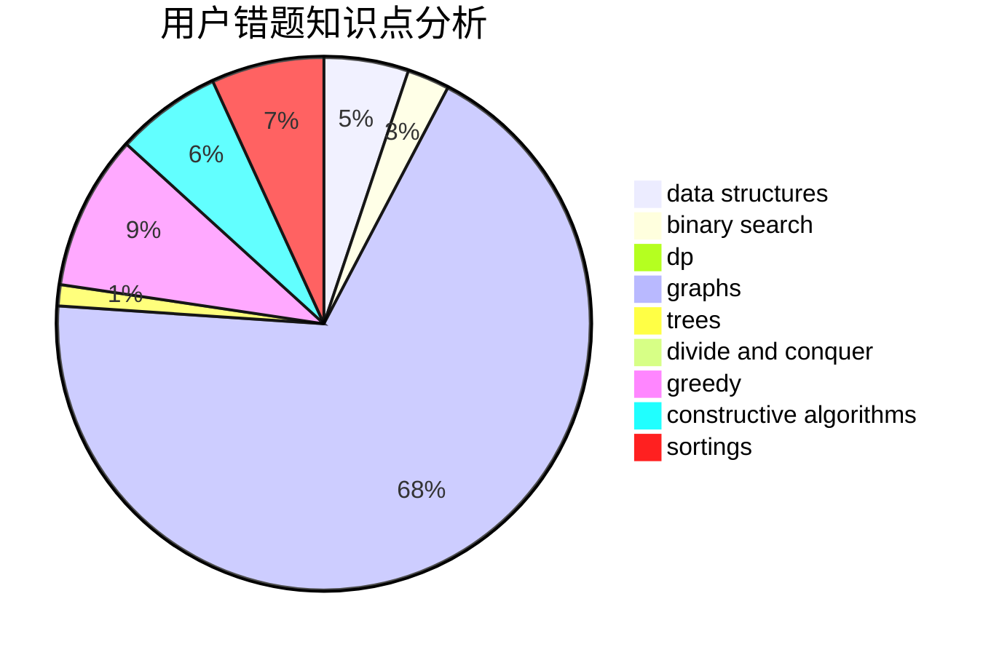

# Infinity25
<!-- tabs:start -->
#### **用户提交结果分析**

#### **用户做题类型偏好分析**

#### **用户错题知识点分析**

<!-- tabs:end -->
# 推荐题目
[805B](http://codeforces.com/problemset/problem/805/B)		constructive algorithms		  
[1290C](http://codeforces.com/problemset/problem/1290/C)		dfs and similar,
                        dsu,
                        graphs		  
[360A](http://codeforces.com/problemset/problem/360/A)		greedy,
                        implementation		  
[770C](http://codeforces.com/problemset/problem/770/C)		*special problem,
                        dfs and similar,
                        graphs,
                        implementation		  
[1191C](https://codeforces.com/contest/1191/problem/C)		implementation,
                        two pointers		  
[86C](http://codeforces.com/problemset/problem/86/C)		dp,
                        string suffix structures,
                        trees		  
[1138E](https://codeforces.com/contest/1138/problem/E)		dp,
                        graphs,
                        implementation		  
[327D](http://codeforces.com/problemset/problem/327/D)		constructive algorithms,
                        dfs and similar,
                        graphs		  
[736E](http://codeforces.com/problemset/problem/736/E)		constructive algorithms,
                        flows,
                        greedy,
                        math		  
[1385C](http://codeforces.com/problemset/problem/1385/C)		greedy		  
<!-- tabs:start -->
#### **data structures**
[875E](http://codeforces.com/problemset/problem/875/E)		binary search,
                        data structures,
                        dp		  
[339D](http://codeforces.com/problemset/problem/339/D)		data structures,
                        trees		  
[487E](http://codeforces.com/problemset/problem/487/E)		data structures,
                        dfs and similar,
                        graphs,
                        trees		  
[1379F2](http://codeforces.com/problemset/problem/1379/F2)		data structures,
                        divide and conquer		  
[19D](http://codeforces.com/problemset/problem/19/D)		data structures		  
[867E](https://codeforces.com/contest/867/problem/E)		constructive algorithms,
                        data structures,
                        greedy		  
[817E](http://codeforces.com/problemset/problem/817/E)		bitmasks,
                        data structures,
                        trees		  
[1492C](http://codeforces.com/problemset/problem/1492/C)		binary search,
                        data structures,
                        dp,
                        greedy,
                        two pointers		  
[1490G](http://codeforces.com/problemset/problem/1490/G)		binary search,
                        data structures,
                        math		  
[1479D](http://codeforces.com/problemset/problem/1479/D)		binary search,
                        bitmasks,
                        brute force,
                        data structures,
                        probabilities,
                        trees		  
#### **binary search**
[897C](https://codeforces.com/contest/897/problem/C)		binary search,
                        dfs and similar		  
[875E](http://codeforces.com/problemset/problem/875/E)		binary search,
                        data structures,
                        dp		  
[1492C](http://codeforces.com/problemset/problem/1492/C)		binary search,
                        data structures,
                        dp,
                        greedy,
                        two pointers		  
[1463D](http://codeforces.com/problemset/problem/1463/D)		binary search,
                        constructive algorithms,
                        greedy,
                        two pointers		  
[1490G](http://codeforces.com/problemset/problem/1490/G)		binary search,
                        data structures,
                        math		  
[1479D](http://codeforces.com/problemset/problem/1479/D)		binary search,
                        bitmasks,
                        brute force,
                        data structures,
                        probabilities,
                        trees		  
[1436E](http://codeforces.com/problemset/problem/1436/E)		binary search,
                        data structures,
                        two pointers		  
[1461D](http://codeforces.com/problemset/problem/1461/D)		binary search,
                        brute force,
                        data structures,
                        divide and conquer,
                        implementation,
                        sortings		  
[1493C](http://codeforces.com/problemset/problem/1493/C)		binary search,
                        brute force,
                        constructive algorithms,
                        greedy,
                        strings		  
[1487D](http://codeforces.com/problemset/problem/1487/D)		binary search,
                        brute force,
                        math,
                        number theory		  
#### **dp**
[86C](http://codeforces.com/problemset/problem/86/C)		dp,
                        string suffix structures,
                        trees		  
[1138E](https://codeforces.com/contest/1138/problem/E)		dp,
                        graphs,
                        implementation		  
[138D](http://codeforces.com/problemset/problem/138/D)		dp,
                        games		  
[875E](http://codeforces.com/problemset/problem/875/E)		binary search,
                        data structures,
                        dp		  
[1400F](http://codeforces.com/problemset/problem/1400/F)		brute force,
                        dfs and similar,
                        dp,
                        string suffix structures,
                        strings		  
[1492C](http://codeforces.com/problemset/problem/1492/C)		binary search,
                        data structures,
                        dp,
                        greedy,
                        two pointers		  
[1457C](https://codeforces.com/contest/1457/problem/C)		brute force,
                        dp,
                        implementation		  
[1491C](http://codeforces.com/problemset/problem/1491/C)		brute force,
                        data structures,
                        dp,
                        greedy,
                        implementation		  
[1437C](http://codeforces.com/problemset/problem/1437/C)		dp,
                        flows,
                        graph matchings,
                        greedy,
                        math,
                        sortings		  
[1499B](http://codeforces.com/problemset/problem/1499/B)		brute force,
                        dp,
                        greedy,
                        implementation		  
#### **graph**
[1290C](http://codeforces.com/problemset/problem/1290/C)		dfs and similar,
                        dsu,
                        graphs		  
[770C](http://codeforces.com/problemset/problem/770/C)		*special problem,
                        dfs and similar,
                        graphs,
                        implementation		  
[1138E](https://codeforces.com/contest/1138/problem/E)		dp,
                        graphs,
                        implementation		  
[327D](http://codeforces.com/problemset/problem/327/D)		constructive algorithms,
                        dfs and similar,
                        graphs		  
[1205B](http://codeforces.com/problemset/problem/1205/B)		bitmasks,
                        brute force,
                        graphs,
                        shortest paths		  
[118E](http://codeforces.com/problemset/problem/118/E)		dfs and similar,
                        graphs		  
[487E](http://codeforces.com/problemset/problem/487/E)		data structures,
                        dfs and similar,
                        graphs,
                        trees		  
[1316D](http://codeforces.com/problemset/problem/1316/D)		constructive algorithms,
                        dfs and similar,
                        graphs,
                        implementation		  
[1487C](http://codeforces.com/problemset/problem/1487/C)		brute force,
                        constructive algorithms,
                        dfs and similar,
                        graphs,
                        greedy,
                        implementation,
                        math		  
[1437C](http://codeforces.com/problemset/problem/1437/C)		dp,
                        flows,
                        graph matchings,
                        greedy,
                        math,
                        sortings		  
#### **trees**
[86C](http://codeforces.com/problemset/problem/86/C)		dp,
                        string suffix structures,
                        trees		  
[715C](http://codeforces.com/problemset/problem/715/C)		dfs and similar,
                        divide and conquer,
                        dsu,
                        trees		  
[339D](http://codeforces.com/problemset/problem/339/D)		data structures,
                        trees		  
[487E](http://codeforces.com/problemset/problem/487/E)		data structures,
                        dfs and similar,
                        graphs,
                        trees		  
[817E](http://codeforces.com/problemset/problem/817/E)		bitmasks,
                        data structures,
                        trees		  
[1479D](http://codeforces.com/problemset/problem/1479/D)		binary search,
                        bitmasks,
                        brute force,
                        data structures,
                        probabilities,
                        trees		  
[1511C](http://codeforces.com/problemset/problem/1511/C)		brute force,
                        data structures,
                        implementation,
                        trees		  
[1499F](http://codeforces.com/problemset/problem/1499/F)		combinatorics,
                        dfs and similar,
                        dp,
                        trees		  
[1491E](http://codeforces.com/problemset/problem/1491/E)		brute force,
                        dfs and similar,
                        divide and conquer,
                        number theory,
                        trees		  
[1466D](http://codeforces.com/problemset/problem/1466/D)		data structures,
                        greedy,
                        sortings,
                        trees		  
#### **divide and conquer**
[715C](http://codeforces.com/problemset/problem/715/C)		dfs and similar,
                        divide and conquer,
                        dsu,
                        trees		  
[1379F2](http://codeforces.com/problemset/problem/1379/F2)		data structures,
                        divide and conquer		  
[1461D](http://codeforces.com/problemset/problem/1461/D)		binary search,
                        brute force,
                        data structures,
                        divide and conquer,
                        implementation,
                        sortings		  
[1466G](http://codeforces.com/problemset/problem/1466/G)		combinatorics,
                        divide and conquer,
                        hashing,
                        math,
                        string suffix structures,
                        strings		  
[1490D](http://codeforces.com/problemset/problem/1490/D)		dfs and similar,
                        divide and conquer,
                        implementation		  
[1483C](https://codeforces.com/contest/1483/problem/C)		data structures,
                        divide and conquer,
                        dp		  
[1491E](http://codeforces.com/problemset/problem/1491/E)		brute force,
                        dfs and similar,
                        divide and conquer,
                        number theory,
                        trees		  
[1303G](http://codeforces.com/problemset/problem/1303/G)		data structures,
                        divide and conquer,
                        geometry,
                        trees		  
[1494D](http://codeforces.com/problemset/problem/1494/D)		constructive algorithms,
                        data structures,
                        dfs and similar,
                        divide and conquer,
                        dsu,
                        greedy,
                        sortings,
                        trees		  
[1482E](http://codeforces.com/problemset/problem/1482/E)		data structures,
                        divide and conquer,
                        dp		  
#### **greedy**
[360A](http://codeforces.com/problemset/problem/360/A)		greedy,
                        implementation		  
[736E](http://codeforces.com/problemset/problem/736/E)		constructive algorithms,
                        flows,
                        greedy,
                        math		  
[1385C](http://codeforces.com/problemset/problem/1385/C)		greedy		  
[205B](http://codeforces.com/problemset/problem/205/B)		brute force,
                        greedy		  
[16B](http://codeforces.com/problemset/problem/16/B)		greedy,
                        implementation,
                        sortings		  
[1077E](http://codeforces.com/problemset/problem/1077/E)		greedy,
                        sortings		  
[1501E](https://codeforces.com/contest/1501/problem/E)		bitmasks,
                        brute force,
                        constructive algorithms,
                        greedy,
                        two pointers		  
[1265C](https://codeforces.com/contest/1265/problem/C)		greedy,
                        implementation		  
[1292B](http://codeforces.com/problemset/problem/1292/B)		brute force,
                        constructive algorithms,
                        geometry,
                        greedy,
                        implementation		  
[867E](https://codeforces.com/contest/867/problem/E)		constructive algorithms,
                        data structures,
                        greedy		  
#### **constructive algorithms**
[805B](http://codeforces.com/problemset/problem/805/B)		constructive algorithms		  
[327D](http://codeforces.com/problemset/problem/327/D)		constructive algorithms,
                        dfs and similar,
                        graphs		  
[736E](http://codeforces.com/problemset/problem/736/E)		constructive algorithms,
                        flows,
                        greedy,
                        math		  
[1451E1](http://codeforces.com/problemset/problem/1451/E1)		bitmasks,
                        constructive algorithms,
                        interactive,
                        math		  
[877C](http://codeforces.com/problemset/problem/877/C)		constructive algorithms		  
[1501E](https://codeforces.com/contest/1501/problem/E)		bitmasks,
                        brute force,
                        constructive algorithms,
                        greedy,
                        two pointers		  
[1333A](http://codeforces.com/problemset/problem/1333/A)		constructive algorithms		  
[1316D](http://codeforces.com/problemset/problem/1316/D)		constructive algorithms,
                        dfs and similar,
                        graphs,
                        implementation		  
[1292B](http://codeforces.com/problemset/problem/1292/B)		brute force,
                        constructive algorithms,
                        geometry,
                        greedy,
                        implementation		  
[867E](https://codeforces.com/contest/867/problem/E)		constructive algorithms,
                        data structures,
                        greedy		  
#### **sortings**
[16B](http://codeforces.com/problemset/problem/16/B)		greedy,
                        implementation,
                        sortings		  
[1077E](http://codeforces.com/problemset/problem/1077/E)		greedy,
                        sortings		  
[1496C](https://codeforces.com/contest/1496/problem/C)		geometry,
                        greedy,
                        math,
                        sortings		  
[1495A](http://codeforces.com/problemset/problem/1495/A)		geometry,
                        greedy,
                        math,
                        sortings		  
[1497A](http://codeforces.com/problemset/problem/1497/A)		brute force,
                        data structures,
                        greedy,
                        sortings		  
[1427A](http://codeforces.com/problemset/problem/1427/A)		math,
                        sortings		  
[1461D](http://codeforces.com/problemset/problem/1461/D)		binary search,
                        brute force,
                        data structures,
                        divide and conquer,
                        implementation,
                        sortings		  
[1437C](http://codeforces.com/problemset/problem/1437/C)		dp,
                        flows,
                        graph matchings,
                        greedy,
                        math,
                        sortings		  
[1473A](http://codeforces.com/problemset/problem/1473/A)		greedy,
                        implementation,
                        math,
                        sortings		  
[1486B](http://codeforces.com/problemset/problem/1486/B)		binary search,
                        geometry,
                        shortest paths,
                        sortings		  
<!-- tabs:end -->
