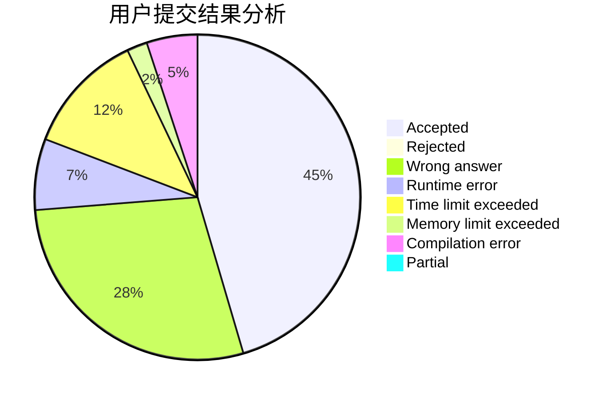
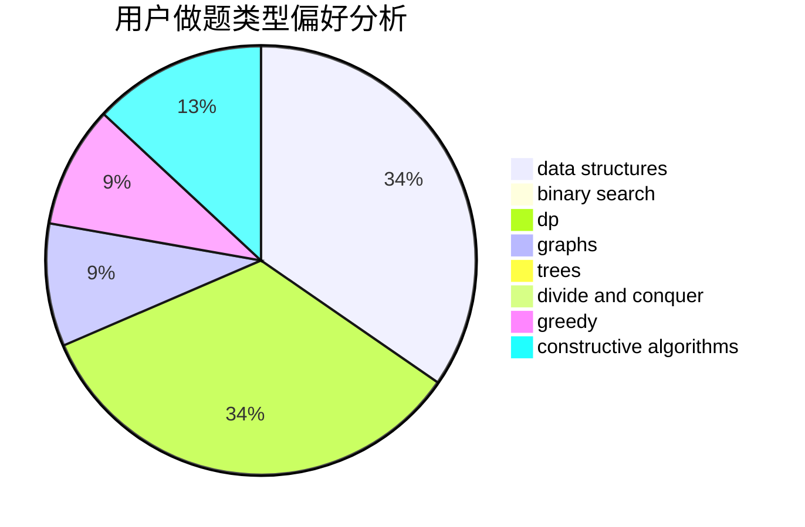
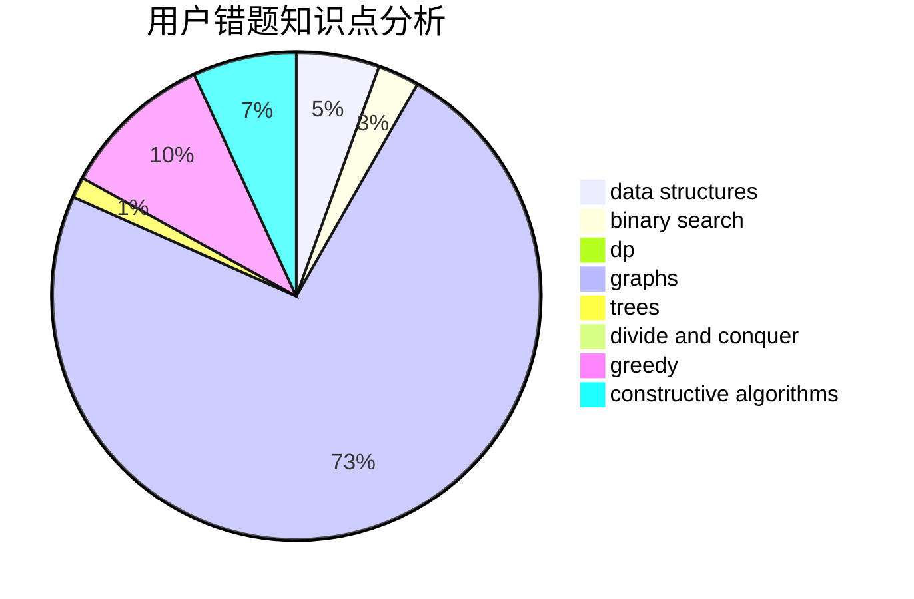

# Infinity25

<!-- tabs:start -->

#### **用户提交结果分析**

#### **用户做题类型偏好分析**

#### **用户错题知识点分析**

<!-- tabs:end -->
# 推荐题目
[1461A](https://codeforces.com/contest/1461/problem/A)		constructive algorithms,
                        greedy		  
[1395C](https://codeforces.com/contest/1395/problem/C)		bitmasks,
                        brute force,
                        dp,
                        greedy		  
[1296F](https://codeforces.com/contest/1296/problem/F)		constructive algorithms,
                        dfs and similar,
                        greedy,
                        sortings,
                        trees		  
[1197B](https://codeforces.com/contest/1197/problem/B)		greedy,
                        implementation		  
[366D](https://codeforces.com/contest/366/problem/D)		binary search,
                        data structures,
                        dfs and similar,
                        dsu,
                        shortest paths,
                        two pointers		  
[821C](https://codeforces.com/contest/821/problem/C)		data structures,
                        greedy,
                        trees		  
[791A](https://codeforces.com/contest/791/problem/A)		implementation		  
[388B](https://codeforces.com/contest/388/problem/B)		bitmasks,
                        constructive algorithms,
                        graphs,
                        implementation,
                        math		  
[895E](https://codeforces.com/contest/895/problem/E)		data structures,
                        probabilities		  
[898B](https://codeforces.com/contest/898/problem/B)		brute force,
                        implementation,
                        number theory		  
