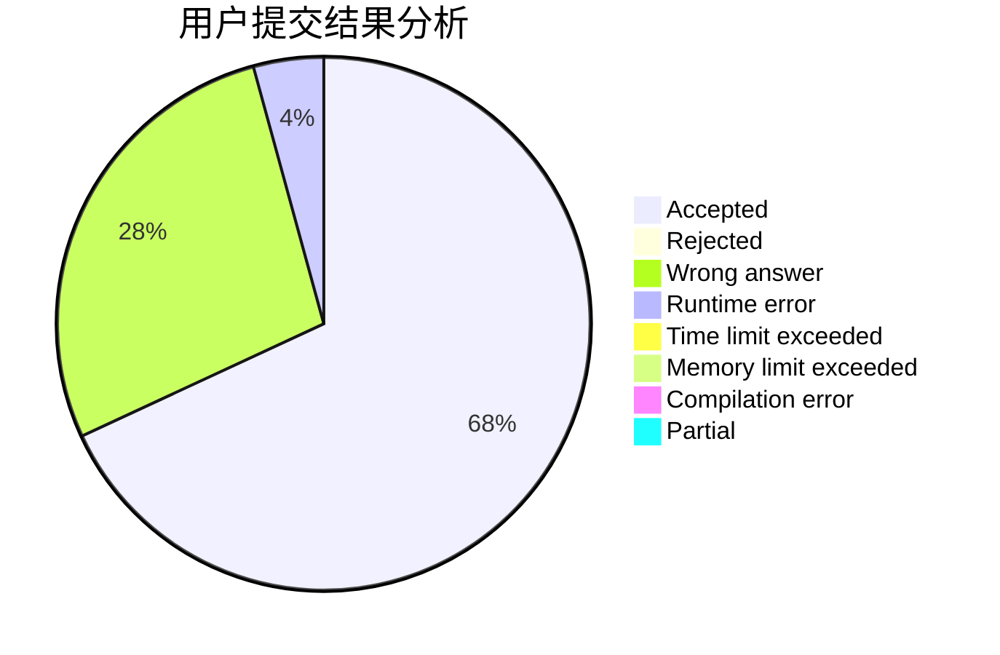
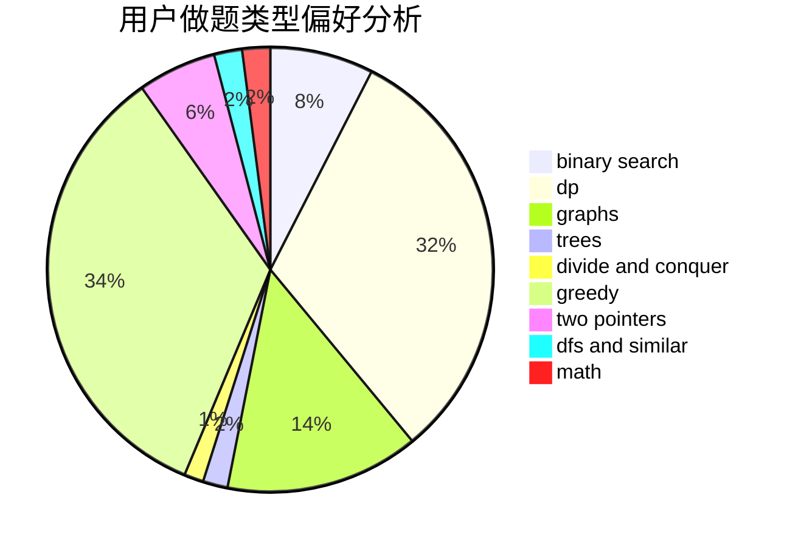

# InfinityDimension

<!-- tabs:start -->

#### **用户提交结果分析**

#### **用户做题类型偏好分析**

<!-- tabs:end -->
# 推荐题目
[283A](https://codeforces.com/contest/283/problem/A)
[739B](https://codeforces.com/contest/739/problem/B)
[1003A](https://codeforces.com/contest/1003/problem/A)
[631E](https://codeforces.com/contest/631/problem/E)
[1007E](https://codeforces.com/contest/1007/problem/E)
[13992](https://codeforces.com/contest/1399/problem/2)
[781C](https://codeforces.com/contest/781/problem/C)
[519E](https://codeforces.com/contest/519/problem/E)
[454A](https://codeforces.com/contest/454/problem/A)
[938E](https://codeforces.com/contest/938/problem/E)
