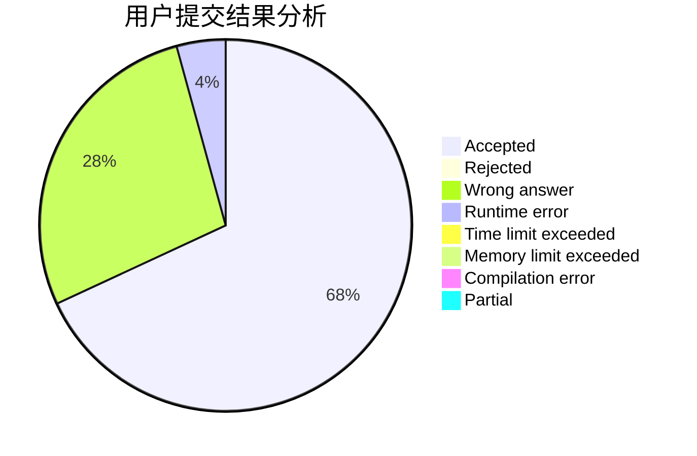
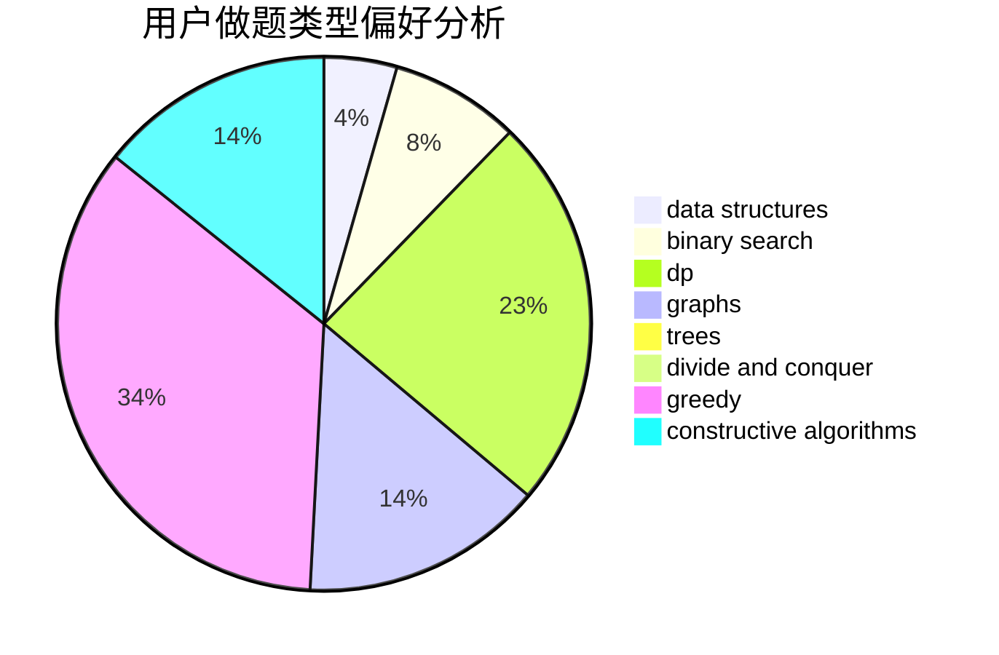
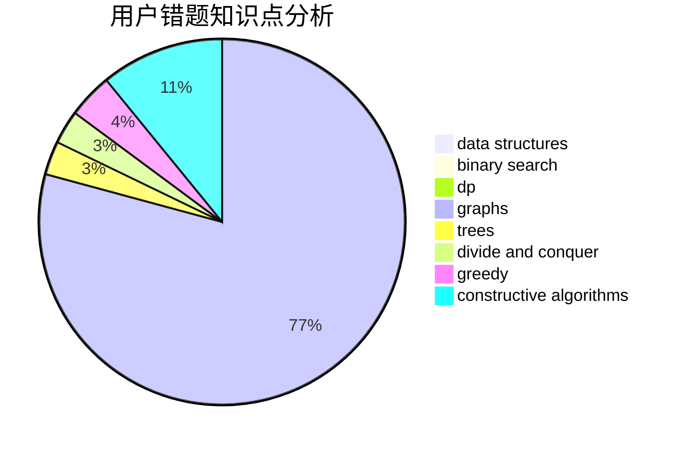

# InfinityDimension

<!-- tabs:start -->

#### **用户提交结果分析**

#### **用户做题类型偏好分析**

#### **用户错题知识点分析**

<!-- tabs:end -->
# 推荐题目
[283A](https://codeforces.com/contest/283/problem/A)		constructive algorithms,
                        data structures,
                        implementation		  
[739B](https://codeforces.com/contest/739/problem/B)		binary search,
                        data structures,
                        dfs and similar,
                        graphs,
                        trees		  
[1003A](https://codeforces.com/contest/1003/problem/A)		implementation		  
[631E](https://codeforces.com/contest/631/problem/E)		data structures,
                        dp,
                        geometry		  
[1007E](https://codeforces.com/contest/1007/problem/E)		dp		  
[13992](https://codeforces.com/contest/1399/problem/2)		dsu,graphs,sortings,trees		  
[781C](https://codeforces.com/contest/781/problem/C)		dsu,graphs,sortings,trees		  
[519E](https://codeforces.com/contest/519/problem/E)		binary search,
                        data structures,
                        dfs and similar,
                        dp,
                        trees		  
[454A](https://codeforces.com/contest/454/problem/A)		implementation		  
[938E](https://codeforces.com/contest/938/problem/E)		combinatorics,
                        math		  
