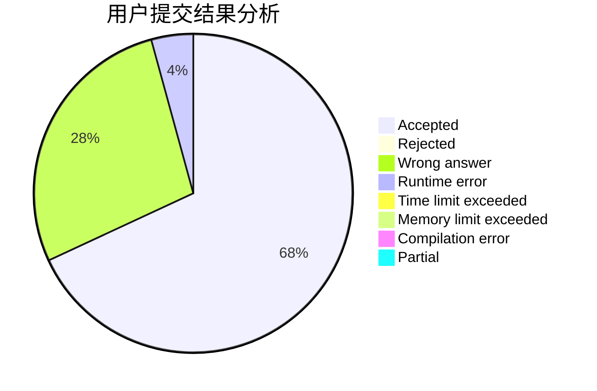
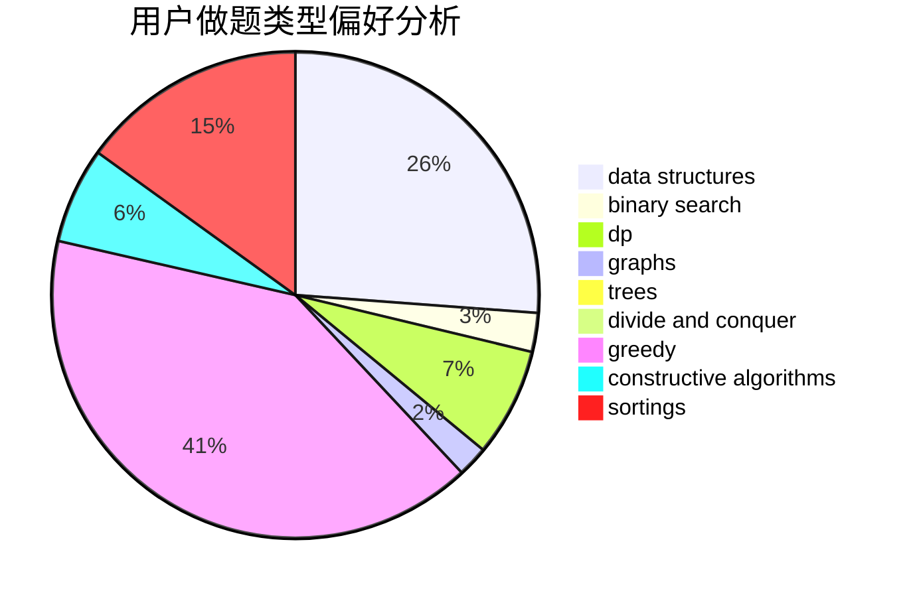
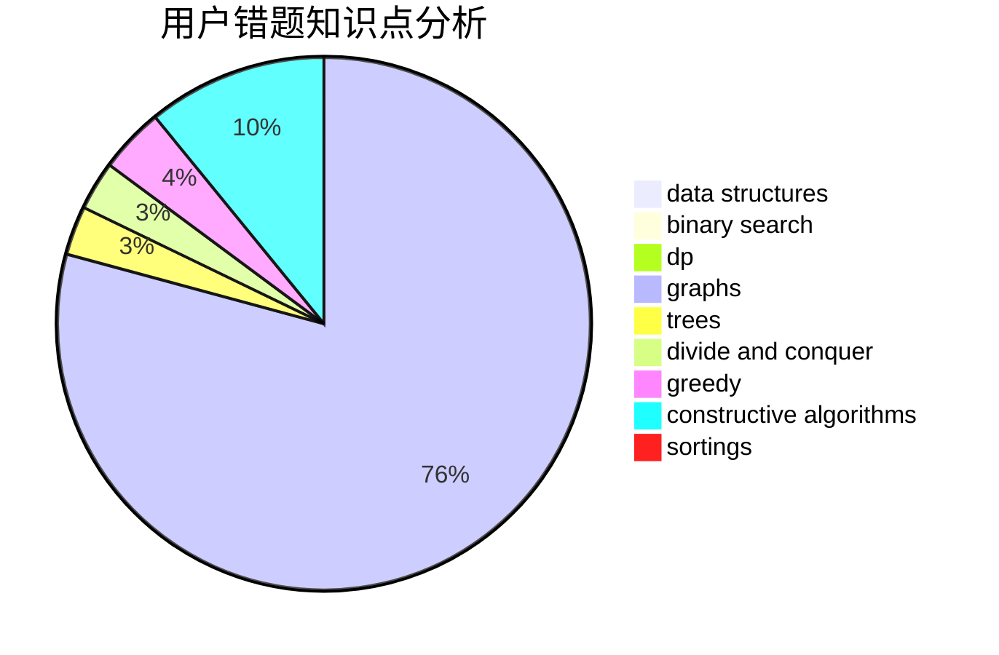

# InfinityDimension
<!-- tabs:start -->
#### **用户提交结果分析**

#### **用户做题类型偏好分析**

#### **用户错题知识点分析**

<!-- tabs:end -->
# 推荐题目
[612C](http://codeforces.com/problemset/problem/612/C)		data structures,
                        expression parsing,
                        math		  
[489B](http://codeforces.com/problemset/problem/489/B)		dfs and similar,
                        dp,
                        graph matchings,
                        greedy,
                        sortings,
                        two pointers		  
[86B](http://codeforces.com/problemset/problem/86/B)		constructive algorithms,
                        graph matchings,
                        greedy,
                        math		  
[498E](http://codeforces.com/problemset/problem/498/E)		dp,
                        matrices		  
[778C](http://codeforces.com/problemset/problem/778/C)		brute force,
                        dfs and similar,
                        dsu,
                        hashing,
                        strings,
                        trees		  
[219D](http://codeforces.com/problemset/problem/219/D)		dfs and similar,
                        dp,
                        graphs,
                        trees		  
[434A](https://codeforces.com/contest/434/problem/A)		implementation,
                        math,
                        sortings		  
[762E](http://codeforces.com/problemset/problem/762/E)		binary search,
                        data structures		  
[267A](http://codeforces.com/problemset/problem/267/A)		math,
                        number theory		  
[864B](http://codeforces.com/problemset/problem/864/B)		brute force,
                        implementation,
                        strings		  
<!-- tabs:start -->
#### **data structures**
[612C](http://codeforces.com/problemset/problem/612/C)		data structures,
                        expression parsing,
                        math		  
[762E](http://codeforces.com/problemset/problem/762/E)		binary search,
                        data structures		  
[1007A](http://codeforces.com/problemset/problem/1007/A)		combinatorics,
                        data structures,
                        math,
                        sortings,
                        two pointers		  
[721D](http://codeforces.com/problemset/problem/721/D)		constructive algorithms,
                        data structures,
                        greedy,
                        math		  
[1419F](http://codeforces.com/problemset/problem/1419/F)		binary search,
                        data structures,
                        dfs and similar,
                        dsu,
                        graphs,
                        implementation		  
[1418G](http://codeforces.com/problemset/problem/1418/G)		data structures,
                        divide and conquer,
                        hashing,
                        two pointers		  
[425C](http://codeforces.com/problemset/problem/425/C)		data structures,
                        dp		  
[1434D](https://codeforces.com/contest/1434/problem/D)		data structures,
                        trees		  
[144E](http://codeforces.com/problemset/problem/144/E)		data structures,
                        greedy		  
[1389F](http://codeforces.com/problemset/problem/1389/F)		data structures,
                        dp,
                        graph matchings,
                        sortings		  
#### **binary search**
[762E](http://codeforces.com/problemset/problem/762/E)		binary search,
                        data structures		  
[1419F](http://codeforces.com/problemset/problem/1419/F)		binary search,
                        data structures,
                        dfs and similar,
                        dsu,
                        graphs,
                        implementation		  
[448D](http://codeforces.com/problemset/problem/448/D)		binary search,
                        brute force		  
[1366F](http://codeforces.com/problemset/problem/1366/F)		binary search,
                        dp,
                        geometry,
                        graphs		  
[822C](http://codeforces.com/problemset/problem/822/C)		binary search,
                        greedy,
                        implementation,
                        sortings		  
[609D](http://codeforces.com/problemset/problem/609/D)		binary search,
                        greedy,
                        two pointers		  
[1201C](http://codeforces.com/problemset/problem/1201/C)		binary search,
                        greedy,
                        math,
                        sortings		  
[1114E](http://codeforces.com/problemset/problem/1114/E)		binary search,
                        interactive,
                        number theory,
                        probabilities		  
[1257D](http://codeforces.com/problemset/problem/1257/D)		binary search,
                        data structures,
                        dp,
                        greedy,
                        sortings,
                        two pointers		  
[1492C](http://codeforces.com/problemset/problem/1492/C)		binary search,
                        data structures,
                        dp,
                        greedy,
                        two pointers		  
#### **dp**
[489B](http://codeforces.com/problemset/problem/489/B)		dfs and similar,
                        dp,
                        graph matchings,
                        greedy,
                        sortings,
                        two pointers		  
[498E](http://codeforces.com/problemset/problem/498/E)		dp,
                        matrices		  
[219D](http://codeforces.com/problemset/problem/219/D)		dfs and similar,
                        dp,
                        graphs,
                        trees		  
[1037C](http://codeforces.com/problemset/problem/1037/C)		dp,
                        greedy,
                        strings		  
[303E](http://codeforces.com/problemset/problem/303/E)		dp,
                        math,
                        probabilities		  
[425C](http://codeforces.com/problemset/problem/425/C)		data structures,
                        dp		  
[918D](https://codeforces.com/contest/918/problem/D)		dfs and similar,
                        dp,
                        games,
                        graphs		  
[1389F](http://codeforces.com/problemset/problem/1389/F)		data structures,
                        dp,
                        graph matchings,
                        sortings		  
[1366F](http://codeforces.com/problemset/problem/1366/F)		binary search,
                        dp,
                        geometry,
                        graphs		  
[1227F1](http://codeforces.com/problemset/problem/1227/F1)		dp		  
#### **graph**
[489B](http://codeforces.com/problemset/problem/489/B)		dfs and similar,
                        dp,
                        graph matchings,
                        greedy,
                        sortings,
                        two pointers		  
[86B](http://codeforces.com/problemset/problem/86/B)		constructive algorithms,
                        graph matchings,
                        greedy,
                        math		  
[219D](http://codeforces.com/problemset/problem/219/D)		dfs and similar,
                        dp,
                        graphs,
                        trees		  
[1419F](http://codeforces.com/problemset/problem/1419/F)		binary search,
                        data structures,
                        dfs and similar,
                        dsu,
                        graphs,
                        implementation		  
[918D](https://codeforces.com/contest/918/problem/D)		dfs and similar,
                        dp,
                        games,
                        graphs		  
[1433G](http://codeforces.com/problemset/problem/1433/G)		brute force,
                        graphs,
                        shortest paths		  
[1389F](http://codeforces.com/problemset/problem/1389/F)		data structures,
                        dp,
                        graph matchings,
                        sortings		  
[323B](http://codeforces.com/problemset/problem/323/B)		constructive algorithms,
                        graphs		  
[1366F](http://codeforces.com/problemset/problem/1366/F)		binary search,
                        dp,
                        geometry,
                        graphs		  
[1037E](http://codeforces.com/problemset/problem/1037/E)		graphs		  
#### **trees**
[778C](http://codeforces.com/problemset/problem/778/C)		brute force,
                        dfs and similar,
                        dsu,
                        hashing,
                        strings,
                        trees		  
[219D](http://codeforces.com/problemset/problem/219/D)		dfs and similar,
                        dp,
                        graphs,
                        trees		  
[1434D](https://codeforces.com/contest/1434/problem/D)		data structures,
                        trees		  
[1479D](http://codeforces.com/problemset/problem/1479/D)		binary search,
                        bitmasks,
                        brute force,
                        data structures,
                        probabilities,
                        trees		  
[1511C](http://codeforces.com/problemset/problem/1511/C)		brute force,
                        data structures,
                        implementation,
                        trees		  
[1499F](http://codeforces.com/problemset/problem/1499/F)		combinatorics,
                        dfs and similar,
                        dp,
                        trees		  
[1491E](http://codeforces.com/problemset/problem/1491/E)		brute force,
                        dfs and similar,
                        divide and conquer,
                        number theory,
                        trees		  
[1466D](http://codeforces.com/problemset/problem/1466/D)		data structures,
                        greedy,
                        sortings,
                        trees		  
[1495D](http://codeforces.com/problemset/problem/1495/D)		combinatorics,
                        dfs and similar,
                        graphs,
                        math,
                        shortest paths,
                        trees		  
[1303G](http://codeforces.com/problemset/problem/1303/G)		data structures,
                        divide and conquer,
                        geometry,
                        trees		  
#### **divide and conquer**
[1418G](http://codeforces.com/problemset/problem/1418/G)		data structures,
                        divide and conquer,
                        hashing,
                        two pointers		  
[1461D](http://codeforces.com/problemset/problem/1461/D)		binary search,
                        brute force,
                        data structures,
                        divide and conquer,
                        implementation,
                        sortings		  
[1466G](http://codeforces.com/problemset/problem/1466/G)		combinatorics,
                        divide and conquer,
                        hashing,
                        math,
                        string suffix structures,
                        strings		  
[1490D](http://codeforces.com/problemset/problem/1490/D)		dfs and similar,
                        divide and conquer,
                        implementation		  
[1483C](https://codeforces.com/contest/1483/problem/C)		data structures,
                        divide and conquer,
                        dp		  
[1491E](http://codeforces.com/problemset/problem/1491/E)		brute force,
                        dfs and similar,
                        divide and conquer,
                        number theory,
                        trees		  
[1303G](http://codeforces.com/problemset/problem/1303/G)		data structures,
                        divide and conquer,
                        geometry,
                        trees		  
[1494D](http://codeforces.com/problemset/problem/1494/D)		constructive algorithms,
                        data structures,
                        dfs and similar,
                        divide and conquer,
                        dsu,
                        greedy,
                        sortings,
                        trees		  
[1482E](http://codeforces.com/problemset/problem/1482/E)		data structures,
                        divide and conquer,
                        dp		  
[566C](http://codeforces.com/problemset/problem/566/C)		dfs and similar,
                        divide and conquer,
                        trees		  
#### **greedy**
[489B](http://codeforces.com/problemset/problem/489/B)		dfs and similar,
                        dp,
                        graph matchings,
                        greedy,
                        sortings,
                        two pointers		  
[86B](http://codeforces.com/problemset/problem/86/B)		constructive algorithms,
                        graph matchings,
                        greedy,
                        math		  
[721D](http://codeforces.com/problemset/problem/721/D)		constructive algorithms,
                        data structures,
                        greedy,
                        math		  
[443D](https://codeforces.com/contest/443/problem/D)		greedy,
                        math,
                        probabilities		  
[1251B](http://codeforces.com/problemset/problem/1251/B)		greedy,
                        strings		  
[1037C](http://codeforces.com/problemset/problem/1037/C)		dp,
                        greedy,
                        strings		  
[144E](http://codeforces.com/problemset/problem/144/E)		data structures,
                        greedy		  
[822C](http://codeforces.com/problemset/problem/822/C)		binary search,
                        greedy,
                        implementation,
                        sortings		  
[918C](https://codeforces.com/contest/918/problem/C)		dp,
                        greedy,
                        implementation,
                        math		  
[464A](http://codeforces.com/problemset/problem/464/A)		greedy,
                        strings		  
#### **constructive algorithms**
[86B](http://codeforces.com/problemset/problem/86/B)		constructive algorithms,
                        graph matchings,
                        greedy,
                        math		  
[721D](http://codeforces.com/problemset/problem/721/D)		constructive algorithms,
                        data structures,
                        greedy,
                        math		  
[761A](http://codeforces.com/problemset/problem/761/A)		brute force,
                        constructive algorithms,
                        implementation,
                        math		  
[323B](http://codeforces.com/problemset/problem/323/B)		constructive algorithms,
                        graphs		  
[1469D](http://codeforces.com/problemset/problem/1469/D)		brute force,
                        constructive algorithms,
                        math,
                        number theory		  
[1481D](http://codeforces.com/problemset/problem/1481/D)		brute force,
                        constructive algorithms,
                        graphs,
                        greedy,
                        implementation		  
[1493A](http://codeforces.com/problemset/problem/1493/A)		constructive algorithms,
                        greedy		  
[1463D](http://codeforces.com/problemset/problem/1463/D)		binary search,
                        constructive algorithms,
                        greedy,
                        two pointers		  
[1456B](https://codeforces.com/contest/1456/problem/B)		bitmasks,
                        brute force,
                        constructive algorithms		  
[1492D](http://codeforces.com/problemset/problem/1492/D)		bitmasks,
                        constructive algorithms,
                        greedy,
                        math		  
#### **sortings**
[489B](http://codeforces.com/problemset/problem/489/B)		dfs and similar,
                        dp,
                        graph matchings,
                        greedy,
                        sortings,
                        two pointers		  
[434A](https://codeforces.com/contest/434/problem/A)		implementation,
                        math,
                        sortings		  
[1007A](http://codeforces.com/problemset/problem/1007/A)		combinatorics,
                        data structures,
                        math,
                        sortings,
                        two pointers		  
[1389F](http://codeforces.com/problemset/problem/1389/F)		data structures,
                        dp,
                        graph matchings,
                        sortings		  
[822C](http://codeforces.com/problemset/problem/822/C)		binary search,
                        greedy,
                        implementation,
                        sortings		  
[1201C](http://codeforces.com/problemset/problem/1201/C)		binary search,
                        greedy,
                        math,
                        sortings		  
[1257D](http://codeforces.com/problemset/problem/1257/D)		binary search,
                        data structures,
                        dp,
                        greedy,
                        sortings,
                        two pointers		  
[1496C](https://codeforces.com/contest/1496/problem/C)		geometry,
                        greedy,
                        math,
                        sortings		  
[1495A](http://codeforces.com/problemset/problem/1495/A)		geometry,
                        greedy,
                        math,
                        sortings		  
[1497A](http://codeforces.com/problemset/problem/1497/A)		brute force,
                        data structures,
                        greedy,
                        sortings		  
<!-- tabs:end -->
