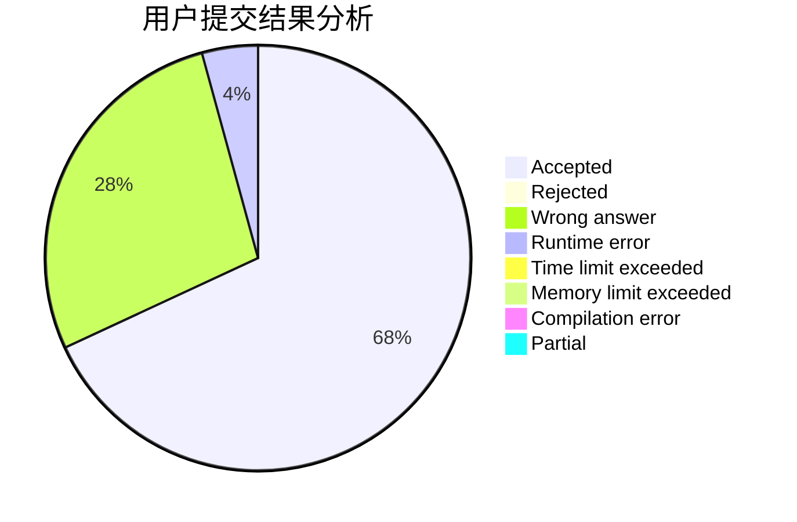
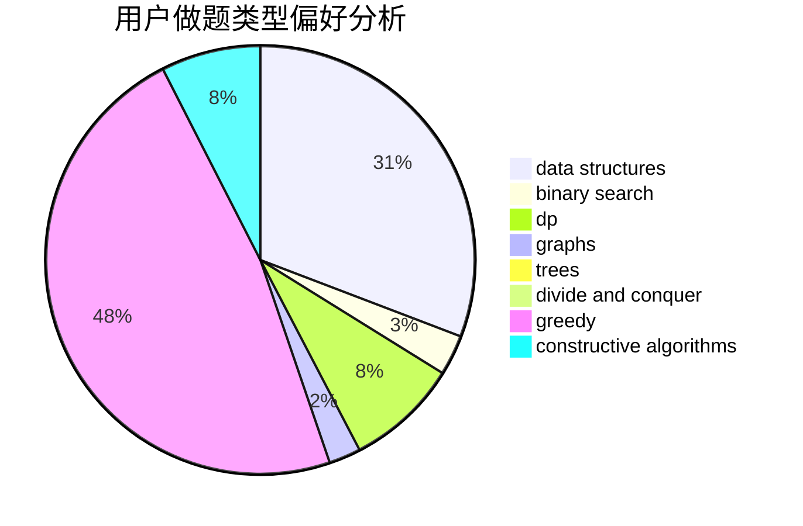
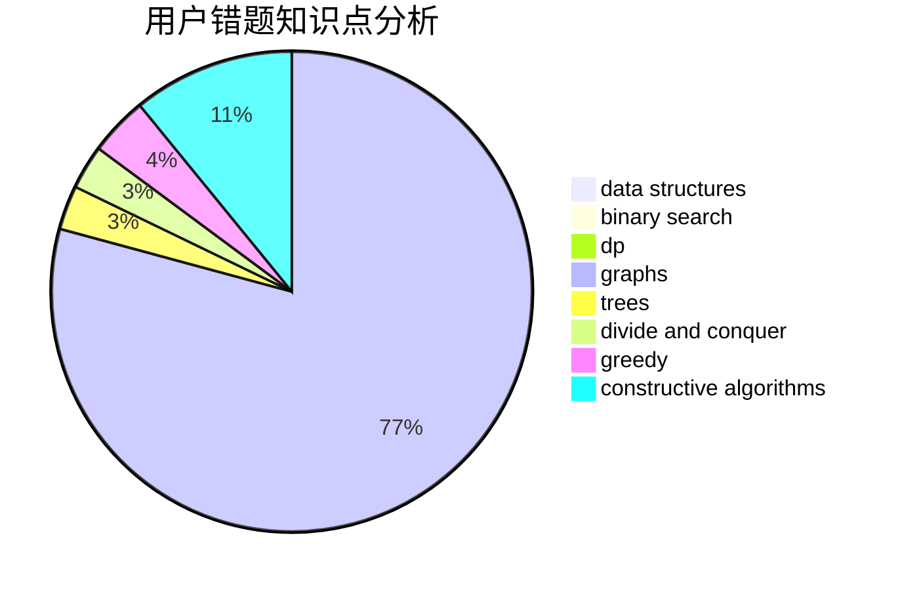

# InfinityDimension

<!-- tabs:start -->

#### **用户提交结果分析**

#### **用户做题类型偏好分析**

#### **用户错题知识点分析**

<!-- tabs:end -->
# 推荐题目
[267A](https://codeforces.com/contest/267/problem/A)		math,
                        number theory		  
[721D](https://codeforces.com/contest/721/problem/D)		constructive algorithms,
                        data structures,
                        greedy,
                        math		  
[1002D3](https://codeforces.com/contest/1002D/problem/3)		nan		  
[612C](https://codeforces.com/contest/612/problem/C)		data structures,
                        expression parsing,
                        math		  
[1007A](https://codeforces.com/contest/1007/problem/A)		combinatorics,
                        data structures,
                        math,
                        sortings,
                        two pointers		  
[1389F](https://codeforces.com/contest/1389/problem/F)		data structures,
                        dp,
                        graph matchings,
                        sortings		  
[762E](https://codeforces.com/contest/762/problem/E)		binary search,
                        data structures		  
[498E](https://codeforces.com/contest/498/problem/E)		dp,
                        matrices		  
[434A](https://codeforces.com/contest/434/problem/A)		dsu,graphs,sortings,trees		  
[918B](https://codeforces.com/contest/918/problem/B)		implementation,
                        strings		  
