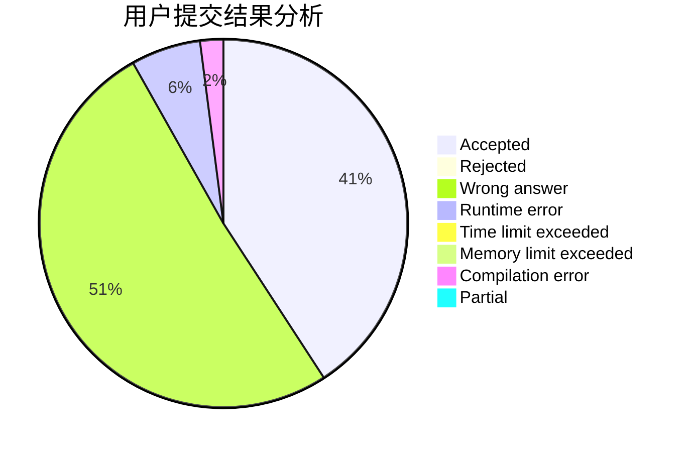
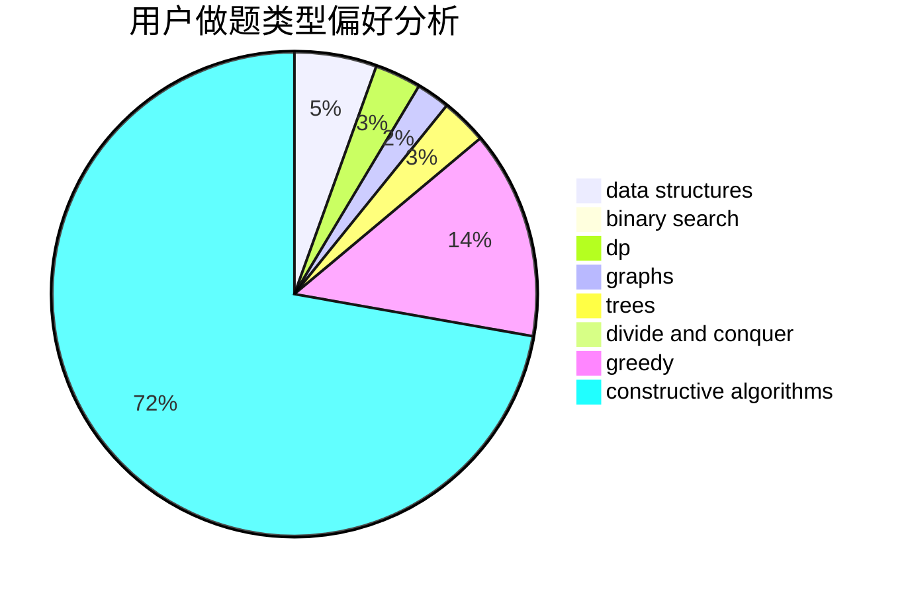
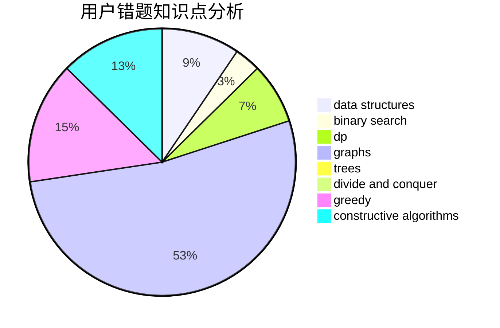

# InkyFlameMaster

<!-- tabs:start -->

#### **用户提交结果分析**

#### **用户做题类型偏好分析**

#### **用户错题知识点分析**

<!-- tabs:end -->
# 推荐题目
[1070D](https://codeforces.com/contest/1070/problem/D)		greedy		  
[421A](https://codeforces.com/contest/421/problem/A)		constructive algorithms,
                        implementation		  
[57D](https://codeforces.com/contest/57/problem/D)		dp,
                        math		  
[939A](https://codeforces.com/contest/939/problem/A)		graphs		  
[749D](https://codeforces.com/contest/749/problem/D)		binary search,
                        data structures		  
[1163E](https://codeforces.com/contest/1163/problem/E)		bitmasks,
                        brute force,
                        constructive algorithms,
                        data structures,
                        graphs,
                        math		  
[609A](https://codeforces.com/contest/609/problem/A)		greedy,
                        implementation,
                        sortings		  
[1329A](https://codeforces.com/contest/1329/problem/A)		constructive algorithms,
                        greedy,
                        implementation,
                        math		  
[480A](https://codeforces.com/contest/480/problem/A)		dsu,graphs,sortings,trees		  
[861B](https://codeforces.com/contest/861/problem/B)		dsu,graphs,sortings,trees		  
