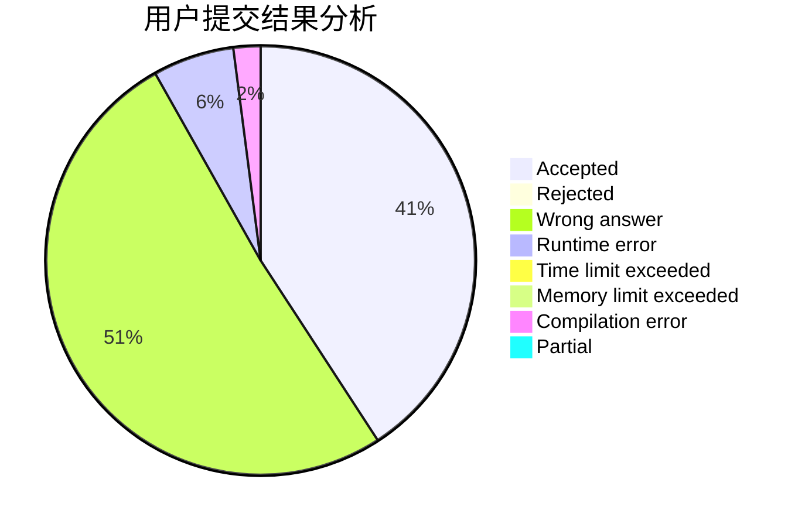
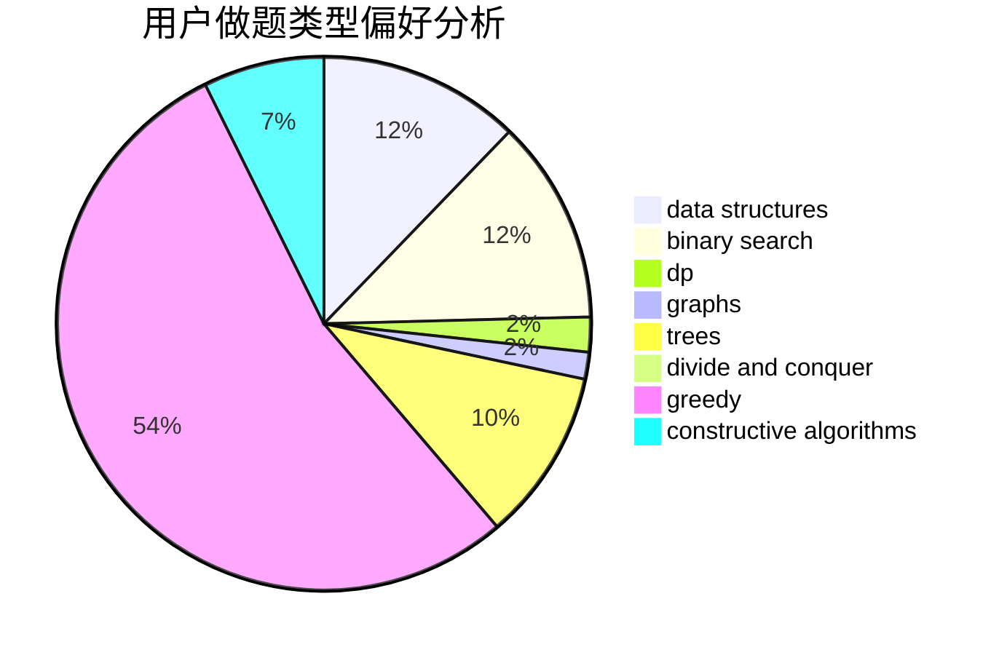
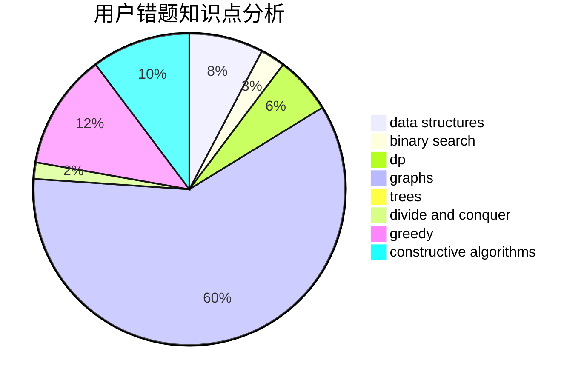

# InkyFlameMaster

<!-- tabs:start -->

#### **用户提交结果分析**

#### **用户做题类型偏好分析**

#### **用户错题知识点分析**

<!-- tabs:end -->
# 推荐题目
[1070A](https://codeforces.com/contest/1070/problem/A)		dp,
                        graphs,
                        number theory,
                        shortest paths		  
[392B](https://codeforces.com/contest/392/problem/B)		dp		  
[555C](https://codeforces.com/contest/555/problem/C)		data structures		  
[918E](https://codeforces.com/contest/918/problem/E)		dsu,graphs,sortings,trees		  
[731C](https://codeforces.com/contest/731/problem/C)		dfs and similar,
                        dsu,
                        graphs,
                        greedy		  
[1161B](https://codeforces.com/contest/1161/problem/B)		dsu,graphs,sortings,trees		  
[588C](https://codeforces.com/contest/588/problem/C)		dsu,graphs,sortings,trees		  
[1322B](https://codeforces.com/contest/1322/problem/B)		binary search,
                        bitmasks,
                        constructive algorithms,
                        data structures,
                        math,
                        sortings		  
[461A](https://codeforces.com/contest/461/problem/A)		greedy,
                        sortings		  
[842C](https://codeforces.com/contest/842/problem/C)		dfs and similar,
                        graphs,
                        math,
                        number theory,
                        trees		  
