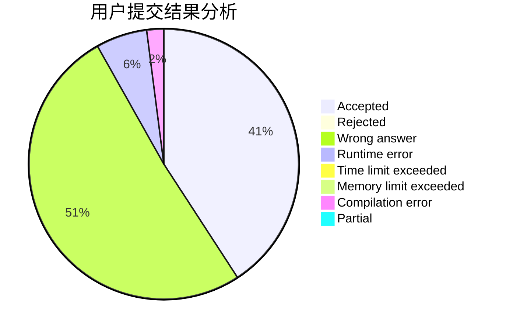
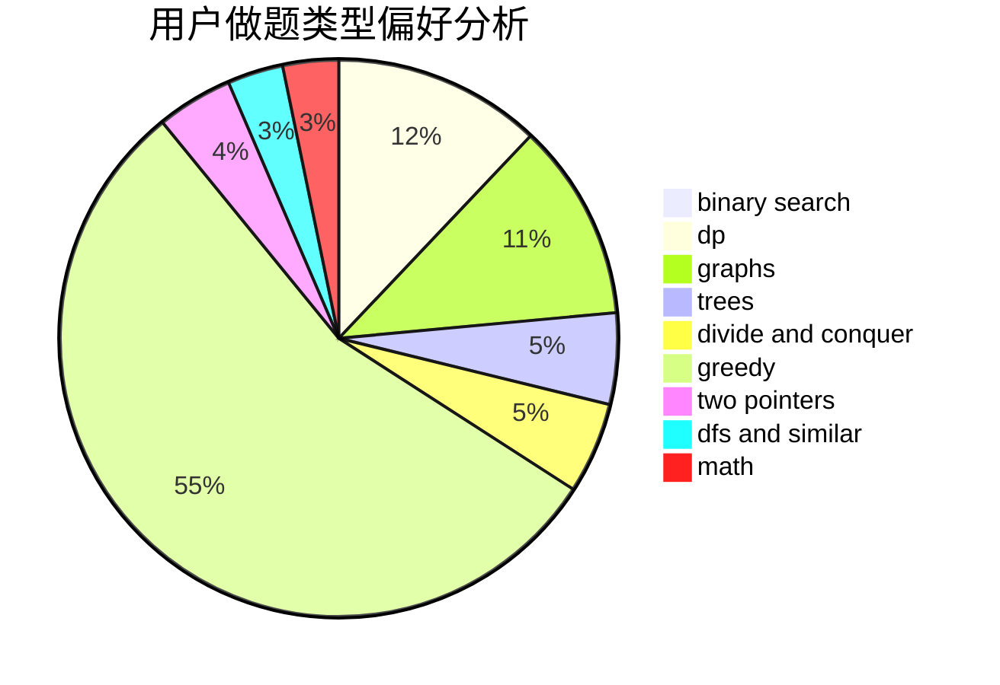

# InkyFlameMaster

<!-- tabs:start -->

#### **用户提交结果分析**

#### **用户做题类型偏好分析**

<!-- tabs:end -->
# 推荐题目
[1070D](https://codeforces.com/contest/1070/problem/D)
[421A](https://codeforces.com/contest/421/problem/A)
[57D](https://codeforces.com/contest/57/problem/D)
[939A](https://codeforces.com/contest/939/problem/A)
[749D](https://codeforces.com/contest/749/problem/D)
[1163E](https://codeforces.com/contest/1163/problem/E)
[609A](https://codeforces.com/contest/609/problem/A)
[1329A](https://codeforces.com/contest/1329/problem/A)
[480A](https://codeforces.com/contest/480/problem/A)
[861B](https://codeforces.com/contest/861/problem/B)
