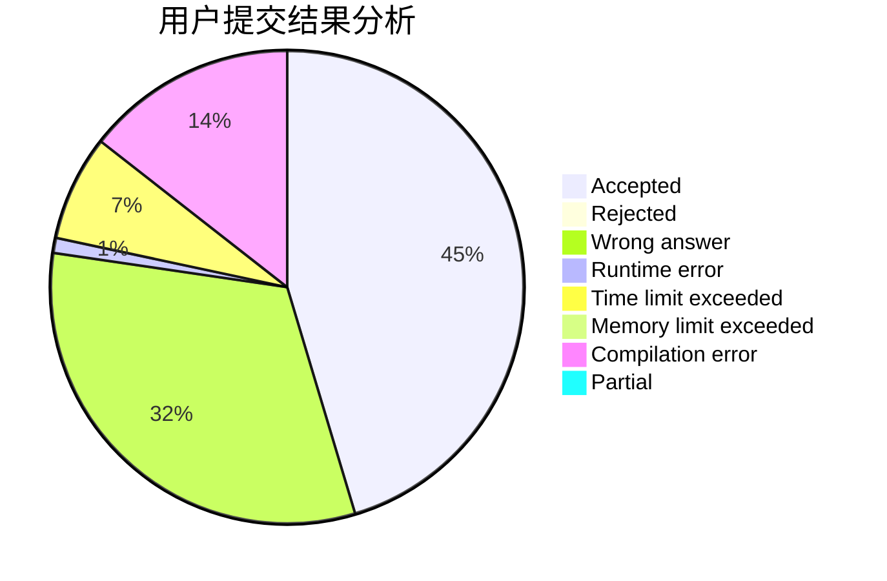
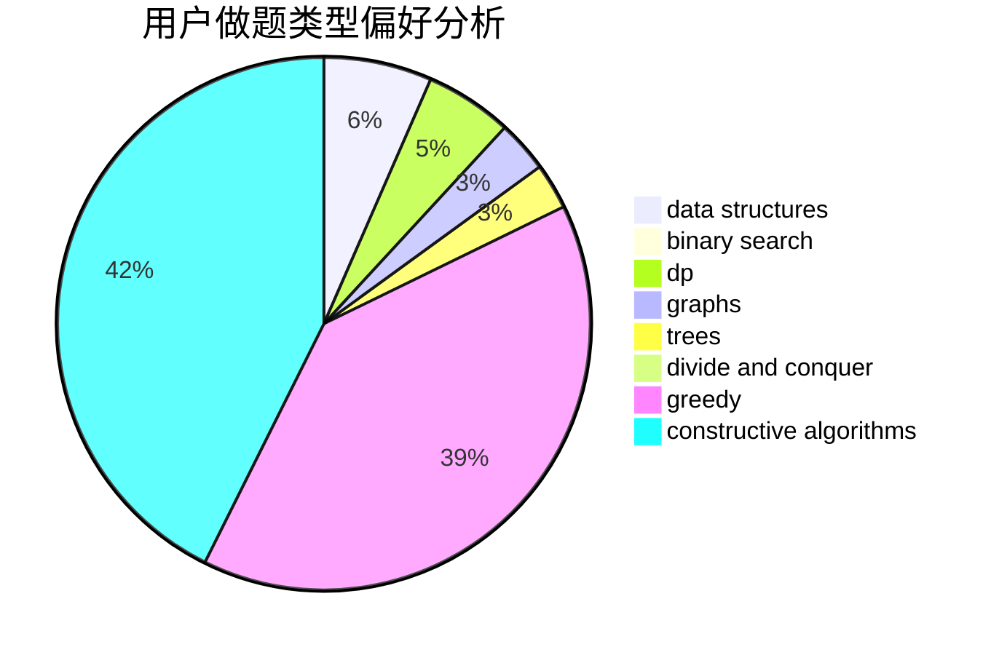

# Inversentropir-36

<!-- tabs:start -->

#### **用户提交结果分析**

#### **用户做题类型偏好分析**

#### **用户错题知识点分析**

<!-- tabs:end -->
# 推荐题目
[1129B](https://codeforces.com/contest/1129/problem/B)		constructive algorithms		  
[764D](https://codeforces.com/contest/764/problem/D)		dsu,graphs,sortings,trees		  
[1164F](https://codeforces.com/contest/1164/problem/F)		dsu,graphs,sortings,trees		  
[620E](https://codeforces.com/contest/620/problem/E)		bitmasks,
                        data structures,
                        trees		  
[696F](https://codeforces.com/contest/696/problem/F)		binary search,
                        geometry,
                        two pointers		  
[1165D](https://codeforces.com/contest/1165/problem/D)		math,
                        number theory		  
[600C](https://codeforces.com/contest/600/problem/C)		constructive algorithms,
                        greedy,
                        strings		  
[682D](https://codeforces.com/contest/682/problem/D)		dp,
                        strings		  
[439D](https://codeforces.com/contest/439/problem/D)		binary search,
                        sortings,
                        ternary search,
                        two pointers		  
[1061C](https://codeforces.com/contest/1061/problem/C)		data structures,
                        dp,
                        implementation,
                        math,
                        number theory		  
