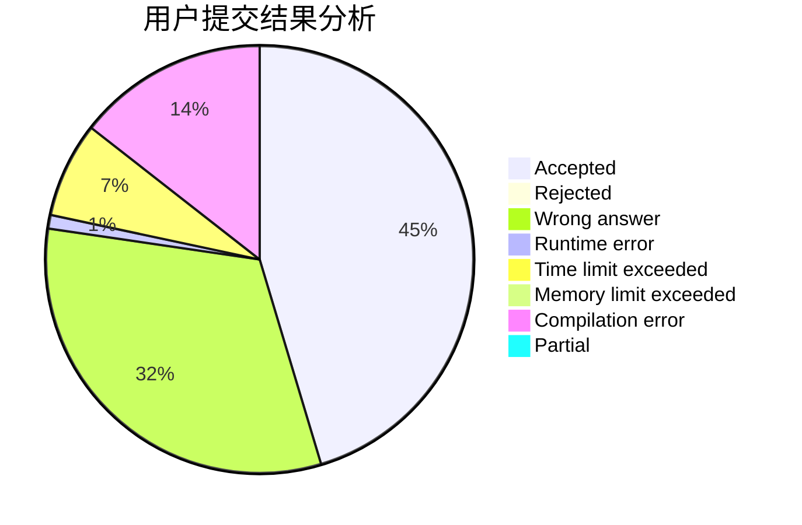
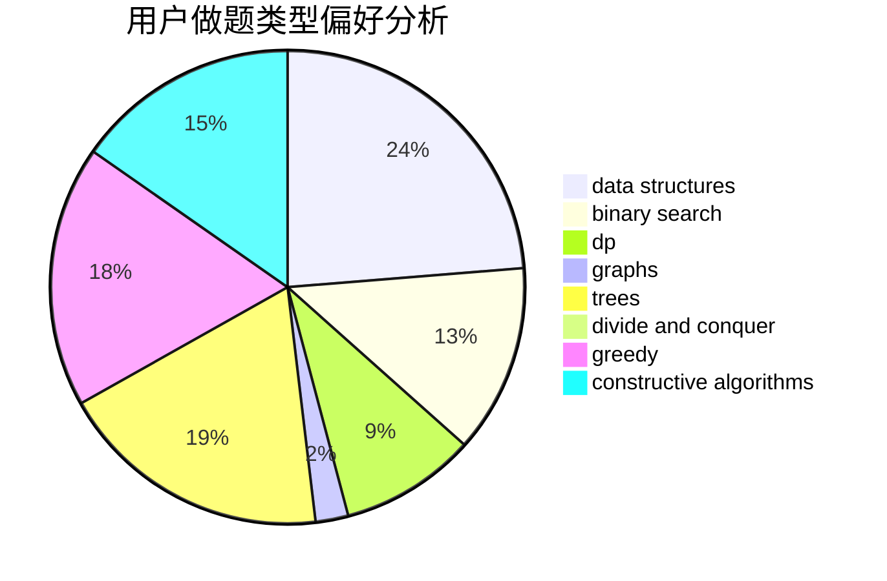

# Inversentropir-36

<!-- tabs:start -->

#### **用户提交结果分析**

#### **用户做题类型偏好分析**

#### **用户错题知识点分析**

<!-- tabs:end -->
# 推荐题目
[1131B](https://codeforces.com/contest/1131/problem/B)		greedy,
                        implementation		  
[784B](https://codeforces.com/contest/784/problem/B)		*special problem		  
[1165C](https://codeforces.com/contest/1165/problem/C)		greedy		  
[644A](https://codeforces.com/contest/644/problem/A)		*special problem,
                        constructive algorithms		  
[713D](https://codeforces.com/contest/713/problem/D)		binary search,
                        data structures		  
[1167F](https://codeforces.com/contest/1167/problem/F)		combinatorics,
                        data structures,
                        math,
                        sortings		  
[61B](https://codeforces.com/contest/61/problem/B)		strings		  
[706E](https://codeforces.com/contest/706/problem/E)		data structures,
                        implementation		  
[460E](https://codeforces.com/contest/460/problem/E)		brute force,
                        geometry,
                        math,
                        sortings		  
[1062A](https://codeforces.com/contest/1062/problem/A)		greedy,
                        implementation		  
