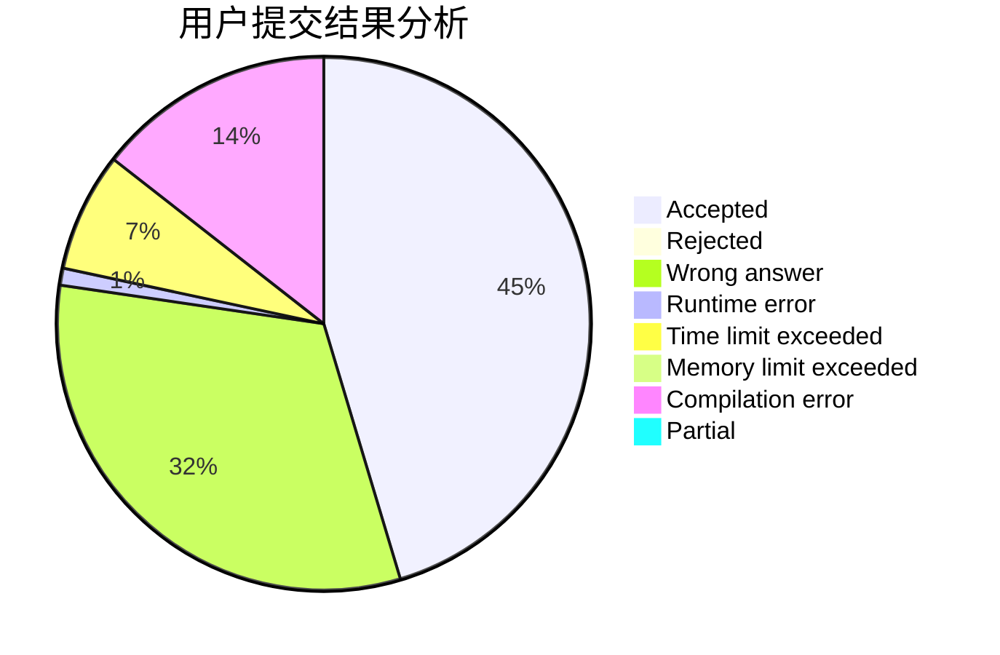
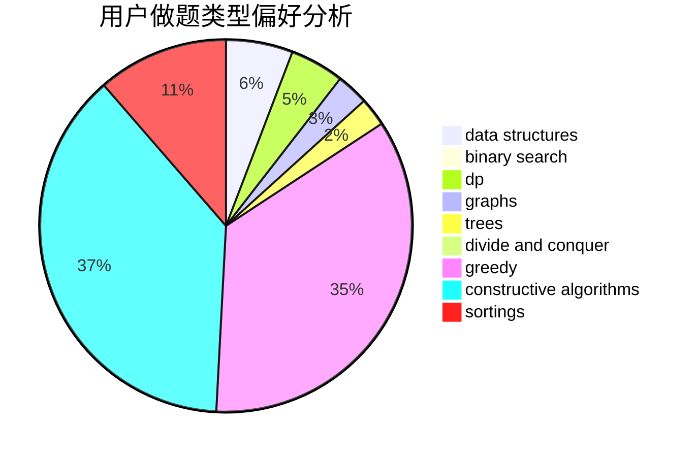

# Inversentropir-36
<!-- tabs:start -->
#### **用户提交结果分析**

#### **用户做题类型偏好分析**

#### **用户错题知识点分析**

<!-- tabs:end -->
# 推荐题目
[1393D](http://codeforces.com/problemset/problem/1393/D)		dfs and similar,
                        dp,
                        implementation,
                        shortest paths		  
[835A](http://codeforces.com/problemset/problem/835/A)		math		  
[1218I](http://codeforces.com/problemset/problem/1218/I)		2-sat,
                        dfs and similar,
                        greedy		  
[13D](http://codeforces.com/problemset/problem/13/D)		dp,
                        geometry		  
[1061C](http://codeforces.com/problemset/problem/1061/C)		data structures,
                        dp,
                        implementation,
                        math,
                        number theory		  
[682D](http://codeforces.com/problemset/problem/682/D)		dp,
                        strings		  
[1129C](http://codeforces.com/problemset/problem/1129/C)		binary search,
                        data structures,
                        dp,
                        hashing,
                        sortings,
                        string suffix structures,
                        strings		  
[750B](http://codeforces.com/problemset/problem/750/B)		geometry,
                        implementation		  
[596A](http://codeforces.com/problemset/problem/596/A)		geometry,
                        implementation		  
[439D](http://codeforces.com/problemset/problem/439/D)		binary search,
                        sortings,
                        ternary search,
                        two pointers		  
<!-- tabs:start -->
#### **data structures**
[1061C](http://codeforces.com/problemset/problem/1061/C)		data structures,
                        dp,
                        implementation,
                        math,
                        number theory		  
[1129C](http://codeforces.com/problemset/problem/1129/C)		binary search,
                        data structures,
                        dp,
                        hashing,
                        sortings,
                        string suffix structures,
                        strings		  
[38G](http://codeforces.com/problemset/problem/38/G)		data structures		  
[609E](http://codeforces.com/problemset/problem/609/E)		data structures,
                        dfs and similar,
                        dsu,
                        graphs,
                        trees		  
[620E](http://codeforces.com/problemset/problem/620/E)		bitmasks,
                        data structures,
                        trees		  
[163E](http://codeforces.com/problemset/problem/163/E)		data structures,
                        dfs and similar,
                        dp,
                        strings,
                        trees		  
[818E](http://codeforces.com/problemset/problem/818/E)		binary search,
                        data structures,
                        number theory,
                        two pointers		  
[1142B](http://codeforces.com/problemset/problem/1142/B)		data structures,
                        dfs and similar,
                        dp,
                        math,
                        trees		  
[1472E](http://codeforces.com/problemset/problem/1472/E)		binary search,
                        data structures,
                        dp,
                        sortings,
                        two pointers		  
[677D](http://codeforces.com/problemset/problem/677/D)		data structures,
                        dp,
                        graphs,
                        shortest paths		  
#### **binary search**
[1129C](http://codeforces.com/problemset/problem/1129/C)		binary search,
                        data structures,
                        dp,
                        hashing,
                        sortings,
                        string suffix structures,
                        strings		  
[439D](http://codeforces.com/problemset/problem/439/D)		binary search,
                        sortings,
                        ternary search,
                        two pointers		  
[696F](http://codeforces.com/problemset/problem/696/F)		binary search,
                        geometry,
                        two pointers		  
[818E](http://codeforces.com/problemset/problem/818/E)		binary search,
                        data structures,
                        number theory,
                        two pointers		  
[1472E](http://codeforces.com/problemset/problem/1472/E)		binary search,
                        data structures,
                        dp,
                        sortings,
                        two pointers		  
[1492C](http://codeforces.com/problemset/problem/1492/C)		binary search,
                        data structures,
                        dp,
                        greedy,
                        two pointers		  
[1463D](http://codeforces.com/problemset/problem/1463/D)		binary search,
                        constructive algorithms,
                        greedy,
                        two pointers		  
[1490G](http://codeforces.com/problemset/problem/1490/G)		binary search,
                        data structures,
                        math		  
[1479D](http://codeforces.com/problemset/problem/1479/D)		binary search,
                        bitmasks,
                        brute force,
                        data structures,
                        probabilities,
                        trees		  
[1436E](http://codeforces.com/problemset/problem/1436/E)		binary search,
                        data structures,
                        two pointers		  
#### **dp**
[1393D](http://codeforces.com/problemset/problem/1393/D)		dfs and similar,
                        dp,
                        implementation,
                        shortest paths		  
[13D](http://codeforces.com/problemset/problem/13/D)		dp,
                        geometry		  
[1061C](http://codeforces.com/problemset/problem/1061/C)		data structures,
                        dp,
                        implementation,
                        math,
                        number theory		  
[682D](http://codeforces.com/problemset/problem/682/D)		dp,
                        strings		  
[1129C](http://codeforces.com/problemset/problem/1129/C)		binary search,
                        data structures,
                        dp,
                        hashing,
                        sortings,
                        string suffix structures,
                        strings		  
[1387B1](http://codeforces.com/problemset/problem/1387/B1)		*special problem,
                        dp,
                        greedy,
                        trees		  
[354E](http://codeforces.com/problemset/problem/354/E)		constructive algorithms,
                        dfs and similar,
                        dp		  
[1402C](http://codeforces.com/problemset/problem/1402/C)		*special problem,
                        combinatorics,
                        dfs and similar,
                        dp,
                        games,
                        graphs,
                        matrices,
                        trees		  
[163E](http://codeforces.com/problemset/problem/163/E)		data structures,
                        dfs and similar,
                        dp,
                        strings,
                        trees		  
[1142B](http://codeforces.com/problemset/problem/1142/B)		data structures,
                        dfs and similar,
                        dp,
                        math,
                        trees		  
#### **graph**
[1402C](http://codeforces.com/problemset/problem/1402/C)		*special problem,
                        combinatorics,
                        dfs and similar,
                        dp,
                        games,
                        graphs,
                        matrices,
                        trees		  
[609E](http://codeforces.com/problemset/problem/609/E)		data structures,
                        dfs and similar,
                        dsu,
                        graphs,
                        trees		  
[1496E](https://codeforces.com/contest/1496/problem/E)		constructive algorithms,
                        graphs		  
[677D](http://codeforces.com/problemset/problem/677/D)		data structures,
                        dp,
                        graphs,
                        shortest paths		  
[1487C](http://codeforces.com/problemset/problem/1487/C)		brute force,
                        constructive algorithms,
                        dfs and similar,
                        graphs,
                        greedy,
                        implementation,
                        math		  
[1437C](http://codeforces.com/problemset/problem/1437/C)		dp,
                        flows,
                        graph matchings,
                        greedy,
                        math,
                        sortings		  
[1470D](http://codeforces.com/problemset/problem/1470/D)		constructive algorithms,
                        dfs and similar,
                        graph matchings,
                        graphs,
                        greedy		  
[1476C](http://codeforces.com/problemset/problem/1476/C)		dp,
                        graphs,
                        greedy		  
[1304D](http://codeforces.com/problemset/problem/1304/D)		constructive algorithms,
                        graphs,
                        greedy,
                        two pointers		  
[1475C](http://codeforces.com/problemset/problem/1475/C)		combinatorics,
                        graphs,
                        math		  
#### **trees**
[1387B1](http://codeforces.com/problemset/problem/1387/B1)		*special problem,
                        dp,
                        greedy,
                        trees		  
[1402C](http://codeforces.com/problemset/problem/1402/C)		*special problem,
                        combinatorics,
                        dfs and similar,
                        dp,
                        games,
                        graphs,
                        matrices,
                        trees		  
[609E](http://codeforces.com/problemset/problem/609/E)		data structures,
                        dfs and similar,
                        dsu,
                        graphs,
                        trees		  
[620E](http://codeforces.com/problemset/problem/620/E)		bitmasks,
                        data structures,
                        trees		  
[163E](http://codeforces.com/problemset/problem/163/E)		data structures,
                        dfs and similar,
                        dp,
                        strings,
                        trees		  
[1142B](http://codeforces.com/problemset/problem/1142/B)		data structures,
                        dfs and similar,
                        dp,
                        math,
                        trees		  
[1479D](http://codeforces.com/problemset/problem/1479/D)		binary search,
                        bitmasks,
                        brute force,
                        data structures,
                        probabilities,
                        trees		  
[1511C](http://codeforces.com/problemset/problem/1511/C)		brute force,
                        data structures,
                        implementation,
                        trees		  
[1499F](http://codeforces.com/problemset/problem/1499/F)		combinatorics,
                        dfs and similar,
                        dp,
                        trees		  
[1491E](http://codeforces.com/problemset/problem/1491/E)		brute force,
                        dfs and similar,
                        divide and conquer,
                        number theory,
                        trees		  
#### **divide and conquer**
[1461D](http://codeforces.com/problemset/problem/1461/D)		binary search,
                        brute force,
                        data structures,
                        divide and conquer,
                        implementation,
                        sortings		  
[1466G](http://codeforces.com/problemset/problem/1466/G)		combinatorics,
                        divide and conquer,
                        hashing,
                        math,
                        string suffix structures,
                        strings		  
[1490D](http://codeforces.com/problemset/problem/1490/D)		dfs and similar,
                        divide and conquer,
                        implementation		  
[1483C](https://codeforces.com/contest/1483/problem/C)		data structures,
                        divide and conquer,
                        dp		  
[1491E](http://codeforces.com/problemset/problem/1491/E)		brute force,
                        dfs and similar,
                        divide and conquer,
                        number theory,
                        trees		  
[1303G](http://codeforces.com/problemset/problem/1303/G)		data structures,
                        divide and conquer,
                        geometry,
                        trees		  
[1494D](http://codeforces.com/problemset/problem/1494/D)		constructive algorithms,
                        data structures,
                        dfs and similar,
                        divide and conquer,
                        dsu,
                        greedy,
                        sortings,
                        trees		  
[1482E](http://codeforces.com/problemset/problem/1482/E)		data structures,
                        divide and conquer,
                        dp		  
[566C](http://codeforces.com/problemset/problem/566/C)		dfs and similar,
                        divide and conquer,
                        trees		  
[1428F](http://codeforces.com/problemset/problem/1428/F)		binary search,
                        data structures,
                        divide and conquer,
                        dp,
                        two pointers		  
#### **greedy**
[1218I](http://codeforces.com/problemset/problem/1218/I)		2-sat,
                        dfs and similar,
                        greedy		  
[1387B1](http://codeforces.com/problemset/problem/1387/B1)		*special problem,
                        dp,
                        greedy,
                        trees		  
[785B](http://codeforces.com/problemset/problem/785/B)		greedy,
                        sortings		  
[600C](http://codeforces.com/problemset/problem/600/C)		constructive algorithms,
                        greedy,
                        strings		  
[42A](http://codeforces.com/problemset/problem/42/A)		greedy,
                        implementation		  
[919A](http://codeforces.com/problemset/problem/919/A)		brute force,
                        greedy,
                        implementation		  
[1492C](http://codeforces.com/problemset/problem/1492/C)		binary search,
                        data structures,
                        dp,
                        greedy,
                        two pointers		  
[1496C](https://codeforces.com/contest/1496/problem/C)		geometry,
                        greedy,
                        math,
                        sortings		  
[1493A](http://codeforces.com/problemset/problem/1493/A)		constructive algorithms,
                        greedy		  
[1463D](http://codeforces.com/problemset/problem/1463/D)		binary search,
                        constructive algorithms,
                        greedy,
                        two pointers		  
#### **constructive algorithms**
[764D](https://codeforces.com/contest/764/problem/D)		constructive algorithms,
                        geometry		  
[1129B](http://codeforces.com/problemset/problem/1129/B)		constructive algorithms		  
[720C](http://codeforces.com/problemset/problem/720/C)		constructive algorithms		  
[901B](http://codeforces.com/problemset/problem/901/B)		constructive algorithms,
                        math		  
[354E](http://codeforces.com/problemset/problem/354/E)		constructive algorithms,
                        dfs and similar,
                        dp		  
[600C](http://codeforces.com/problemset/problem/600/C)		constructive algorithms,
                        greedy,
                        strings		  
[1496E](https://codeforces.com/contest/1496/problem/E)		constructive algorithms,
                        graphs		  
[1493A](http://codeforces.com/problemset/problem/1493/A)		constructive algorithms,
                        greedy		  
[1463D](http://codeforces.com/problemset/problem/1463/D)		binary search,
                        constructive algorithms,
                        greedy,
                        two pointers		  
[1456B](https://codeforces.com/contest/1456/problem/B)		bitmasks,
                        brute force,
                        constructive algorithms		  
#### **sortings**
[1129C](http://codeforces.com/problemset/problem/1129/C)		binary search,
                        data structures,
                        dp,
                        hashing,
                        sortings,
                        string suffix structures,
                        strings		  
[439D](http://codeforces.com/problemset/problem/439/D)		binary search,
                        sortings,
                        ternary search,
                        two pointers		  
[785B](http://codeforces.com/problemset/problem/785/B)		greedy,
                        sortings		  
[1472E](http://codeforces.com/problemset/problem/1472/E)		binary search,
                        data structures,
                        dp,
                        sortings,
                        two pointers		  
[1496C](https://codeforces.com/contest/1496/problem/C)		geometry,
                        greedy,
                        math,
                        sortings		  
[1495A](http://codeforces.com/problemset/problem/1495/A)		geometry,
                        greedy,
                        math,
                        sortings		  
[1497A](http://codeforces.com/problemset/problem/1497/A)		brute force,
                        data structures,
                        greedy,
                        sortings		  
[1427A](http://codeforces.com/problemset/problem/1427/A)		math,
                        sortings		  
[1461D](http://codeforces.com/problemset/problem/1461/D)		binary search,
                        brute force,
                        data structures,
                        divide and conquer,
                        implementation,
                        sortings		  
[1437C](http://codeforces.com/problemset/problem/1437/C)		dp,
                        flows,
                        graph matchings,
                        greedy,
                        math,
                        sortings		  
<!-- tabs:end -->
