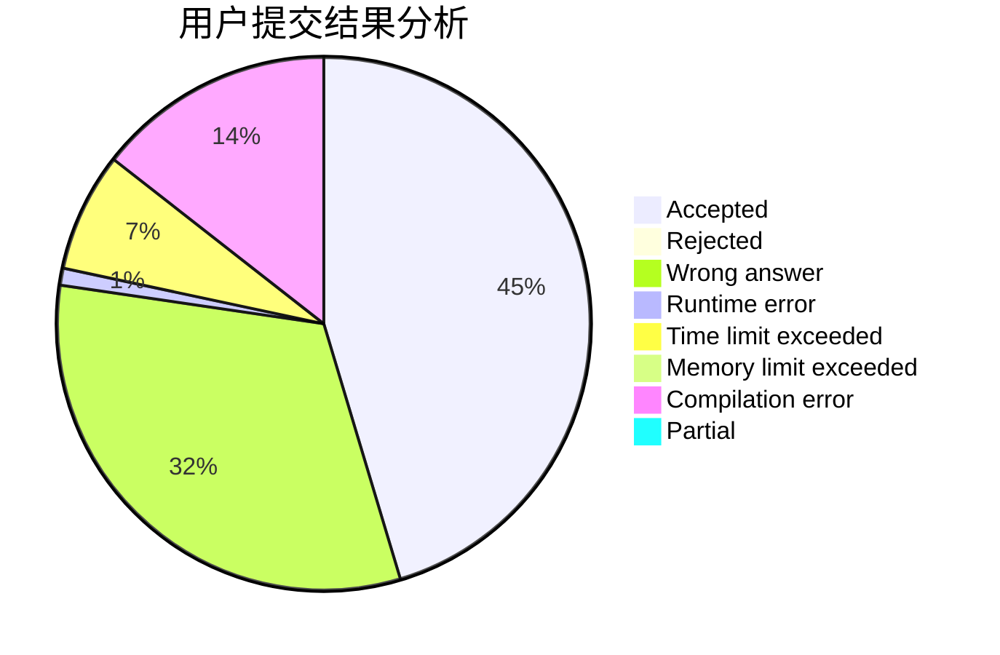
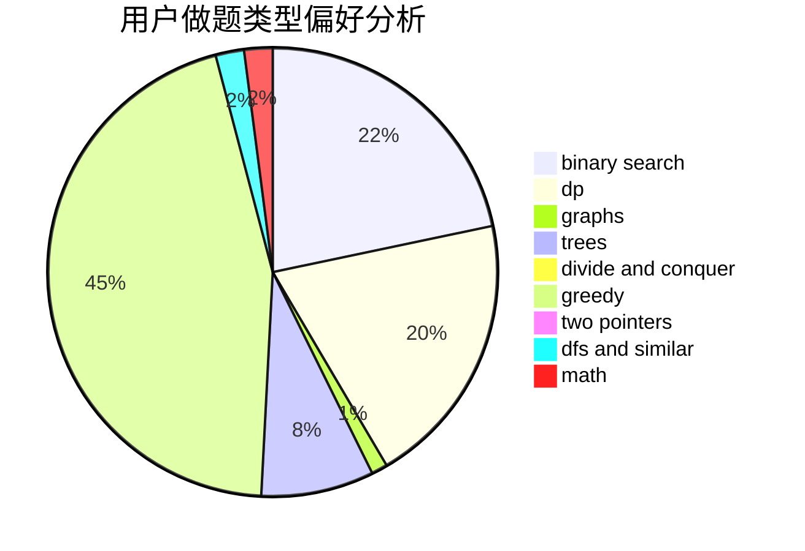

# Inversentropir-36

<!-- tabs:start -->

#### **用户提交结果分析**

#### **用户做题类型偏好分析**

<!-- tabs:end -->
# 推荐题目
[1131B](https://codeforces.com/contest/1131/problem/B)
[784B](https://codeforces.com/contest/784/problem/B)
[1165C](https://codeforces.com/contest/1165/problem/C)
[644A](https://codeforces.com/contest/644/problem/A)
[713D](https://codeforces.com/contest/713/problem/D)
[1167F](https://codeforces.com/contest/1167/problem/F)
[61B](https://codeforces.com/contest/61/problem/B)
[706E](https://codeforces.com/contest/706/problem/E)
[460E](https://codeforces.com/contest/460/problem/E)
[1062A](https://codeforces.com/contest/1062/problem/A)
