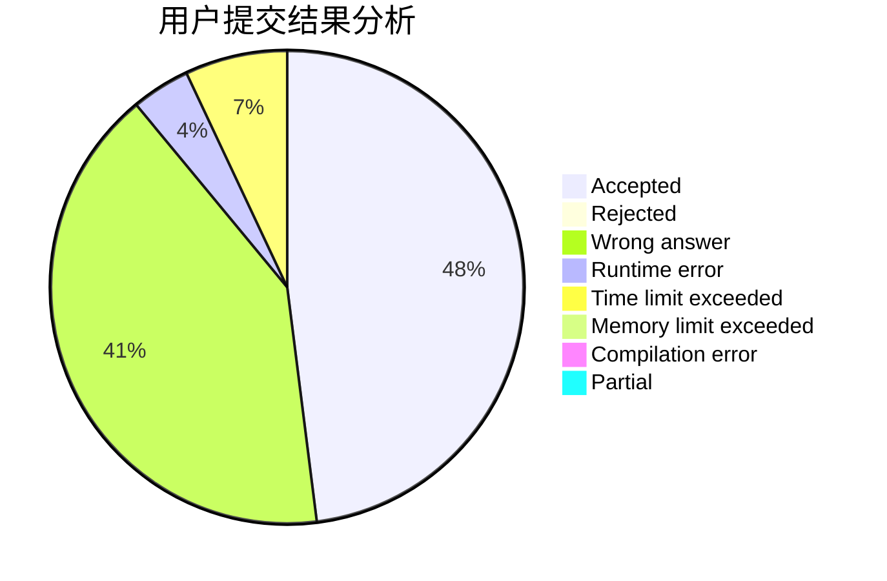
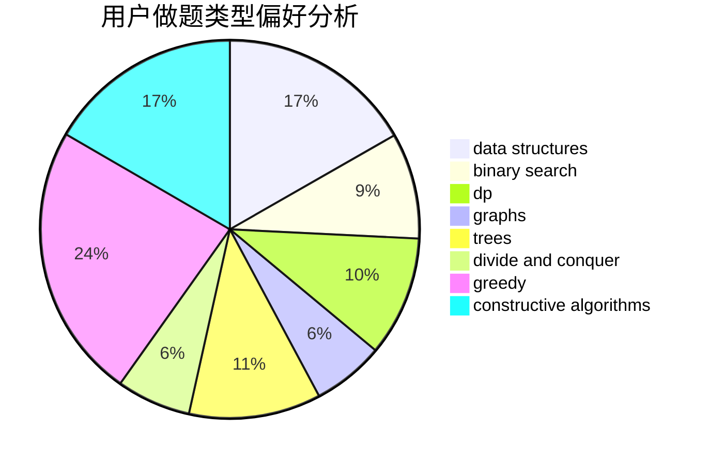

# Irene

<!-- tabs:start -->

#### **用户提交结果分析**

#### **用户做题类型偏好分析**

#### **用户错题知识点分析**

<!-- tabs:end -->
# 推荐题目
[1439D](https://codeforces.com/contest/1439/problem/D)		combinatorics,
                        dp,
                        fft		  
[788B](https://codeforces.com/contest/788/problem/B)		combinatorics,
                        constructive algorithms,
                        dfs and similar,
                        dsu,
                        graphs		  
[11521](https://codeforces.com/contest/1152/problem/1)		dsu,graphs,sortings,trees		  
[13577](https://codeforces.com/contest/1357/problem/7)		dsu,graphs,sortings,trees		  
[10C](https://codeforces.com/contest/10/problem/C)		number theory		  
[465D](https://codeforces.com/contest/465/problem/D)		dsu,graphs,sortings,trees		  
[683B](https://codeforces.com/contest/683/problem/B)		*special problem		  
[386C](https://codeforces.com/contest/386/problem/C)		dp,
                        strings,
                        two pointers		  
[886A](https://codeforces.com/contest/886/problem/A)		brute force		  
[713A](https://codeforces.com/contest/713/problem/A)		data structures,
                        implementation		  
